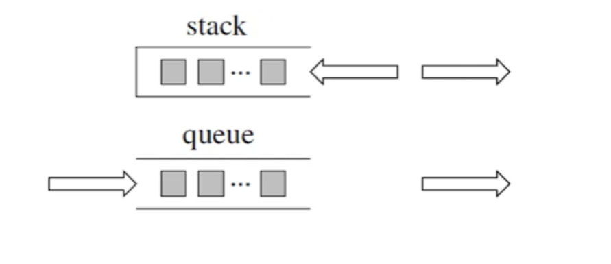

# 栈与队列

主要从 C，C++, Java，Python, 用图去感觉什么是栈和队列




## 1.1 用栈实现队列

这里利用两个栈实现队列

```python

class MySqueue:

    def __init__(self):
        self.st_in = []   # 输入栈（卸货区：新来的货全堆在这里）
        self.st_out = []  # 输出栈（前台货架：顾客从这里拿货）

    def push(self, x: int) -> None:
        self.st_in.append(x)      


    def peek(self) -> int:
        # 规则 1：如果前台货架（st_out）空了，才去卸货区拿货
        if not self.st_out:
            # 规则 2：只要卸货区（st_in）还有货，就一件一件搬过去
            while self.st_in:
                # 把 st_in 顶上的货搬下来，放到 st_out 的顶上
                self.st_out.append(self.st_in.pop())
        
        # 此时，st_out 的最后一个元素（[-1]），就是我们苦苦等待的队头
        return self.st_out[-1]

    def pop(self) -> int:
        # 第一步：直接调用 peek()，让它去检查并把数据搬运好
        res = self.peek()
        
        # 第二步：此时 st_out 顶上一定是队头，安心弹出并返回
        return self.st_out.pop()

    def empty(self) -> bool:
        # 只有当 卸货区(st_in) 和 前台货架(st_out) 都没货了，整家店才算空
        return not self.st_in and not self.st_out

```


## 1.2 用队列实现栈

使用队列实现栈的下列操作：

push(x) -- 元素 x 入栈
pop() -- 移除栈顶元素
top() -- 获取栈顶元素
empty() -- 返回栈是否为空


```python
from collections import deque

class MyStack:

    def __init__(self):
        """
        Python普通的Queue或SimpleQueue没有类似于peek的功能
        也无法用索引访问，在实现top的时候较为困难。

        用list可以，但是在使用pop(0)的时候时间复杂度为O(n)
        因此这里使用双向队列，我们保证只执行popleft()和append()，因为deque可以用索引访问，可以实现和peek相似的功能

        in - 存所有数据
        out - 仅在pop的时候会用到
        """
        self.queue_in = deque()
        self.queue_out = deque()

    def push(self, x: int) -> None:
        """
        直接append即可
        """
        self.queue_in.append(x)


    def pop(self) -> int:
        """
        1. 首先确认不空
        2. 因为队列的特殊性，FIFO，所以我们只有在pop()的时候才会使用queue_out
        3. 先把queue_in中的所有元素（除了最后一个），依次出列放进queue_out
        4. 交换in和out，此时out里只有一个元素
        5. 把out中的pop出来，即是原队列的最后一个
        
        tip：这不能像栈实现队列一样，因为另一个queue也是FIFO，如果执行pop()它不能像
        stack一样从另一个pop()，所以干脆in只用来存数据，pop()的时候两个进行交换
        """
        if self.empty():
            return None

        for i in range(len(self.queue_in) - 1):
            self.queue_out.append(self.queue_in.popleft())
        
        self.queue_in, self.queue_out = self.queue_out, self.queue_in    # 交换in和out，这也是为啥in只用来存
        return self.queue_out.popleft()

    def top(self) -> int:
        """
        写法一：
        1. 首先确认不空
        2. 我们仅有in会存放数据，所以返回第一个即可（这里实际上用到了栈）
        写法二：
        1. 首先确认不空
        2. 因为队列的特殊性，FIFO，所以我们只有在pop()的时候才会使用queue_out
        3. 先把queue_in中的所有元素（除了最后一个），依次出列放进queue_out
        4. 交换in和out，此时out里只有一个元素
        5. 把out中的pop出来，即是原队列的最后一个，并使用temp变量暂存
        6. 把temp追加到queue_in的末尾
        """
        # 写法一：
        # if self.empty():
        #     return None
        
        # return self.queue_in[-1]    # 这里实际上用到了栈，因为直接获取了queue_in的末尾元素

        # 写法二：
        if self.empty():
            return None

        for i in range(len(self.queue_in) - 1):
            self.queue_out.append(self.queue_in.popleft())
        
        self.queue_in, self.queue_out = self.queue_out, self.queue_in 
        temp = self.queue_out.popleft()   
        self.queue_in.append(temp)
        return temp


    def empty(self) -> bool:
        """
        因为只有in存了数据，只要判断in是不是有数即可
        """
        return len(self.queue_in) == 0


```