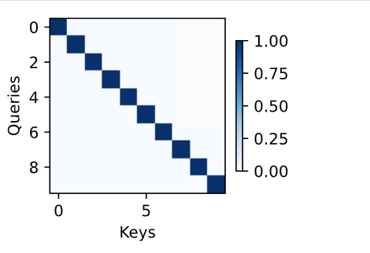

---
layout: note_with_toc
title: 1. 注意力提示
description: Introduction to attention mechanism - voluntary and involuntary attention cues, Query-Key-Value framework
category: Deep Learning
subcategory: Attention
tags: [Attention, Query-Key-Value, Deep Learning, Neural Networks]
permalink: /notes/attention/attention-introduction/
---

## 1.1 注意力提示

注意力是一种稀缺资源，我的理解就是现在对你要做的事情进行分工分，谁是第一。

**例子 1：视频或音乐 APP**

- 你不付钱 → 用注意力看广告
- 你付钱 → 买的是“不被广告打扰的注意力空间”

**🎮 例子 2：网络游戏**

- 你花注意力打怪、刷装备 → 帮游戏变得有活力，吸引更多玩家
- 你花钱 → 买到了节省注意力的捷径（快速变强）

注意力不是免费的——你要么花时间，要么花钱。

人类的感官每秒都在处理大量信息，但是大脑无法全部处理，在进化的过程中，能自动筛选和聚焦重要信息。

## 1.2 注意力基本分类

来自心理学家威廉·詹姆斯的框架（19世纪90年代）：

注意力有两个来源：

**1. 非自主性注意（bottom-up，自下而上）**

由外界刺激的突显性引起，是自动发生的。

- 桌上有报纸、论文、笔记本、书都很普通
- 但一个红色的杯子特别显眼
- 👉 你的注意力就会被它吸引
- 这是不由自主的。

**2. 自主性注意（top-down，自上而下）**

由人的目标、意愿、任务驱动，是主动控制的。

- 喝完咖啡，你想读书
- 于是你主动把视线移到书上
- 👉 这是你的意图和任务目标决定的注意力方向
- 这种注意力更稳定、强烈、专注。

## 1.3 Q K V

自主性和非自主性的注意力提示解释其基本及机制，通过神经网络去设计注意力的机制的框架。

非自主提示，这里简单地使用参数化的全连接层，甚至是非参数化的最大汇聚层或平均汇聚层，就像全连接层，最大池化，平均池化。

但是，注意力机制的来源就是加入了自主性提示，查询，键，值的引入才是真正的关键。

想象你在一个房间找一个“红色的杯子”。
s
查询（Query）： “红色、杯子形状”

房间中的物品（视觉输入）每个都有：

Key：物品的特征（颜色、形状、位置）
Value：物品的完整视觉信息

注意力机制做的事就是：

用 Query 去计算“红杯子”与每个 Key 的匹配程度

匹配度越高，注意力权重越大

最终突出与“红杯子”最接近的 Value（那就是你实际关注到的物体）

图 10.1.3 就是这个过程的抽象示意图。

### 1.3.1 实现方式

不一定是可微分的Q K V 形式， 也可以设计成不可微模型，用强化训练。

## 1.4 代码实践

```python
#@save
def show_heatmaps(matrices, xlabel, ylabel, titles=None, figsize=(2.5, 2.5),
                  cmap='Reds'):
    """显示矩阵热图"""

    '''
    matrices 待绘制的多个矩阵，通常形状是 (num_rows, num_cols, H, W),

    例如 2 行 3 列，共 6 个矩阵

    xlabel, ylabel：坐标轴标签

    titles：每列子图的标题

    figsize：单个子图的大小

    cmap='Reds'：使用红色系热图
        
    '''

    d2l.use_svg_display()

    num_rows, num_cols = matrices.shape[0], matrices.shape[1]
    
    # 获取矩阵的排列尺寸


    fig, axes = d2l.plt.subplots(num_rows, num_cols, figsize=figsize,
                                 sharex=True, sharey=True, squeeze=False)
    
    # fig 是一张画布， axes 就是子图的对象矩阵
    # sharex and sharey 代表共享
    # queeze=False：永远把 axes
    
    for i, (row_axes, row_matrices) in enumerate(zip(axes, matrices)):

      # 逐行遍历子图和矩阵 

      # row_axes：这一行的子图 row_matrices：这一行对应的矩阵们 

      # zip(axes, matrices): 将每一行的子图列表和每一行的数据列表打包在一起。

      # 一个可迭代的 enumerate （index，value）
        for j, (ax, matrix) in enumerate(zip(row_axes, row_matrices)):

      # 遍历“列”（具体的子图）,当前行后 + 当前列

            pcm = ax.imshow(matrix.detach().numpy(), cmap=cmap)

            # pcm: 返回一个 QuadMesh 对象，用于后续生成颜色条（Colorbar）
          
            # 转化为NumPy 数组，

            # ax.imshow(...): 在子图 ax 上绘制热力图（Image Show）
            # 为了防止图表显得杂乱，代码使用了逻辑判断，只在网格的边缘添加标签

            if i == num_rows - 1: #最后一行。加入标签
                ax.set_xlabel(xlabel)
            if j == 0: # 只在最左侧的子图左边添加 Y 轴标签
                ax.set_ylabel(ylabel) 
            if titles: # 标题是按列分配,第一列统一一个标题
                ax.set_title(titles[j])

    fig.colorbar(pcm, ax=axes, shrink=0.6);
    # 在整个画布（Figure）上添加一个颜色条。

```
```
[Title 0]       [Title 1]
    +-----------+   +-----------+
Y   |           |   |           |
L   | Matrix[0] |   | Matrix[1] |      C
a   |           |   |           |      o
b   +-----------+   +-----------+      l
e                                      o
l   +-----------+   +-----------+      r
    |           |   |           |      b
    | Matrix[2] |   | Matrix[3] |      a
    |           |   |           |      r
    +-----------+   +-----------+
       X Label         X Label

```

```python

attention_weights = torch.eye(10).reshape((1, 1, 10, 10))

'''
创建一个 10  10 的单位矩阵（Identity Matrix）。对角线全是 1，其余全是 0

假设这是一个长度为 10 的句子。

第 1 个词只关注第 1 个词（权重为1），对其他词权重为 0。

第 2 个词只关注第 2 个词...以此类推。

将这个二维矩阵变形为 4维张量

Batch Size = 1: 只有一个样本（一句话）。

Num Heads = 1: 只有一个注意力头（Single Head）。

Query/Key Length = 10: 句子长度是 10 个 token。
'''

show_heatmaps(attention_weights, xlabel='Keys', ylabel='Queries')
```



## 1.5 问题

### 1.5.1 在机器翻译中通过解码序列词元时，其自主性提示可能是什么？非自主性提示和感官输入又是什么？

首先，感官输入应该指的是源语言句子，具体可以是编码器生成后的上下文向量.

自主性提示，对应的主要是解码器件的隐藏状态或者查询向量，解码器通过这个“提示”去源句子中寻找对应的信息。它类似于你在阅读时**“当前的视线焦点”**。

非自主性提示应该是句子中的每个词的编码特征


### 1.5.2 随机生成一个
矩阵并使用softmax运算来确保每行都是有效的概率分布，然后可视化输出注意力权重。

```python
import torch
import torch.nn.functional as F
import matplotlib.pyplot as plt

torch.manual_seed(42)

logits = torch.randn(10, 10)

attention_weights = F.softmax(logits, dim=1).reshape(1, 1, 10, 10)

show_heatmaps(attention_weights, xlabel='Keys', ylabel='Queries')
```


