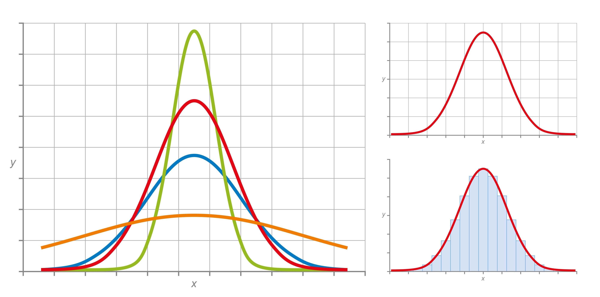

# 2. 注意力汇聚：Nadaraya-Watson 核回归

Nadaraya-Watson 核回归（Nadaraya-Watson Kernel Regression）虽然是一个 1964 年提出的古老统计学模型，但它在数学结构上完美对应了现代深度学习中的 Attention(Q, K, V) 机制。

## 2.1 机制

基本场景：

假设你有一堆数据点（训练集），比如房价数据：$x_i$ (特征)：房子的面积。$y_i$ (标签)：房子的价格。

1. 最近邻算法（Hard Attention）

你只看最像的那一套房子（比如面积最接近 $x$ 的 $x_j$），直接把它的价格 $y_j$ 拿来当作预测结果

2. 方案 B：加权平均（Soft Attention / Nadaraya-Watson）

你会看所有的房子，但是根据它们与新房子的相似程度来分配权重。

方案B 就是器核心思想

- 核心公式;

$$f(q) = \sum_{i=1}^{n} \underbrace{\frac{K(q - k_i)}{\sum_{j=1}^{n} K(q - k_j)}}_{\alpha(q, k_i)} v_i$$


$$K(q - k_i)$$

这里 $K$ 是一个核函数（Kernel），通常是高斯核（Gaussian Kernel）,衡量 $q$ 和 $k_i$ 有多近,这相当于计算 $Q \cdot K^T$（点积相似度）

$$\alpha(q, k_i) = \frac{K(q - k_i)}{\sum_{j=1}^{n} K(q - k_j)}$$

这里把当前的相似度，除以所有相似度的总和，确保所有权重加起来等于 1，这完全就是 Softmax 操作

$$f(q) = \sum_{i=1}^{n} \alpha(q, k_i) v_i$$

这里就是加权求和，对应深度学习：这就是 $Attention(Q, K, V) = \text{softmax}(\dots) V$


## 2.2 基本汇聚

有一些基本的核心公式：

### 2.2.1 平均汇聚

### 2.2.2 非参数注意力汇聚

### 2.2.3 带参数注意力汇聚

## 2.3 为什么要使用对角线

利用排序，把模型脑子里的“数值匹配”，投影到了纸面上变成了“对角线”。

这里数值跟value，没有关系。

因此，建立了一个联系是：数值越大，座位号（Index）越大。

书里把数据排序画成对角线，是为了把“数学正确”翻译成“视觉直观：

1. 满天星”，人眼看不出规律，排序图成对角线，直观展示了“小的找小的，大的找大的”。只要线是直的，就证明模型找对人了。 
2. 胖瘦看参数（诊断 $w$）
太细（像针）：$w$ 太大，只看自己，过拟合。线太粗（像河）：$w$ 太小，乱看周围，欠拟合。适中（带晕染）：$w$ 完美，既精准又有泛化能力。

3. 在深度学习（如机器翻译、语音识别）中，“对角线”就代表“匹配成功”。这是一种通用的视觉语言，一眼就能看懂模型的效果。

排序的作用是你排在第几位（Index），直接代表了你的数值大小：

我是数值最小的 Query，我必须去找数值最小的 Key

我是数值最小的，所以我坐在 Y 轴第 0 排。 他是数值最小的，所以他坐在 X 轴第 0 排。


## 2.4 问题

### 2.4.1 加训练数据的样本数量，能否得到更好的非参数的Nadaraya-Watson核回归模型？

毫无疑问的是肯定可以提升，就像估算某一地区的房价，你知道得越多，算出来得平均值就越接近真实情况，降低方差。


### 2.4.2 在带参数的注意力汇聚的实验中学习得到的参数的价值是什么？为什么在可视化注意力权重时，它会使加权区域更加尖锐？

首先，没有参数意味着固定，固定的话：你只能定一个死规矩，比如：“方圆 1 公里内的人都是邻居”。

由于数据的分布是不一样的，按照设定的话，稀疏地区的人可能只有一户人家。因此，有可能会不是很准确。

那么参数到底在调节什么：

$$K(u) = \exp\left(-\frac{1}{2} (distance \times \mathbf{w})^2\right)$$


其实就是类似一个正态分布，参数的大小就是调整窄宽




这就是为什么这就是为什么在可视化时，你会看到对于某些数据，权重区域很宽（Blurry，大家都有份），而对于某些数据，权重区域很尖（Sharp，只有极少数点有份）。


### 2.4.3 如何将超参数添加到非参数的Nadaraya-Watson核回归中以实现更好地预测结果？

引入标量带宽参数 (Scalar Bandwidth)：

在距离 $u$ 上乘以一个参数 $w$：

$$f(x) = \sum_{i=1}^n \text{Softmax}\left( -\frac{1}{2} \cdot \underbrace{w^2}_{\text{超参数}} \cdot (x - x_i)^2 \right) y_i$$

这里的 $w$ (或写成 $1/\sigma$) 控制核函数的宽度。

引入特征权重向量 (Feature Weighting)：

公式变化：假设输入维度为 $d$，我们引入一个长度为 $d$ 的权重向量 $\mathbf{w} = [w_1, w_2, ..., w_d]$。距离计算变为加权欧氏距离：$$\text{Distance}(x, x_i) = \sum_{k=1}^d w_k^2 (x^{(k)} - x_i^{(k)})^2$$

使用下面：

$$score(q, k) = v^T \tanh(W_q q + W_k k)$$

```python

import torch
import torch.nn as nn
import torch.optim as optim
import numpy as np
import matplotlib.pyplot as plt

# 设置随机种子以保证结果可复现
torch.manual_seed(42)

class AdditiveAttentionReg(nn.Module):
    """
    带有加性注意力的核回归模型。
    使用一个 MLP 来计算查询和键之间的注意力分数。
    """
    def __init__(self, input_size, hidden_size):
        super(AdditiveAttentionReg, self).__init__()
        # 用于将查询和键映射到隐藏空间的线性层
        self.W_q = nn.Linear(input_size, hidden_size, bias=False)
        self.W_k = nn.Linear(input_size, hidden_size, bias=False)
        # 用于将隐藏状态映射到注意力分数的线性层
        self.v = nn.Linear(hidden_size, 1, bias=False)
        # 保存注意力权重用于可视化
        self.attention_weights = None

    def forward(self, queries, keys, values):
        """
        queries: (batch_size, input_size) - 需要预测的点
        keys: (n_train, input_size) - 训练数据的输入
        values: (n_train, output_size) - 训练数据的输出
        """
        # 1. 将 Queries 和 Keys 映射到隐藏空间
        # Q shape: (batch_size, hidden_size) -> (batch_size, 1, hidden_size)
        Q = self.W_q(queries).unsqueeze(1)
        # K shape: (n_train, hidden_size) -> (1, n_train, hidden_size)
        K = self.W_k(keys).unsqueeze(0)

        # 2. 计算加性注意力分数
        # 使用广播机制计算 Q + K，形状为 (batch_size, n_train, hidden_size)
        # 然后通过 tanh 激活函数和 v 线性层
        features = torch.tanh(Q + K)
        scores = self.v(features).squeeze(-1) # 形状变为 (batch_size, n_train)

        # 3. 使用 Softmax 归一化分数得到注意力权重
        # 在 dim=1 (键的维度) 上进行归一化
        self.attention_weights = nn.functional.softmax(scores, dim=1)

        # 4. 计算值的加权平均
        # values shape: (n_train, 1) -> (1, n_train, 1)
        # weights shape: (batch_size, n_train) -> (batch_size, n_train, 1)
        # 结果形状: (batch_size, 1)
        return torch.bmm(self.attention_weights.unsqueeze(1), values.unsqueeze(0).expand(len(queries), -1, -1)).squeeze(1)
```

