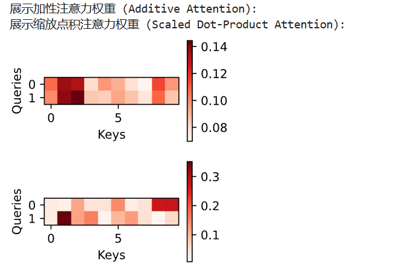

# 3. 注意力评分函数

不同注意力函数的不同注意力机制的差别就在于 评分函数的定义不同。

在章节2， 主要提供了： 高斯核的方法。 此外，实际上，还存在一些其他方法，点积和多层感知机的方法。

## 3.1 Mask 函数

这个主要是针对之前提到的特殊填充词，设计的函数。

```python

#@save
def masked_softmax(X, valid_lens):
    """通过在最后一个轴上掩蔽元素来执行softmax操作"""
    # X:3D张量，valid_lens:1D或2D张量
    if valid_lens is None:
        return nn.functional.softmax(X, dim=-1)
    else:
        shape = X.shape
        if valid_lens.dim() == 1: # 如果是一个维度，代表只是针对一个queery
            valid_lens = torch.repeat_interleave(valid_lens, shape[1])
        else:
            valid_lens = valid_lens.reshape(-1) 

        # 最后一轴上被掩蔽的元素使用一个非常大的负值替换，从而其softmax输出为0

        X = d2l.sequence_mask(X.reshape(-1, shape[-1]), valid_lens,
                              value=-1e6)
        return nn.functional.softmax(X.reshape(shape), dim=-1)
```

下面以一个例子进行简单说明：

```python
X = [
  [  # batch 0
    [1.0, 2.0, 3.0, 4.0],   # query 0
    [2.0, 1.0, 0.0, -1.0]   # query 1
  ],
  [  # batch 1
    [0.0, 1.0, 2.0, 3.0],   # query 0
    [3.0, 2.0, 1.0, 0.0]    # query 1
  ]
]

valid_lens = torch.tensor([2, 3])

batch0 有效 key 数 = 2 → 后面 2 个 key 都要被 mask

batch1 有效 key 数 = 3 → 只 mask 最后 1 个 key

valid_lens = [2, 3]  

repeat → [2, 2, 3, 3] 

batch0 有 2 个 query → 各自都用 valid_len = 2

batch1 有 2 个 query → 各自都用 valid_len = 3

X.reshape(-1, 4) 得到 4 行（因为 2×2=4），每行 4 个 key：
Row0: [1.0, 2.0, 3.0, 4.0]   # batch0-query0
Row1: [2.0, 1.0, 0.0, -1.0]  # batch0-query1
Row2: [0.0, 1.0, 2.0, 3.0]   # batch1-query0
Row3: [3.0, 2.0, 1.0, 0.0]   # batch1-query1

对应的valid_len

Row0 → 2 : [1.0, 2.0, -1e6, -1e6]
Row1 → 2 : [2.0, 1.0, -1e6, -1e6]
Row2 → 3 : [0.0, 1.0, 2.0, -1e6]
Row3 → 3 : [3.0, 2.0, 1.0, -1e6]

最后采用归一化就是softmax 进行使用

```

## 3.2 加性注意力

加性注意力也被称为bahdanau 注意力，其核心是处理查询（Query）和键（Key）的向量维度不一致的情况，相比较之下，点积注意力通常要求两者维度相同。本质来说，上是让神经网络自己“学习”如何计算两个向量的相似度，而不是像点积注意力那样直接通过几何性质（点积）来计算。
数学公式：

$$a(\mathbf{q}, \mathbf{k}) = \mathbf{w}_v^\top \tanh(\mathbf{W}_q \mathbf{q} + \mathbf{W}_k \mathbf{k})$$

$\mathbf{q} \in \mathbb{R}^{d_q}$：查询向量（Query），长度为 $d_q$。
$\mathbf{k} \in \mathbb{R}^{d_k}$：键向量（Key），长度为 $d_k$。

$\mathbf{W}_q \in \mathbb{R}^{h \times d_q}$：将查询向量映射到隐藏层维度 $h$ 的权重矩阵。

$\mathbf{W}_k \in \mathbb{R}^{h \times d_k}$：将键向量映射到隐藏层维度 $h$ 的权重矩阵。

$\mathbf{w}_v \in \mathbb{R}^{h}$：将隐藏层输出映射回标量评分的权重向量

由于两者的长度不一样，因此，通过一个线性层映射

```python

#@save
class AdditiveAttention(nn.Module):
    """加性注意力"""
    def __init__(self, key_size, query_size, num_hiddens, dropout, **kwargs):

        super(AdditiveAttention, self).__init__(**kwargs)

        self.W_k = nn.Linear(key_size, num_hiddens, bias=False)

        self.W_q = nn.Linear(query_size, num_hiddens, bias=False)

        self.w_v = nn.Linear(num_hiddens, 1, bias=False)

        self.dropout = nn.Dropout(dropout)

    def forward(self, queries, keys, values, valid_lens):
        queries, keys = self.W_q(queries), self.W_k(keys)
        # 在维度扩展后，

        # queries的形状：(batch_size，查询的个数，1，num_hidden)

        # key的形状：(batch_size，1，“键－值”对的个数，num_hiddens)

        # 使用广播方式进行求和, 我们需要计算每一个查询和每一个键之间的分数
        
        features = queries.unsqueeze(2) + keys.unsqueeze(1)

        # (B, m, 1, h) +   (B, 1, n, h),
        
        # 维度 1 上的 $m$ 会被复制 $n$ 次，维度 2 上的 $n$ 会被复制 $m$ 次。

        # 最终的维度是(B, m, n, h)
        
        features = torch.tanh(features)
        
        # self.w_v仅有一个输出，因此从形状中移除最后那个维度。
        # scores的形状：(batch_size，查询的个数，“键-值”对的个数)
        scores = self.w_v(features).squeeze(-1)

        self.attention_weights = masked_softmax(scores, valid_lens)
        # values的形状：(batch_size，“键－值”对的个数，值的维度)
        return torch.bmm(self.dropout(self.attention_weights), values)
        '''
        Weights: $(B, m, n)$Values: $(B, n, v)$Output: $(B, m, v)$
        加权求和
        '''

```

这里会考虑一下维度计算： 
---
$B$ = Batch Size (批量大小)
$m$ = Query 的个数 (查询序列长度)
$n$ = Key/Value 的个数 (键值对序列长度)
$d_q$ = Query 的原始维度
$d_k$ = Key 的原始维度
$h$ = num_hiddens (中间隐藏层维度)$v$ = Value 的维度


输入 queries: $(B, m, d_q)$

输入 keys: $(B, n, d_k)$

操作: 简单的线性变换（矩阵乘法）

输出 queries: $(B, m, h)$

输出 keys: $(B, n, h)$

升维： 

变身前: $(B, m, h)$ q

变身后: $(B, m, \mathbf{1}, h)$ q 会被复制 $n$ 次

变身前: $(B, n, h)$ k

变身后: $(B, \mathbf{1}, n, h)$ k 会被复制 $m$ 次

广播加法 (+) :  $(B, m, n, h)$ 

这是一个 4D 张量。对于 Batch 中的每个样本，我们得到了一个 $m \times n$ 的网格，网格中的每一个点 $(i, j)$ 都是一个长度为 $h$ 的向量，代表第 $i$ 个 Query 和第 $j$ 个 Key 混合后的特征。

---


## 3.3 缩放点积注意力

点积公式为：$x = \mathbf{q} \cdot \mathbf{k} = \sum_{i=1}^d q_i k_i$

根据统计学规律：均值：$E[x] = 0， 
 $方差：$Var(x) = \sum_{i=1}^d Var(q_i k_i) = \sum_{i=1}^d 1 = d$

 随着向量维度 $d$ 的增加，点积结果的方差会变大

这会导致Softmax 梯度消失， 反向传播时梯度传不回去，模型无法训练。

因此，为了避免这种问题，采用缩放机制：

为了让输入 Softmax 的数值保持在一个比较好的范围（方差为 1），我们将点积结果除以 $\sqrt{d}$：

$$Var(\frac{\mathbf{q} \cdot \mathbf{k}}{\sqrt{d}}) = \frac{1}{(\sqrt{d})^2} \cdot Var(\mathbf{q} \cdot \mathbf{k}) = \frac{1}{d} \cdot d = 1$$

说白了，点积注意力的计算速度很快。

```python
#@save
class DotProductAttention(nn.Module):
    """缩放点积注意力"""

    # nn.Linear

    # 这里没有定义所谓的维度，这意味着输入的 queries, keys, values 必须已经被投影到了合适的维度。


    def __init__(self, dropout, **kwargs):

        super(DotProductAttention, self).__init__(**kwargs)

        self.dropout = nn.Dropout(dropout)

    # queries的形状：(batch_size，查询的个数，d)

    # keys的形状：(batch_size，“键－值”对的个数，d)

    # values的形状：(batch_size，“键－值”对的个数，值的维度)

    # valid_lens的形状:(batch_size，)或者(batch_size，查询的个数)

    def forward(self, queries, keys, values, valid_lens=None):
        d = queries.shape[-1] # 就是其queries 的长度
        # 设置transpose_b=True为了交换keys的最后两个维度
        scores = torch.bmm(queries, keys.transpose(1,2)) / math.sqrt(d) 

        # 这个对应的其实是实际的公式推导

        self.attention_weights = masked_softmax(scores, valid_lens) # 计算损失 

        return torch.bmm(self.dropout(self.attention_weights), values)

```
queries :  $(B, m, d)$

keys  $(B, n, d)$

keys_T $(B, d, n)$

scores  $(B, m, n)$

weights  $(B, m, n)$

values  $(B, n, v)$

Output $(B, m, v)$

## 3.4 问题

### 3.4.1 修改小例子中的键，并且可视化注意力权重。可加性注意力和缩放的“点－积”注意力是否仍然产生相同的结果？为什么？

首先，针对绘图，它需要的基本格式：

第 1 维 (1): 行数 (Rows)。表示你想在画布上画几行图。这里是 1 行。

第 2 维 (1): 列数 (Cols)。表示你想在画布上画几列图。这里是 1 列。

第 3 维 (2): 查询数 (Height)。单张热力图的高度（Y轴数据的数量）。

第 4 维 (10): 键数 (Width)。单张热力图的宽度（X轴数据的数量）。

```python 
queries = torch.normal(0, 1, (1, 2, 20)) # (Batch, Q_num, Dim)
keys = torch.normal(0, 1, (1, 10, 20))   # (Batch, K_num, Dim)
values = torch.normal(0, 1, (1, 10, 20)) # Values
valid_lens = torch.tensor([10])          # 有效长度 10

# 2. 运行加性注意力
additive_net = AdditiveAttention(key_size=20, query_size=20, num_hiddens=8, dropout=0.1)
additive_net.eval()
additive_net(queries, keys, values, valid_lens)

print("展示加性注意力权重 (Additive Attention):")
# 使用你的代码
d2l.show_heatmaps(additive_net.attention_weights.reshape((1, 1, 2, 10)),
                  xlabel='Keys', ylabel='Queries')

# 3. 运行缩放点积注意力
dot_net = DotProductAttention(dropout=0.1)
dot_net.eval()
dot_net(queries, keys, values, valid_lens)

print("展示缩放点积注意力权重 (Scaled Dot-Product Attention):")
# 使用你的代码
d2l.show_heatmaps(dot_net.attention_weights.reshape((1, 1, 2, 10)),
                  xlabel='Keys', ylabel='Queries')

```




### 3.4.2 只使用矩阵乘法，能否为具有不同矢量长度的查询和键设计新的评分函数？

说白了，就是属于梯度

肯定是可以的，最早由2015年，Luong 提出的双线性注意力：

1. 数学公式与设计思路假设：查询向量 $\mathbf{q} \in \mathbb{R}^{d_q}$ （长度为 $d_q$）键向量 $\mathbf{k} \in \mathbb{R}^{d_k}$ （长度为 $d_k$）且 $d_q \neq d_k$。我们可以引入一个可学习的权重矩阵 $\mathbf{W} \in \mathbb{R}^{d_q \times d_k}$ 来充当“桥梁”或“适配器”。评分函数定义为：$$score(\mathbf{q}, \mathbf{k}) = \mathbf{q}^\top \mathbf{W} \mathbf{k}$$

2. 维度推演（证明它可行）让我们一步步检查维度，看看它是如何把两个不同长度的向量变成一个标量分数的：

第一步：线性投影计算 $\mathbf{q}^\top \mathbf{W}$。维度运算：$(1 \times d_q) \times (d_q \times d_k) \rightarrow (1 \times d_k)$

物理意义：这相当于把查询向量 $\mathbf{q}$ 投影到了键向量 $\mathbf{k}$ 的空间中。

第二步：点积匹配将上一步的结果与 $\mathbf{k}$ 相乘。维度运算：$(1 \times d_k) \times (d_k \times 1) \rightarrow (1 \times 1)$

结果：得到了一个标量评分。结论：通过插入一个中间矩阵 $\mathbf{W}$，我们成功地在不同维度的向量之间计算出了相似度，且全过程只使用了矩阵乘法。


### 3.4.3 当查询和键具有相同的矢量长度时，矢量求和作为评分函数是否比“点－积”更好？为什么？

不，矢量求和作为评分函数通常比“点－积”要差得多。

$$\text{Score} = \underbrace{\mathbf{w}^\top \mathbf{q}}_{\text{只与Q有关}} + \underbrace{\mathbf{w}^\top \mathbf{k}}_{\text{只与K有关}}$$

问题的关键是Q 和 K 没有关系，和联系，解耦。

尽管加性注意力也是：$$\mathbf{v}^\top \tanh(\mathbf{W}_q \mathbf{q} + \mathbf{W}_k \mathbf{k})$$

但是，具备非线性，打破解耦问题，学到非线性混合的关系。
