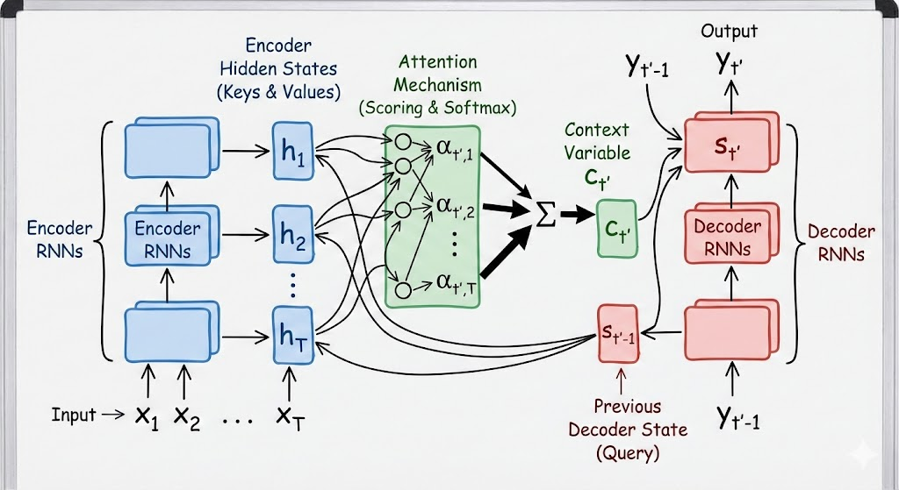

# 4. ahdanau 注意力

## 4.1 基本机制

传统 Seq2Seq 模型（Encoder-Decod在 9.7 节介绍的传统 Seq2Seq 模型（Encoder-Decoder）中，编码器必须把整个输入序列（无论多长）压缩成一个固定形状的向量（上下文变量 $c$）

基于此，上下文变量是一块固定的石头。不管翻译到句首还是句尾，用的都是这块石头，
新的模型提出使用可以改变的机制。

- Q queries： $s_{t'-1}$ 这是解码器上一个时间步的隐状态

- 键 (Key) & 值 (Value): $h_t$ 这是编码器对输入序列（源句z子）每个词产生的隐状态。

左边编码结构产生的隐藏状态就是 key and Value 值。

最终的公式就是


$$c_{t'} = \sum_{t=1}^{T} \alpha(s_{t'-1}, h_t) h_t$$

模型拿出解码器上一步的状态 $s_{t'-1}$ (Query)，去和编码器所有的状态 $h_1, h_2, ... h_T$ (Keys) 一一进行加性注意力计算，然后进行归一化。在去使用编码器的ht进行加权求和。



## 4.2 代码实践

解码器架构, 因为，编码器的架构不需要，只是最终出来的就是综合的隐藏状态的上下文向量。

```python

def __init__(self, ...):
    ...
    # 1. 定义注意力层（那双“眼睛”）
    self.attention = d2l.AdditiveAttention(...)
    
    # 2. 定义词嵌入层
    self.embedding = nn.Embedding(...)
    
    # 3. 定义循环神经网络 (GRU)
    # 这个属于解码其
    # ⚠️ 重点：输入维度是 embed_size + num_hiddens
    # 为什么？因为我们不仅输入当前的词向量(embed_size)，
    # 还要拼接上注意力算出来的上下文向量(num_hiddens)。
    self.rnn = nn.GRU(embed_size + num_hiddens, num_hiddens, ...)
    
    # 4. 输出层
    self.dense = nn.Linear(...)
```


```python
def __init__(self, vocab_size, embed_size, num_hiddens, num_layers, dropout=0, **kwargs):
    super(Seq2SeqAttentionDecoder, self).__init__(**kwargs)
    
    # 1.【眼睛】注意力层 (Additive Attention)
    # 用来计算 Query(解码器状态) 和 Key(编码器输出) 之间的关系
    self.attention = d2l.AdditiveAttention(
        num_hiddens, num_hiddens, num_hiddens, dropout)
    
    # 2.【词汇本】嵌入层
    # 将输入的单词索引 (index) 变成向量 (vector)
    self.embedding = nn.Embedding(vocab_size, embed_size)
    
    # 3.【大脑】RNN 单元 (GRU)
    # ⚠️ 关键细节：input_size = embed_size + num_hiddens
    # 因为输入不是光秃秃的“当前词”，而是“当前词 + 注意力上下文”拼接而成的。
    self.rnn = nn.GRU(
        embed_size + num_hiddens, num_hiddens, num_layers,
        dropout=dropout)
    
    # 4.【嘴巴】输出层
    # 将 RNN 的输出转化为词表大小的概率分布
    self.dense = nn.Linear(num_hiddens, vocab_size)
```
编码器的初始状态： 以及给后续的解码器件的初始状态

```python

def init_state(self, enc_outputs, enc_valid_lens, *args):
    # enc_outputs 是一个元组，包含：
    # outputs: 编码器每一步的输出 (作为 Key 和 Value)
    # hidden_state: 编码器最后一步的隐状态 (作为初始的 Query)
    outputs, hidden_state = enc_outputs
    
    # permute(1, 0, 2) 是为了调整维度顺序。
    # 原始 outputs 通常是 (batch, steps, hidden)，这里调整是为了配合后续计算或存储习惯。
    # 返回这三个东西，它们会被打包成一个叫 `state` 的变量传给 forward。
    return (outputs.permute(1, 0, 2), hidden_state, enc_valid_lens)

```
数据流的核心，由于这里的细节较多，因此，先整理整体思路：

1. 编码器

输入： 原始的单词序列。

工作： 双向 RNN 读一遍句子。

产出（关键数据）：enc_outputs (Keys & Values)： 这是一个列表

2. 权重计算

发起查询 (Query)， 解码器当前的隐状态

注意力分数： Query (解码器状态) 会和 Keys (编码器输出 $h_1, h_2, h_3$) 逐个进行计算

生成上下文向量： $Context = 0.9 \times h_1 + 0.08 \times h_2 + 0.02 \times h_3$

3. 解码器：

拼接输入：这一步的输入词 $x$ +  $Context 

进行RNN运算

通过全连接层，预测出这一步的单词是法语的 "Je" (我)。


4. 总结

Encoder： 把句子变成一排 $h$ (Keys)。$\downarrow$Attention： 拿当前状态 (Query) 去找最匹配的 $h$，算出 Context。$\downarrow$Decoder： 把 Context 和输入拼起来，算出下一个字，并更新状态 (变成新的 Query)。$\downarrow$(回到第2步，周而复始)


```python
def forward(self, X, state):
    # 1. 解包状态
    # enc_outputs: 原文的所有信息 (Key & Value)
    # hidden_state: 上一步的记忆 (Query)
    # enc_valid_lens: 原文的有效长度 (告诉注意力机制不要看填充的 <pad>)
    enc_outputs, hidden_state, enc_valid_lens = state
    
    # 2. 准备输入
    # X 是目标序列（训练时的正确答案）。
    # permute(1, 0, 2) 把 X 变成 (num_steps, batch_size, embed_size)。
    # 这样我们在下面的 for 循环里，就能一步一步地拿出每个时间步的词。
    X = self.embedding(X).permute(1, 0, 2)
    
    outputs, self._attention_weights = [], []
    
    # --- 循环开始：每一个时间步 x ---
    for x in X:
        # x 代表当前输入的词向量。
        
        # A. 【准备查询 Query】
        # 也就是解码器当前的隐状态 hidden_state[-1]。
        # unsqueeze(dim=1) 是为了增加一个维度，变成 (batch, 1, hidden) 方便后续计算。

        # hidden_state[-1]：就是编码器的 RNN 最后一层的状态。

        # unsqueeze：增加一个维度，为了让矩阵形状匹配，方便后面做数学运算。

        query = torch.unsqueeze(hidden_state[-1], dim=1)
        
        # B. 【计算注意力 Context】 (回头看)
        # 用当前的 Query 去“扫描”所有的 enc_outputs。
        # context 就是扫描后得到的“重点摘要”。
        # 它的形状是 (batch, 1, num_hiddens)。
        context = self.attention(
            query, enc_outputs, enc_outputs, enc_valid_lens)
        
        # C. 【拼接 Concatenation】 (关键步骤!)
        # 把“重点摘要 context” 和 “当前词 x” 拼在一起。
        # x 先升维变成 (batch, 1, embed_size)。
        # cat(..., dim=-1) 把它们在最后一维连起来。
        # 结果 x 的形状变成了 (batch, 1, embed_size + num_hiddens)。
        x = torch.cat((context, torch.unsqueeze(x, dim=1)), dim=-1)
        
        # D. 【RNN 运算】 (思考)
        # 把这个拼好的超级向量喂给 RNN。
        # RNN 更新 hidden_state，并输出 out。
        out, hidden_state = self.rnn(x.permute(1, 0, 2), hidden_state)
        
        # E. 【记录】
        outputs.append(out)
        # 顺便把这一步的“注意力权重”存下来，用来画热力图。
        self._attention_weights.append(self.attention.attention_weights)
        
    # --- 循环结束 ---
    
    # 3. 整理输出
    # 把所有步的输出拼起来，通过全连接层，算出最终的单词概率。
    outputs = self.dense(torch.cat(outputs, dim=0))
    
    return outputs.permute(1, 0, 2), [enc_outputs, hidden_state, enc_valid_lens]

```

