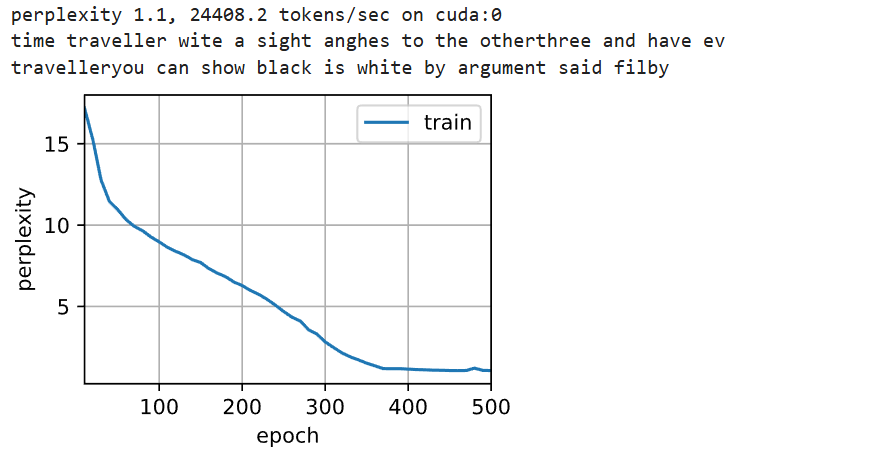
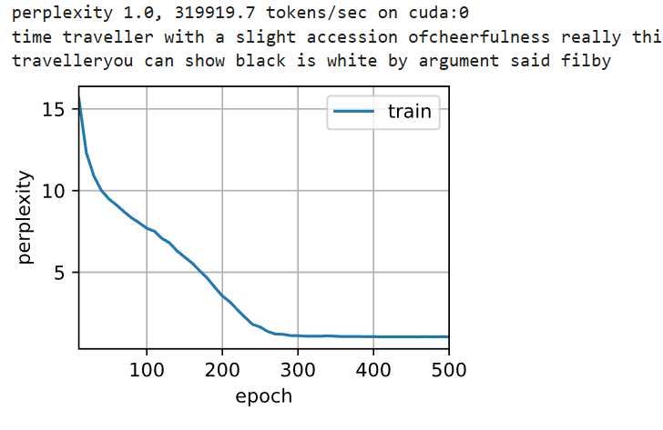
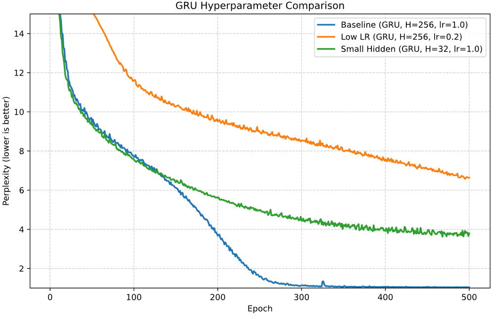
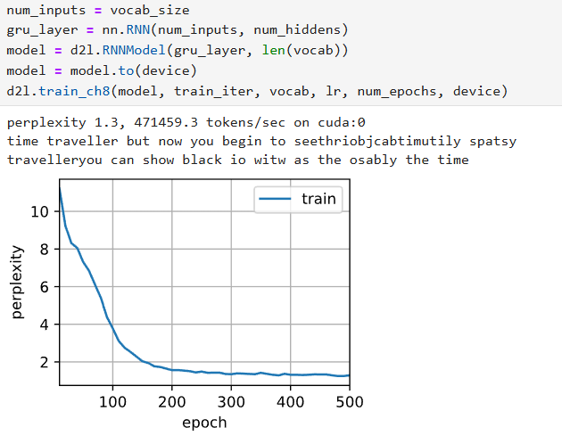
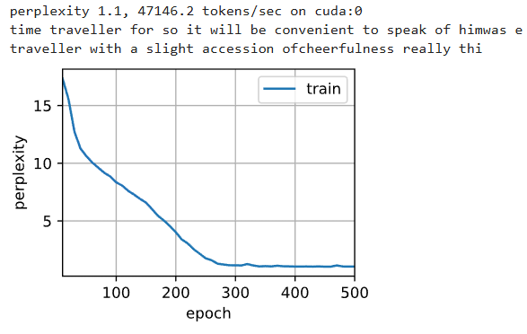
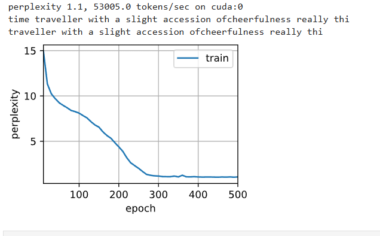

# 1. 门控循环单元（GRU）

## 1.1 问题

RNN的挑战：
1. 早期的观测值很重要
2. 某些词元不是很重要
3. 梯度消失和爆炸
4. 序列的不同部份的逻辑不一定对：

**章节一**：讲述了一个人物的童年经历，设定了故事背景。模型内部的隐状态 $H_{\text{old}}$ 此时充满了关于人物、地点、童年情绪等的信息。

**章节二**：故事发生时间跳转到二十年后，人物、地点、甚至主题都发生了巨大变化。

**逻辑中断**：章节一和章节二之间就是一次逻辑中断。需要快速遗忘或者快速接纳。

## 1.2 门机制

### 1.2.1 Gate

引入了两个Gates进行控制隐状态，一个叫重置门，一个叫更新门。


\[R_t = \sigma(X_t W_{xr} + H_{t-1} W_{hr} + b_r)\]

\[Z_t = \sigma(X_t W_{xz} + H_{t-1} W_{hz} + b_z)\]

总体来讲，和之前的状态的方程是一样的。

### 1.2.2 候选隐状态

$$\tilde{H}_t = \text{tanh}(X_t W_{xh} + (R_t \odot H_{t-1}) W_{hh} + b_h)$$

$\odot$ 是 Hadamard 积（按元素相乘）

重点就在于  $R_t \odot H_{t-1}$
$R_t$ 接近 $1$： $R_t \odot H_{t-1} \approx H_{t-1}$。模型行为类似于普通的 RNN，保留所有过去的隐状态信息。
$R_t$ 接近 $0$： $R_t \odot H_{t-1} \approx 0$。模型忽略了过去的隐状态 $H_{t-1}$ 的大部分信息。


### 1.2.3 最终隐状态

$$H_t = Z_t \odot H_{t-1} + (1 - Z_t) \odot \tilde{H}_t$$

$Z_t$ 接近 $1$： $H_t \approx 1 \odot H_{t-1} + 0 \odot \tilde{H}_t$。新状态 $H_t$ 倾向于保留旧状态 $H_{t-1}$，并忽略新计算的候选状态 $\tilde{H}_t$。这有助于信息长期传递。
$Z_t$ 接近 $0$： $H_t \approx 0 \odot H_{t-1} + 1 \odot \tilde{H}_t$。新状态 $H_t$ 倾向于采纳候选状态 $\tilde{H}_t$，并忽略旧状态 $H_{t-1}$。这相当于重置了状态，用于应对逻辑中断。


### 1.2.4 整体思路梳理

$$h_t = h_{t-1} W_{h} + x_t W_{x}$$ 

希望下一代的模块，能够克服上述提到的挑战以及长期依赖。

模型能够选择性地忽略某些不重要的信息，引入了重置门


$$\tilde{H}_t = \text{tanh}(X_t W_{xh} + \underbrace{(R_t \odot H_{t-1})}_{\text{重置后的旧状态}} W_{hh} + b_h)$$

当 $R_t$ 接近 $\mathbf{0}$ 时： $(R_t \odot H_{t-1}) \to \mathbf{0}$。这意味着，旧状态 $H_{t-1}$ 对 $\tilde{H}_t$ 的影响被完全清除了。此时 $\tilde{H}_t$ 的计算几乎完全依赖于当前输入 $X_t$。

为了针对长期，跳过 $X_t$，并保持 $H_{t-1}$ 中的长期信息不变：

$$H_t = Z_t \odot H_{t-1} + (1 - Z_t) \odot \tilde{H}_t$$

**逻辑分析**：
- **目标**：保持 $H_t \approx H_{t-1}$，即让长期记忆接管。
- **门控设置**：模型会学习设置 $Z_t$ 接近 $\mathbf{1}$。
- **结果**：$H_t \approx \mathbf{1} \odot H_{t-1} + \mathbf{0} \odot \tilde{H}_t \approx H_{t-1}$。


# 2. 代码实践

```python
import torch
from torch import nn
from d2l import torch as d2l

batch_size, num_steps = 32, 35
train_iter, vocab = d2l.load_data_time_machine(batch_size, num_steps)
```
GRU 输入与参数维度推导在开始编写模型代码之前，我们需要明确输入数据的形状以及 GRU 层中各个权重和偏置参数的维度。1. 输入数据的维度输入张量的整体形状为：$(N, T_{\text{max}}, V)$$N$：批次大小（batch size）$T_{\text{max}}$：窗口大小（序列长度）$V$：输入维度（词向量或词表大小）多个窗口组成完整序列，通过批次训练，每次的训练固定为若干窗口。2. 时间步与输入向量取某个时间步 $t$：$$\mathbf{X}_t = \mathbf{X}_{\text{batch}}[:, t, :]
$$此时 $\mathbf{X}_t$ 的维度是 $(N, V)$，对应一个时间步的输入（即一个词）。

- GRU 各部分参数与维度推导**

假设隐藏单元个数为 $H$。

- 更新门（Update Gate）**

$$\mathbf{Z}*t = \sigma(\mathbf{X}*t \mathbf{W}*{xz} + \mathbf{H}*{t-1} \mathbf{W}\_{hz} + \mathbf{b}\_z)
$$要求 $\mathbf{Z}_t$ 的维度为 $(N, H)$。
推导：

  * $\mathbf{X}_t \mathbf{W}_{xz}$：$(N, V) \times (V, H) \rightarrow (N, H)$
  * $\mathbf{H}_{t-1} \mathbf{W}_{hz}$：$(N, H) \times (H, H) \rightarrow (N, H)$

结论：$\mathbf{W}_{xz}$ 维度为 $(V, H)$，$\mathbf{W}_{hz}$ 维度为 $(H, H)$，$\mathbf{b}_z$ 维度为 $(H)$。

- 重置门（Reset Gate）
$$\mathbf{R}t = \sigma(\mathbf{X}t \mathbf{W}{xr} + \mathbf{H}{t-1} \mathbf{W}{hr} + \mathbf{b}r)$$要求 $\mathbf{R}_t$ 的维度为 $(N, H)$。结论：$\mathbf{W}{xr}$ 维度为 $(V, H)$，$\mathbf{W}{hr}$ 维度为 $(H, H)$，$\mathbf{b}_r$ 维度为 $(H)$。3.3 候选隐藏状态（Candidate Hidden State）$$\tilde{\mathbf{H}}t = \tanh(\mathbf{X}t \mathbf{W}{xh} + (\mathbf{R}t \odot \mathbf{H}{t-1}) \mathbf{W}{hh} + \mathbf{b}_h)$$分析：$(\mathbf{R}_t \odot \mathbf{H}_{t-1})$ 维度为 $(N, H)$，与 $\mathbf{W}_{hh}$ (维度 $(H, H)$) 相乘得到 $(N, H)$。结论：$\mathbf{W}_{xh}$ 维度为 $(V, H)$，$\mathbf{W}_{hh}$ 维度为 $(H, H)$，$\mathbf{b}_h$ 维度为 $(H)$。4. 输出层的维度推导最终输出 $\mathbf{Q}_t = \mathbf{H}_t \mathbf{W}_{hq} + \mathbf{b}_q$。其中 $\mathbf{H}_t$ 维度为 $(N, H)$，输出 $\mathbf{Q}_t$ 维度为 $(N, V)$。推导：$(N, H) \times (H, V) \rightarrow (N, V)$。结论：$\mathbf{W}_{hq}$ 维度为 $(H, V)$，$\mathbf{b}_q$ 维度为 $(V)$。

```python
def get_params(vocab_size, num_hiddens, device):
    """
    初始化 GRU 的模型参数
    :param vocab_size: 词表大小 (V)，同时也是输入和输出的维度
    :param num_hiddens: 隐藏层神经元数 (H)
    :param device: 计算设备
    :return: 包含所有可学习参数的列表
    """
    num_inputs = num_outputs = vocab_size

    def normal(shape):
        """返回从均值为0、标准差为0.01的正态分布中采样的随机张量"""
        return torch.randn(size=shape, device=device) * 0.01

    def three():
        """
        辅助函数：初始化一组 (W_x, W_h, b) 参数。
        GRU 有三个主要组件（更新门、重置门、候选状态），每个都需要这样一组参数。
        """
        return (normal((num_inputs, num_hiddens)),  # W_x: (V, H)
                normal((num_hiddens, num_hiddens)), # W_h: (H, H)
                torch.zeros(num_hiddens, device=device)) # b: (H)

    # 1. 初始化 GRU 核心参数
    W_xz, W_hz, b_z = three()  # 更新门参数
    W_xr, W_hr, b_r = three()  # 重置门参数
    W_xh, W_hh, b_h = three()  # 候选隐状态参数

    # 2. 初始化输出层参数
    # 将隐藏状态 H 转换为词表大小的预测输出 V
    W_hq = normal((num_hiddens, num_outputs))
    b_q = torch.zeros(num_outputs, device=device)

    # 3. 收集所有参数并开启梯度
    params = [W_xz, W_hz, b_z, W_xr, W_hr, b_r, W_xh, W_hh, b_h, W_hq, b_q]
    for param in params:
        param.requires_grad_(True)
        
    return params
```

隐藏层的状态：

$$(N, H) \times (H, H) \rightarrow (N, H)$$

```python
def init_gru_state(batch_size, num_hiddens, device):
    return (torch.zeros((batch_size, num_hiddens), device=device), )
```

有了基本的初始化和参数设置，构建每个循环单元 

```python
def gru(inputs, state, params):

    '''
    输入
    初始隐藏状态
    参数

    '''

    W_xz, W_hz, b_z, W_xr, W_hr, b_r, W_xh, W_hh, b_h, W_hq, b_q = params
    H, = state
    outputs = []
    for X in inputs: 提取每一个批次： 环每次提取一个时间步的数据 X，
    其形状为 (batch_size, vocab_size)。
        Z = torch.sigmoid((X @ W_xz) + (H @ W_hz) + b_z)
        R = torch.sigmoid((X @ W_xr) + (H @ W_hr) + b_r)
        H_tilda = torch.tanh((X @ W_xh) + ((R * H) @ W_hh) + b_h)

        PyTorch（以及 NumPy 3.5+）中，@ 运算符专门用于执行矩阵乘法

        H = Z * H + (1 - Z) * H_tilda
        Y = H @ W_hq + b_q
        outputs.append(Y)
    return torch.cat(outputs, dim=0), (H,)
    操作：torch.cat(..., dim=0) 沿着第 0 维（行）将这些张量拼接起来。

    tensor([[ 1.1,  1.2,  1.3 ],   <- 样本1 (t=1)
        [ 2.1,  2.2,  2.3 ]])  <- 样本2 (t=1)


    tensor([[ 3.1,  3.2,  3.3 ],   <- 样本1 (t=2)
        [ 4.1,  4.2,  4.3 ]])  <- 样本2 (t=2)    

    
    tensor([[ 1.1,  1.2,  1.3 ],   <- 样本1 (t=1)
        [ 2.1,  2.2,  2.3 ],   <- 样本2 (t=1)
        [ 3.1,  3.2,  3.3 ],   <- 样本1 (t=2)
        [ 4.1,  4.2,  4.3 ]])  <- 样本2 (t=2

```

```python
def gru(inputs, state, params):
    W_xz, W_hz, b_z, W_xr, W_hr, b_r, W_xh, W_hh, b_h, W_hq, b_q = params
    H, = state
    outputs = []
    for X in inputs:
        Z = torch.sigmoid((X @ W_xz) + (H @ W_hz) + b_z)
        R = torch.sigmoid((X @ W_xr) + (H @ W_hr) + b_r)
        H_tilda = torch.tanh((X @ W_xh) + ((R * H) @ W_hh) + b_h)
        H = Z * H + (1 - Z) * H_tilda
        Y = H @ W_hq + b_q
        outputs.append(Y)
    return torch.cat(outputs, dim=0), (H,)
        
```

定义基本参数，然后同样的模型开始跑，也就意味着，每个不同的模型，真正需要改变的是基础单元和模型的参数初始化，和维度

```python
vocab_size, num_hiddens, device = len(vocab), 256, d2l.try_gpu()
num_epochs, lr = 500, 1
model = d2l.RNNModelScratch(len(vocab), num_hiddens, device, get_params,
                            init_gru_state, gru)
d2l.train_ch8(model, train_iter, vocab, lr, num_epochs, device)
     
```
 


下面是简洁实现，速度更快：它将整个时间序列的计算下沉到了底层高度优化的 C++/CUDA 代码中执行，而极大减少了 Python 层面的开销和 GPU 内核启动次数

nn.GRU: 它使用了算子融合技术。它会将上述多个操作合并成极少数的几个大型 GPU 内核。

```python
num_inputs = vocab_size
gru_layer = nn.GRU(num_inputs, num_hiddens)
model = d2l.RNNModel(gru_layer, len(vocab))
model = model.to(device)
d2l.train_ch8(model, train_iter, vocab, lr, num_epochs, device)
     
```


# 3. 问题

#### 假设我们只想使用当前时间步的输入来预测下一步时间步的输出对于每个时间步，重置门和更新门的最佳值是什么？

仅使用当前时间步的输入 $X_t$ 来预测当前输出，这意味着我们需要完全忽略历史信息 $H_{t-1}$。

更新门 (Update Gate) $Z_t$ 应该趋近于 0。

重置门 (Reset Gate) $R_t$ 应该趋近于 0。

$$H_t = \tanh(\mathbf{X}_t \mathbf{W}_{xh} + \mathbf{b}_h)$$

就变成了仅仅取决于当前时间步


#### 调整和分析超参数对运行时间、困惑度和输出顺序的影响。

对比实验：

隐藏层单元数	num_hiddens	256, 32 等	决定“脑容量”。越大能记 住越复杂的信息，但更容易过拟合且计算更慢。
学习率	lr	1.0, 0.2 等	决定“学习步长”。太大容易训练震荡甚至崩溃（NaN），太小则收敛极慢。
训练轮数	num_epochs	200, 500 等	决定“学习时长”。太少欠拟合（还没学会），太多可能过拟合（死记硬背）。
批量大小	batch_size	32	决定“并行度”和梯度稳定性。越大训练越快（GPU利用率高），梯度估计越准确，但可能陷入局部最优。
时间步数	num_steps	35	决定“看多远”。即模型一次能往回看多少个词的历史。太短学不到长距离依赖，太长计算开销大且可能梯度衰减。


 

#### 比较rnn.RNN和rnn.GRU的不同实现对运行时间、困惑度和输出字符串的影响。




#### 如果仅仅实现门控循环单元的一部分，例如，只有一个重置门或一个更新门会怎样？


```python
import torch
from torch import nn
from d2l import torch as d2l

# --- 1. 数据加载 ---
batch_size, num_steps = 32, 35
train_iter, vocab = d2l.load_data_time_machine(batch_size, num_steps)

# --- 2. 初始化参数 (已去除更新门 Z 的参数) ---
def get_params(vocab_size, num_hiddens, device):
    num_inputs = num_outputs = vocab_size

    def normal(shape):
        return torch.randn(size=shape, device=device)*0.01

    def three():
        return (normal((num_inputs, num_hiddens)),
                normal((num_hiddens, num_hiddens)),
                torch.zeros(num_hiddens, device=device))

    # W_xz, W_hz, b_z = three()  # <--- 已删除：更新门参数 Z
    W_xr, W_hr, b_r = three()  # 重置门参数 R
    W_xh, W_hh, b_h = three()  # 候选隐状态参数 Tilde H
    
    # 输出层参数
    W_hq = normal((num_hiddens, num_outputs))
    b_q = torch.zeros(num_outputs, device=device)
    
    # 附加梯度
    params = [W_xr, W_hr, b_r, W_xh, W_hh, b_h, W_hq, b_q] # <--- 更新后的参数列表
    for param in params:
        param.requires_grad_(True)
    return params

# --- 3. 初始化隐藏状态 ---
def init_gru_state(batch_size, num_hiddens, device):
    return (torch.zeros((batch_size, num_hiddens), device=device), )

# --- 4. 定义 GRU 前向传播 (仅重置门) ---
def gru(inputs, state, params):
    W_xr, W_hr, b_r, W_xh, W_hh, b_h, W_hq, b_q = params # <--- 参数解包对应减少
    H, = state
    outputs = []
    for X in inputs:
        # 1. 不计算更新门 Z
        # Z = torch.sigmoid((X @ W_xz) + (H @ W_hz) + b_z)

        # 2. 计算重置门 R (保留)
        R = torch.sigmoid((X @ W_xr) + (H @ W_hr) + b_r)
        
        # 3. 计算候选隐状态 (保留 R 的作用)
        H_tilda = torch.tanh((X @ W_xh) + ((R * H) @ W_hh) + b_h)
        
        # 4. 核心修改：最终隐状态直接等于候选状态
        # H = Z * H + (1 - Z) * H_tilda  <--- 原公式
        H = H_tilda                     # <--- 新公式 (相当于 Z_t 恒为 0)
        
        # 计算输出
        Y = H @ W_hq + b_q
        outputs.append(Y)
    return torch.cat(outputs, dim=0), (H,)

# --- 5. 训练 ---
# 建议：由于梯度更容易消失，可能需要调整学习率或增加训练轮数来观察效果。
vocab_size, num_hiddens, device = len(vocab), 256, d2l.try_gpu()
num_epochs, lr = 500, 1.0
model = d2l.RNNModelScratch(len(vocab), num_hiddens, device, get_params,
                            init_gru_state, gru)
d2l.train_ch8(model, train_iter, vocab, lr, num_epochs, device)

```




```python
import torch
from torch import nn
from d2l import torch as d2l

# --- 1. 数据加载 ---
batch_size, num_steps = 32, 35
train_iter, vocab = d2l.load_data_time_machine(batch_size, num_steps)

# --- 2. 初始化参数 (已去除重置门 R 的参数) ---
def get_params(vocab_size, num_hiddens, device):
    num_inputs = num_outputs = vocab_size

    def normal(shape):
        return torch.randn(size=shape, device=device)*0.01

    def three():
        return (normal((num_inputs, num_hiddens)),
                normal((num_hiddens, num_hiddens)),
                torch.zeros(num_hiddens, device=device))

    W_xz, W_hz, b_z = three()  # 更新门参数 Z
    # W_xr, W_hr, b_r = three()  # <--- 已删除：重置门参数 R
    W_xh, W_hh, b_h = three()  # 候选隐状态参数 Tilde H
    
    # 输出层参数
    W_hq = normal((num_hiddens, num_outputs))
    b_q = torch.zeros(num_outputs, device=device)
    
    # 附加梯度
    # params = [W_xz, W_hz, b_z, W_xr, W_hr, b_r, W_xh, W_hh, b_h, W_hq, b_q]
    params = [W_xz, W_hz, b_z, W_xh, W_hh, b_h, W_hq, b_q] # <--- 更新后的参数列表
    for param in params:
        param.requires_grad_(True)
    return params

# --- 3. 初始化隐藏状态 ---
def init_gru_state(batch_size, num_hiddens, device):
    return (torch.zeros((batch_size, num_hiddens), device=device), )

# --- 4. 定义 GRU 前向传播 (仅更新门) ---
def gru(inputs, state, params):
    # W_xz, W_hz, b_z, W_xr, W_hr, b_r, W_xh, W_hh, b_h, W_hq, b_q = params
    W_xz, W_hz, b_z, W_xh, W_hh, b_h, W_hq, b_q = params # <--- 参数解包也要对应减少
    H, = state
    outputs = []
    for X in inputs:
        # 计算更新门
        Z = torch.sigmoid((X @ W_xz) + (H @ W_hz) + b_z)
        
        # --- 核心修改 ---
        # 1. 不计算重置门 R
        # R = torch.sigmoid((X @ W_xr) + (H @ W_hr) + b_r)
        # 2. 计算候选隐状态时，直接使用上一时刻的完整 H，不再乘以 R
        H_tilda = torch.tanh((X @ W_xh) + (H @ W_hh) + b_h)
        # ----------------
        
        # 计算最终隐状态 (加权平均)
        H = Z * H + (1 - Z) * H_tilda
        
        # 计算输出
        Y = H @ W_hq + b_q
        outputs.append(Y)
    return torch.cat(outputs, dim=0), (H,)

# --- 5. 训练 ---
vocab_size, num_hiddens, device = len(vocab), 256, d2l.try_gpu()
num_epochs, lr = 500, 1.0
model = d2l.RNNModelScratch(len(vocab), num_hiddens, device, get_params,
                            init_gru_state, gru)
d2l.train_ch8(model, train_iter, vocab, lr, num_epochs, device)

```
 