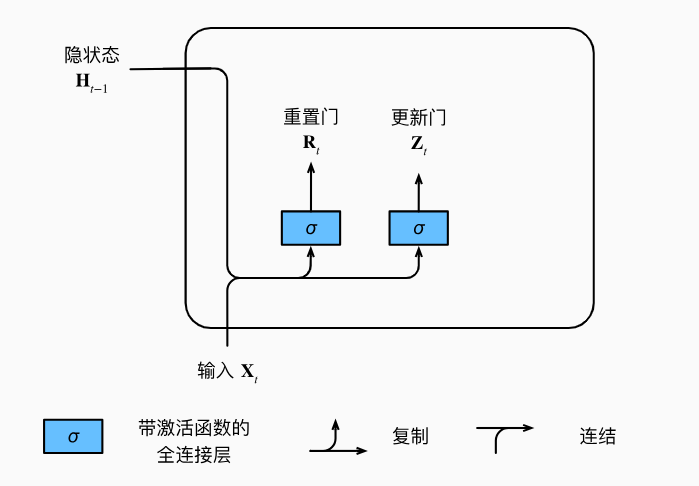
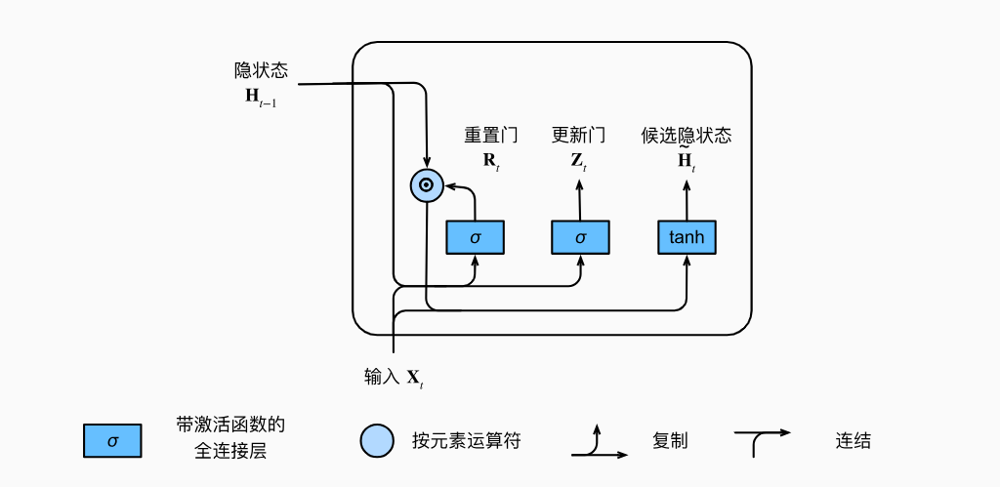
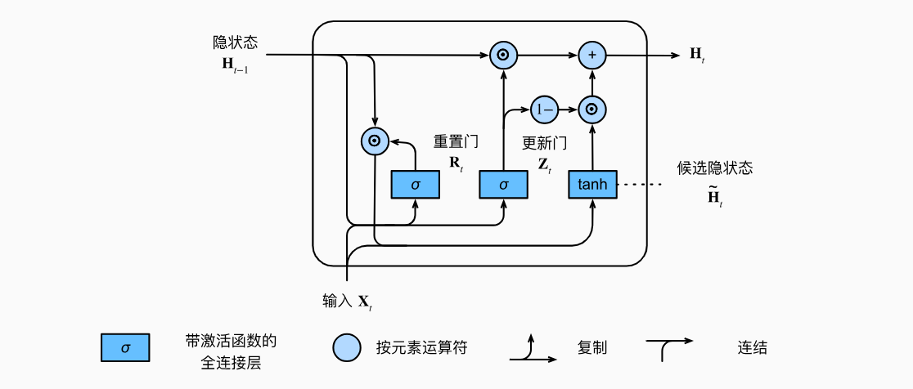

# 1. 门控循环单元（GRU）

## 1.1 问题

RNN的挑战：
1. 早期的观测值很重要
2. 某些词元不是很重要
3. 序列的不同部份的逻辑不一定对：

章节一： 讲述了一个人物的童年经历，设定了故事背景。模型内部的隐状态 $H_{\text{old}}$ 此时充满了关于人物、地点、童年情绪等的信息。章节二： 故事发生时间跳转到二十年后，人物、地点、甚至主题都发生了巨大变化。逻辑中断： 章节一和章节二之间就是一次逻辑中断。需要快速遗忘或者快速接纳。

## 1.2 门机制

### 1.2.1 Gate

引入了两个Gates进行控制隐状态，一个叫重置门，一个叫更新门。

\[R_t = \sigma(X_t W_{xr} + H_{t-1} W_{hr} + b_r)\]

\[Z_t = \sigma(X_t W_{xz} + H_{t-1} W_{hz} + b_z)\]

总体来讲，和之前的状态的方程是一样的。

### 1.2.2 候选隐状态

$$\tilde{H}_t = \text{tanh}(X_t W_{xh} + (R_t \odot H_{t-1}) W_{hh} + b_h)$$

$\odot$ 是 Hadamard 积（按元素相乘）

重点就在于  $R_t \odot H_{t-1}$
$R_t$ 接近 $1$： $R_t \odot H_{t-1} \approx H_{t-1}$。模型行为类似于普通的 RNN，保留所有过去的隐状态信息。
$R_t$ 接近 $0$： $R_t \odot H_{t-1} \approx 0$。模型忽略了过去的隐状态 $H_{t-1}$ 的大部分信息。

### 1.2.3 最终隐状态

$$H_t = Z_t \odot H_{t-1} + (1 - Z_t) \odot \tilde{H}_t$$

$Z_t$ 接近 $1$： $H_t \approx 1 \odot H_{t-1} + 0 \odot \tilde{H}_t$。新状态 $H_t$ 倾向于保留旧状态 $H_{t-1}$，并忽略新计算的候选状态 $\tilde{H}_t$。这有助于信息长期传递。
$Z_t$ 接近 $0$： $H_t \approx 0 \odot H_{t-1} + 1 \odot \tilde{H}_t$。新状态 $H_t$ 倾向于采纳候选状态 $\tilde{H}_t$，并忽略旧状态 $H_{t-1}$。这相当于重置了状态，用于应对逻辑中断。

