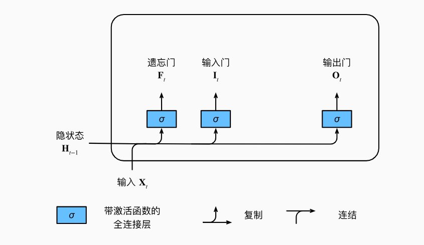
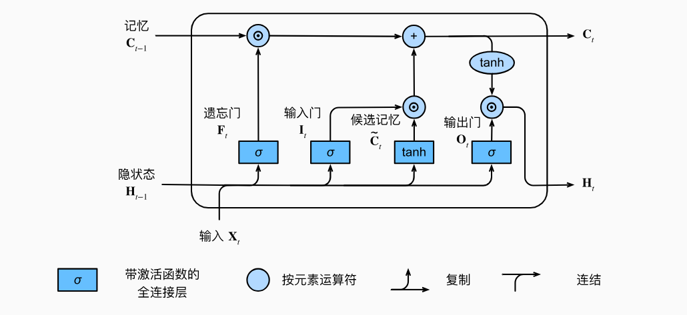

# 2. 长短期记忆网络（LSTM）

## 2.1 问题

隐变量模型始终存在长期信息保存和短期输入缺失问题。比GRU的设计早了快20年

它的总体设计有三个门，灵感来源于计算机的逻辑门。


## 2.2 设计



### 2.2.1 门


输入门（Input Gate）：决定何时将新数据读入记忆元。

遗忘门（Forget Gate）：决定何时重置/忽略记忆元中的旧内容。

输出门（Output Gate）：决定何时将记忆元的内容输出到隐状态。

这三个门（$I_t$, $F_t$, $O_t$）的计算方式类似，都使用 $Sigmoid$ 激活函数 ($\sigma$) 将值约束在 $(0, 1)$ 范围内，实现门控功能。

$$F_t = \sigma(X_t W_{xf} + H_{t-1} W_{hf} + b_f)$$

$$I_t = \sigma(X_t W_{xi} + H_{t-1} W_{hi} + b_i)$$

$$O_t = \sigma(X_t W_{xo} + H_{t-1} W_{ho} + b_o)$$


### 2.2.3 候选记忆门

候选记忆元 $\tilde{C}_t$ 代表了当前时间步可能添加到记忆元的新信息。它使用 $\tanh$ 激活函数，将值约束在 $(-1, 1)$ 范围内：$$\tilde{C}_t = \tanh(X_t W_{xc} + H_{t-1} W_{hc} + b_c)$$


### 2.2.4 记忆元


记忆元 $C_t$ 的更新是 LSTM 最核心的部分，它结合了旧记忆和新信息，并由遗忘门和输入门精确控制：$$C_t = F_t \odot C_{t-1} + I_t \odot \tilde{C}_t$$


遗忘门 ($F_t$) $\odot$ 旧记忆 ($C_{t-1}$): 决定保留多少过去的记忆元 $C_{t-1}$ 的内容。

如果 $F_t$ 接近 $1$，保留旧记忆；接近 $0$，遗忘旧记忆。

输入门 ($I_t$) $\odot$ 候选记忆元 ($\tilde{C}_t$): 决定采用多少来自新数据 $\tilde{C}_t$。

如果 $I_t$ 接近 $1$，完全采纳新信息；接近 $0$，忽略新信息。

这种机制使得信息可以长久地保存在记忆元中（如果 $F_t \approx 1$ 且 $I_t \approx 0$），有效缓解了传统 RNN 中的梯度消失问题，从而捕获长距离依赖关系。


### 2.2.4 记忆元

最终的隐状态 $H_t$ 是模型的输出之一:

$$H_t = O_t \odot \tanh(C_t)$$

输出门 ($O_t$): 决定将记忆元 $C_t$ 中的多少信息暴露给隐状态 $H_t$

如果 $O_t$ 接近 $1$，有效地将所有记忆信息传递给预测部分；接近 $0$，则隐状态几乎不包含记忆信息，只保留记忆元内部的信息。





### 2.2.5 总结

LSTM 的核心在于其**双轨机制**：一条用于存储**长期信息（记忆元 $C_t$）**，另一条用于处理**短期信息（隐状态 $H_t$）**。在每一个时间步，网络的目标是精确地控制这两种信息。

整个过程始于**接收输入**：当前时刻的输入 $X_t$ 和上一时刻的短期信息 $H_{t-1}$ 被送入网络，用于计算所有的“门”。

#### 1. 遗忘旧知识

流程首先遇到**遗忘门 ($F_t$)**。这个门充当一个过滤器，它基于当前的输入 $X_t$ 和 $H_{t-1}$，决定上一时刻的**长期记忆 $C_{t-1}$** 中哪些内容是**不再重要的**。遗忘门会生成一个 $0$ 到 $1$ 之间的数值向量，然后通过按元素相乘的方式，**选择性地保留** $C_{t-1}$ 中的信息。可以想象，这是对旧知识进行一次**清理**。

#### 2. 采纳新知识

清理完毕后，网络开始准备接收新信息。这需要两个步骤：
1.  首先，**候选记忆元 ($\tilde{C}_t$)** 基于 $X_t$ 和 $H_{t-1}$ 计算出所有**潜在的新知识**。
2.  紧接着，**输入门 ($I_t$)** 充当另一个过滤器，它决定 $\tilde{C}_t$ 中**哪些部分是值得采纳的**。只有当 $I_t$ 的值接近 $1$ 时，对应的 $\tilde{C}_t$ 元素才会被考虑写入长期记忆。

#### 3. 长期记忆的更新

至此，我们有了**经过过滤的旧记忆**（由 $F_t$ 控制的 $C_{t-1}$）和**经过过滤的新信息**（由 $I_t$ 控制的 $\tilde{C}_t$）。最新的**记忆元 $C_t$** 就是将这两部分**直接相加**得到。正是这种直接的加法更新机制，保证了信息和梯度能够相对完整地在时间步上流动，从而成功维护了长期依赖。

$$C_t = F_t \odot C_{t-1} + I_t \odot \tilde{C}_t$$

#### 4. 产生输出

最后，我们需要将更新后的**长期记忆 $C_t$** 转化为**短期输出 $H_t$**。这里由**输出门 ($O_t$)** 发挥作用。输出门决定了 $C_t$ 中的哪些信息应该被**公开**。网络首先对 $C_t$ 进行 $\text{tanh}$ 激活来规范化数值，然后用 $O_t$ 对其进行**按元素筛选**。最终的结果就是**隐状态 $H_t$**，它既是当前时间步的输出，也是下一个时间步的输入，继续参与下一轮的门控计算。

$$H_t = O_t \odot \tanh(C_t)$$

这个过程在每个时间步周而复始，使得 LSTM 能够高效地决定何时遗忘、何时输入、以及何时输出信息。


## 2.3 代码实践

```python

import torch
from torch import nn
from d2l import torch as d2l

batch_size, num_steps = 32, 35
train_iter, vocab = d2l.load_data_time_machine(batch_size, num_steps)

```

```python

def get_lstm_params(vocab_size, num_hiddens, device):
    num_inputs = num_outputs = vocab_size

    def normal(shape):
        return torch.randn(size=shape, device=device)*0.01

    def three():
        return (normal((num_inputs, num_hiddens)),
                normal((num_hiddens, num_hiddens)),
                torch.zeros(num_hiddens, device=device))

    W_xi, W_hi, b_i = three()  # 输入门参数
    W_xf, W_hf, b_f = three()  # 遗忘门参数
    W_xo, W_ho, b_o = three()  # 输出门参数
    W_xc, W_hc, b_c = three()  # 候选记忆元参数
    # 输出层参数
    W_hq = normal((num_hiddens, num_outputs))
    b_q = torch.zeros(num_outputs, device=device)
    # 附加梯度
    params = [W_xi, W_hi, b_i, W_xf, W_hf, b_f, W_xo, W_ho, b_o, W_xc, W_hc,
              b_c, W_hq, b_q]
    for param in params:
        param.requires_grad_(True)
    return params

```