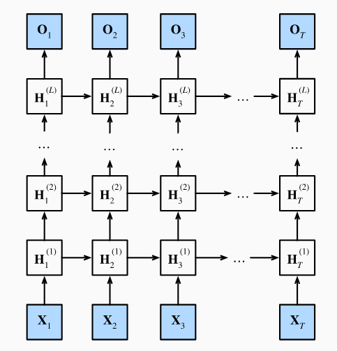
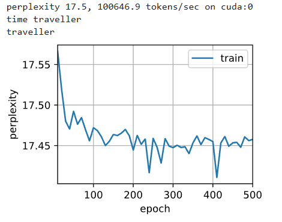
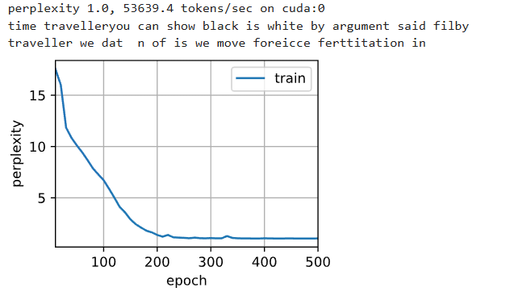

# 3. 深度循环神经网络

## 3.1 机制


之前讨论的只是单向隐藏层的循环神经网络，其中。隐变量和观测值的交互是随机的，这里就开始加入深层。




$$H_t^{(l)} = \phi_l(H_t^{(l-1)} W_{xh}^{(l)} + H_{t-1}^{(l)} W_{hh}^{(l)} + b_h^{(l)})$$

这里请看 H2（2） 作为一个案例，去解释:
 
1. 同一层，上一个时间步的状态继承

2. 上一层，相同时间步的状态继承

3. 这里


## 3.2 代码实践


```python

import torch
from torch import nn
from d2l import torch as d2l

batch_size, num_steps = 32, 35
train_iter, vocab = d2l.load_data_time_machine(batch_size, num_steps)

vocab_size, num_hiddens, num_layers = len(vocab), 256, 2
num_inputs = vocab_size
device = d2l.try_gpu()

# 这里可以看到，nn设计好的模型，有3个基本参数：

# 输入，隐藏层神经数，多少个隐藏层

lstm_layer = nn.LSTM(num_inputs, num_hiddens, num_layers)

model = d2l.RNNModel(lstm_layer, len(vocab))

# 输入层，输出层

# 这个全连接层负责将 LSTM 的隐藏状态（大小为 num_hiddens）转换为对应词汇表大小

model = model.to(device)

num_epochs, lr = 500, 2
d2l.train_ch8(model, train_iter, vocab, lr, num_epochs, device)

```

我这里设置的是 10层




## 3.3 问题

### 3.3.1 基于之前讨论使用的从0开始实现循环神经网络讨论的单层实现， 尝试从零开始实现两层循环神经网络。

理清思路：

1. 输入的数据是独热编码，维度是（batch_size, time_step, 
emdding_dim）

2. 参数初始化以及参数维度设计:

$$H_t^{(l)} = \phi_l(H_t^{(l-1)} W_{xh}^{(l)} + H_{t-1}^{(l)} W_{hh}^{(l)} + b_h^{(l)})$$

这里需要注意的是 $H_0$ 是 $X_t$

```python

%matplotlib inline
import math
import torch
from torch import nn
from torch.nn import functional as F
from d2l import torch as d2l

batch_size, num_steps = 32, 35
train_iter, vocab = d2l.load_data_time_machine(batch_size, num_steps)


def get_params(vocab_size, num_hiddens, device):
    num_inputs = num_outputs = vocab_size

    def normal(shape):
        return torch.randn(size=shape, device=device) * 0.01

    # 隐藏层参数
    W_xh = normal((num_inputs, num_hiddens))
    W_hh = normal((num_hiddens, num_hiddens))
    b_h = torch.zeros(num_hiddens, device=device)
    # 输出层参数
    W_hq = normal((num_hiddens, num_outputs))
    b_q = torch.zeros(num_outputs, device=device)
    # 附加梯度
    params = [W_xh, W_hh, b_h, W_hq, b_q]
    for param in params:
        param.requires_grad_(True)
    return params

def init_rnn_state(batch_size, num_hiddens, device):
    return (torch.zeros((batch_size, num_hiddens), device=device), )

```

这里需要重点设计有2层

错误代码： 未考虑到每一层需要单独的参数以及 需要处理水平和垂直的信息流

```python
def rnn(inputs, state, params):
    # inputs的形状：(时间步数量，批量大小，词表大小)
    W_xh, W_hh, b_h, W_hq, b_q = params
    H, = state
    outputs = []
    # X的形状：(批量大小，词表大小)
    for X in inputs:
        H_1 = torch.tanh(torch.mm(X, W_xh) + torch.mm(H, W_hh) + b_h)
        H_2 = torch.tanh(torch.mm(H_1, W_xh) + torch.mm(H, W_hh) + b_h)
        Y = torch.mm(H, W_hq) + b_q
        outputs.append(Y)
    return torch.cat(outputs, dim=0), (H,)
```

正确代码

```python
def get_rnn_params_deep(vocab_size, num_hiddens, device):
    num_inputs = num_outputs = vocab_size

    def normal(shape):
        return torch.randn(size=shape, device=device) * 0.01

    # --- 第一层参数 ---
    W_xh1 = normal((num_inputs, num_hiddens))
    W_hh1 = normal((num_hiddens, num_hiddens))
    b_h1 = torch.zeros(num_hiddens, device=device)
    
    # --- 第二层参数 ---
    # 第二层的“输入”是第一层的“输出”，所以维度是 (num_hiddens, num_hiddens)
    W_xh2 = normal((num_hiddens, num_hiddens))
    W_hh2 = normal((num_hiddens, num_hiddens))
    b_h2 = torch.zeros(num_hiddens, device=device)

    # --- 输出层参数 ---
    # 输出层的输入来自“最顶层”（第二层）
    W_hq = normal((num_hiddens, num_outputs))
    b_q = torch.zeros(num_outputs, device=device)

    # 附加梯度
    params = [W_xh1, W_hh1, b_h1, W_xh2, W_hh2, b_h2, W_hq, b_q]
    for param in params:
        param.requires_grad_(True)
    return params

def init_rnn_state_deep(batch_size, num_hiddens, device):
    # 返回一个元组，包含两个隐藏层的状态
    return (torch.zeros((batch_size, num_hiddens), device=device), 
            torch.zeros((batch_size, num_hiddens), device=device))


def rnn_2(inputs, state, params):
    # inputs 形状：(时间步数量，批量大小，词表大小)
    
    # 1. 解包两层的参数
    [W_xh1, W_hh1, b_h1, W_xh2, W_hh2, b_h2, W_hq, b_q] = params
    
    # 2. 解包两层的隐藏状态
    # (H1, H2) 是上一个时间步 (t-1) 的状态
    (H1, H2) = state
    
    outputs = []
    
    # X 形状：(批量大小，词表大小)
    for X in inputs:
        # --- 计算第一层 ---
        # H1_t = ϕ(X_t @ W_xh1 + H1_{t-1} @ W_hh1 + b_h1)
        H1 = torch.tanh(torch.mm(X, W_xh1) + torch.mm(H1, W_hh1) + b_h1)
        
        # --- 计算第二层 ---
        # H1（第一层的当前输出）作为 H2（第二层）的当前输入
        # H2_t = ϕ(H1_t @ W_xh2 + H2_{t-1} @ W_hh2 + b_h2)
        H2 = torch.tanh(torch.mm(H1, W_xh2) + torch.mm(H2, W_hh2) + b_h2)
        
        # --- 计算输出层 ---
        # 输出 Y 必须来自最顶层（H2）
        # Y_t = H2_t @ W_hq + b_q
        Y = torch.mm(H2, W_hq) + b_q
        outputs.append(Y)
        
    # 3. 返回所有时间步的输出，以及“最后”一个时间步的两个隐藏状态
    return torch.cat(outputs, dim=0), (H1, H2)

```

```python

# 加载数据
batch_size, num_steps = 32, 35
train_iter, vocab = d2l.load_data_time_machine(batch_size, num_steps)

# 设置超参数
vocab_size, num_hiddens, device = len(vocab), 256, d2l.try_gpu()
num_epochs, lr = 500, 1

# 使用我们新定义的函数
model = d2l.RNNModelScratch(len(vocab), num_hiddens, device, get_rnn_params_deep,
                            init_rnn_state_deep, rnn_deep)

# 开始训练
d2l.train_ch8(model, train_iter, vocab, lr, num_epochs, device)
```




### 3.3.2 在本节训练模型中，比较使用门控循环单元替换长短期记忆网络后模型的精确度和训练速度。


```python

import torch
from torch import nn
from d2l import torch as d2l

# --- 1. 加载数据 (假设 train_iter 和 vocab 已定义) ---
# batch_size, num_steps = 32, 35
# train_iter, vocab = d2l.load_data_time_machine(batch_size, num_steps)

# --- 2. 定义模型超参数 ---
vocab_size, num_hiddens, num_layers = len(vocab), 256, 2
device = d2l.try_gpu()

# --- 3. 修正 GRU 层的实例化 ---
# 签名：nn.GRU(input_size, hidden_size, num_layers)
GRU_layer = nn.GRU(vocab_size, num_hiddens, num_layers)

# --- 4. 封装模型并移至设备 ---
model = d2l.RNNModel(GRU_layer, len(vocab))
model = model.to(device)

# --- 5. 定义训练超参数并开始训练 ---
num_epochs, lr = 500, 2
print(f"开始在 {device} 上训练 GRU 模型...")
d2l.train_ch8(model, train_iter, vocab, lr, num_epochs, device)

```


 


### 3.3.3 如果增加训练数据，能够将困惑度降到多低？

我的理解是困惑度以及下降到了1.0， PPL 接近 1.0 意味着什么？ 意味着模型对下一个词的预测几乎是 100% 确定的。

它不太可能会在降低，是因为因为《时光机器》这个数据集太小了（大约只有 3 万个单词）。而是在**“死记硬背”**整个文本


### 3.3.4 在为文本建模时，是否可以将不同作者的源数据合并？有何优劣呢？

优点：

1. 极大地增加数据量
2. 提升模型的泛化能力
3. 学习更深层次的语言表示


缺点：

1. 这是最大的问题。如果您混合了莎士比亚、H.G.威尔斯和现代网络新闻的数据，模型学到的将是所有风格的**“平均值
2. 如果不同作者的数据源领域跨度太大（例如，一个是法律文书，另一个是奇幻小说），模型可能会“精神错乱”。
3. 如果您的高质量数据（如经典文学）与大量低质量数据（如充满拼写错误和网络俚语的论坛帖子）合并。