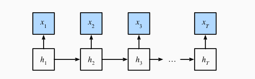
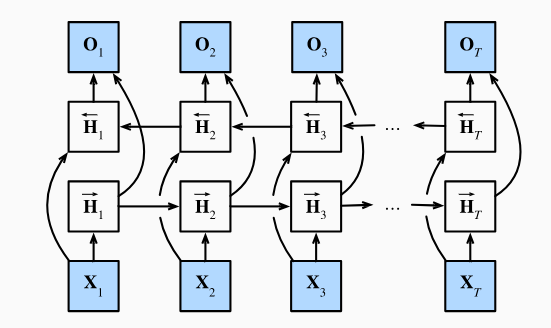
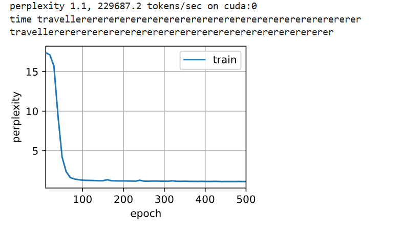
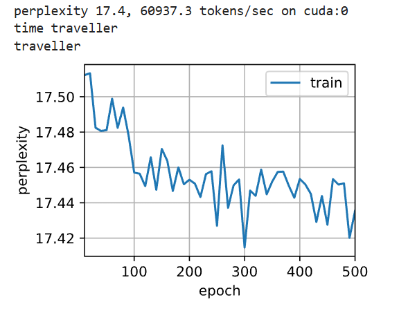

# 4. 双向循环神经网络

## 4.1 机制（隐马尔可夫模型中的动态规划）


为了预测“下一个输出”或解释观测序列，可以使用概率模型，其中 **隐马尔可夫模型（Hidden Markov Model, HMM）** 是经典方法。


例如：

1. **我___。**
2. **我___饿了。**
3. **我___饿了，我可以吃半头猪。**

随着上下文的增加，模型对空缺部分的预测会明显不同。这说明：

* 上下文决定预测分布
* 更多信息会改变模型判断
* 未来信息有时也会反向影响对过去的理解


HMM 假设观测序列由一组不可见的隐状态生成。

* **观测序列：**

\[X = (x_1, x_2, \ldots, x_T)\]

* **隐状态序列：**
  \[
  H = (h_1, h_2, \ldots, h_T)
  \]

 ### 4.1.1 核心假设

 



1. **马尔可夫性：**
   \[
   P(h_t | h_{1:t-1}) = P(h_t | h_{t-1})
   \]

2. **生成性：**
   \[
   P(x_t | h_{1:t}, x_{1:t-1}) = P(x_t | h_t)
   \]

其中一个典型任务是计算观测序列的总概率：

\[
P(X) = P(x_1, x_2, \ldots, x_T)
\]

因为隐藏状态不可见，需要对所有隐状态组合求和：

\[
P(X) = \sum_H P(X, H)
\]

但隐状态数为 (N) 时序列长度 (T)，可能路径为 (N^T)，直接计算不可行。


### 4.1.2 动态规划的精妙之处（DP 的本质）

动态规划（Dynamic Programming, DP）的核心思想是：**不要傻算所有可能路径，而是把中间结果保存下来并重复利用。**

以一个简单例子说明：假设有 **2 种骰子（正常 / 作弊）**，连续掷 **3 次**（即 (k=2, T=3)）。
“笨方法”会枚举所有 \(k^T = 2^3 = 8\) 条隐藏状态路径，如“正常-正常-正常”、“正常-正常-作弊”……一直到“作弊-作弊-作弊”，分别计算每条路径的概率，最后再相加。随着 (T) 增大，这些路径的数量变成 \(2^{100}\) 这种天文数字，几乎不可计算。

而动态规划的方法完全不同：它“逐步向前”，并在每一步把所有通向该步的路径**合并成有限个中间结果**——例如在第一步，只需记录两种情况的概率：
\[
\pi_1(\text{正常}),\quad \pi_1(\text{作弊})
\]
第二步想算“第二次是正常”的概率，只需把所有能到达“正常”的路径合并：
\[
\pi_2(\text{正常})
=\big[\pi_1(\text{正常}) P(\text{正→正}) + \pi_1(\text{作弊}) P(\text{骗→正})\big] P(x_2|\text{正常})
\]
同理可得 \(\pi_2(\text{作弊})\)。此时我们仍然只需记住两个数。
第三步重复相同的过程，得到 \(\pi_3(\text{正常})\) 与 \(\pi_3(\text{作弊})\)，最终总概率为：
\[
P(X) = \pi_3(\text{正常}) + \pi_3(\text{作弊})
\]

关键观察是：**原本 2×2×2=8 条路径的计算，被浓缩成每一步只维护 2 个中间结果。**
因此，计算量从指数级 \(k^T\) 变为线性级 \(T \times k^2\)。
例如 \(T=100, k=2\)：

* 暴力计算量：\(2^{100}\)（不可能）
* DP 计算量：\(100 \times 2^2 = 400\)（瞬间完成）

这就是动态规划在 HMM 中的精妙之处：**它把指数空间压缩成线性时间，通过不断“合并路径”，高效计算序列的整体概率。**

## 4.2 DP 算法讲解

前向传递算法：

$$\pi_t(h_t) = \sum_{h_{t-1}} \pi_{t-1}(h_{t-1}) \times P(h_t | h_{t-1}) \times P(x_t | h_t)$$

简化为：

$\pi_t = f(\pi_{t-1}, x_t)$

这跟 RNN 的前向传递来说是一样的。


反向递推 (从 $t+1$ $\to$ $t$):

后向 $\rho_t$ (在“银行”处)： 假设完整的句子是 "我今天在 [银行] 河边 散步"。$\rho_t$ 就是在问：“假设你现在在‘银行’，你未来会看到‘河边/散步’的概率有多大？”如果 $h_t=$ “河岸 (River Bank)”，那么未来看到“河边/散步”的概率很高。$\rho_t(\text{河岸})$ 的值就高。如果 $h_t=$ “银行 (Financial Bank)”，那么未来看到“河边/散步”的概率很低。$\rho_t(\text{银行})$ 的值就低。

初始化 (t=T)： $\rho_T = 1$ (在结尾处，未来没东西了，概率为1)

$$\rho_{t-1}(h_{t-1}) = \sum_{h_t} P(x_t | h_t) P(h_t | h_{t-1}) \rho_t(h_t)$$


## 4.3 结构设计





$$\overrightarrow{\mathbf{H}}_t = \phi(\mathbf{X}_t \mathbf{W}_{xh}^{(f)} + \overrightarrow{\mathbf{H}}_{t-1} \mathbf{W}_{hh}^{(f)} + \mathbf{b}_h^{(f)})
$$$\overrightarrow{\mathbf{H}}_t$：这是我们要计算的**“前向状态”**（$t$ 时刻对“过去”的总结）。
$\mathbf{X}_t$：这是 $t$ 时刻的当前输入（即“银行”这个词的向量）。
$\overrightarrow{\mathbf{H}}_{t-1}$：这是 $t-1$ 时刻的**“前向状态”**（即对“我今天在”的总结）。


$$\overleftarrow{\mathbf{H}}_t = \phi(\mathbf{X}_t \mathbf{W}_{xh}^{(b)} + \overleftarrow{\mathbf{H}}_{t+1} \mathbf{W}_{hh}^{(b)} + \mathbf{b}_h^{(b)})$$

是我们要计算的**“后向状态”**（$t$ 时刻对“未来”的总结）。
$\mathbf{X}_t$：这仍然是 $t$ 时刻的当前输入（“银行”）。
$\overleftarrow{\mathbf{H}}_{t+1}$：这是 $t+1$ 时刻的**“后向状态”**（即对“河边散步”的总结）。

最后，合并，进行输出。


$\mathbf{H}_t = [ \overrightarrow{\mathbf{H}}_t ; \overleftarrow{\mathbf{H}}_t ]$


$\mathbf{O}_t = \mathbf{H}_t \mathbf{W}_{hq} + \mathbf{b}_q$


## 4.4 总结

### 第1步：作者的“开场白”

基于基本的假设，一阶马尔可夫模型 和 隐状态的引入，借助联合概率密度和条件概率进行转化。

> “这一小节是用来说明动态规划问题的， 具体的技术细节对于理解深度学习模型并不重要， 但它有助于我们思考为什么要使用深度学习， 以及为什么要选择特定的架构。”

**（解释）**
作者在这里先“打了个招呼”。他说：
“我们接下来要讲的 HMM 和动态规划，不是深度学习的必修课，你跳过也能学会怎么用 RNN。

**但是**，如果你懂了它，你就会‘恍然大悟’：哦，原来循环神经网络 (RNN) 的‘循环’结构不是凭空想出来的，它的核心思想，在几十年前的统计学里就已经被发明了。”

---

### 第2步：介绍“传统方法” (HMM)

> “...可以设计一个隐变量模型...这个概率图模型就是一个隐马尔可夫模型（hidden Markov model，HMM）...”

**（解释）**
HMM 是什么？它就是一种用来给“序列”（比如一句话）建模的经典方法。

我们再次请出那个**“掷骰子”**的例子：
* **观测 ($x_t$)：** 你能看到的点数（比如 "1, 6, 2"）。
* **隐状态 ($h_t$)：** 你**看不见**的，庄家在用哪个骰子（比如 "正常, 正常, 作弊"）。

HMM 模型的核心就是两个**假设**：
1.  **转移：** 庄家这次用什么骰子 ($h_t$)，只取决于他上一次用了什么 ($h_{t-1}$)。
2.  **观测：** 庄家掷出什么点数 ($x_t$)，只取决于他这一次用了什么骰子 ($h_t$)。

---

### 第3步：HMM 遇到的“大麻烦”

> “...我们考虑对...所有可能的组合进行求和。如果任何...可以接受 $k$ 个不同的值...我们需要对 $k^T$ 个项求和，这个任务显然难于登天。”

**（解释）**
这就是我们之前讨论过的“**计算量爆炸**”问题。

* **目标：** 我们想计算 $P(X)$，也就是“观测到 (1, 6, 2) 这串序列”的总概率。
* **“笨”方法：** 为了算这个总概率，我们必须把**所有**“看不见”的骰子组合，全都列出来：
    1.  （正常-正常-正常）的概率
    2.  （正常-正常-作弊）的概率
    3.  （正常-作弊-正常）的概率
    4.  ...
    5.  （作弊-作弊-作弊）的概率
* **问题：** 如果有 $k=2$ 种骰子，序列长度 $T=3$，就有 $k^T = 2^3 = 8$ 种组合。
* **“难于登天”：** 这 8 种还好。但如果一句话有 $T=100$ 个词，每个词背后有 $k=10$ 种可能的隐状态（比如词性），那总组合数就是 $k^T = 10^{100}$。这是一个天文数字，计算机**绝对**算不完。

---

### 第4步：“巧妙的解决方案” (DP)

> “幸运的是，有个巧妙的解决方案：动态规划（dynamic programming）。”

**（解释）**
动态规划 (DP) 用“聪明”的办法，取代了“笨”办法。

* **“笨”办法：** 算 $k^T$ 条“完整路径”。
* **“聪明”的DP：** **一步一步算，并合并中间结果。**

它不关心 $t=100$ 时那一共 $k^{100}$ 条路径。它只这么算：
1.  **t=1 时：** 只算出 $k$ 个概率（“$t=1$ 是状态1的概率”、“$t=1$ 是状态2的概率”...）。
2.  **t=2 时：** **利用 $t=1$ 的 $k$ 个结果**，算出 $t=2$ 的 $k$ 个新概率。
3.  **t=3 时：** **利用 $t=2$ 的 $k$ 个结果**，算出 $t=3$ 的 $k$ 个新概率。
4.  ...
5.  **t=T 时：** 最终我们还是只得到 $k$ 个概率。

**关键：** 无论序列 $T$ 多长，我们在任何一步都**只维护 $k$ 个中间结果**。

这就把 $k^T$ 的“指数爆炸”，变成了 $T \times k^2$ 的“线性问题”。

原文提到的**前向递归 (Forward)** 和 **后向递归 (Backward)**，就是实现这种“聪明算法”的两种方式。

---

### 第5步：“最终目的”（HMM 和 RNN 的联系）

> "通常，我们将前向递归...写为：$\pi_{t+1} = f(\pi_t, x_t)$...这看起来就像我们在循环神经网络中讨论的隐变量模型中的更新方程。"
>
> "...后向递归也可以写为 $\rho_{t-1} = g(\rho_t, x_t)$...只是不像我们在循环神经网络中看到的那样前向运算，而是后向计算。"

**（解释）**
这就是作者的“图穷匕见”，揭示了他真正的目的：

1.  **HMM 的“前向递归” $\pi_t = f(\pi_{t-1}, x_t)$**
    * **含义：** “当前 $t$ 时刻的总结 ($\pi_t$)” = $f$ ( “上一步 $t-1$ 的总结 ($\pi_{t-1}$)”, “当前 $t$ 的观测 ($x_t$)” )
    * **类比：** 这和**标准RNN**的公式 $h_t = f(h_{t-1}, x_t)$ 在结构上**完全一样**！
    * **结论：** **标准RNN** $\approx$ HMM的**前向算法**。它们都在用一个“不断更新的状态”来**压缩“过去”的信息**。

2.  **HMM 的“后向递归” $\rho_{t-1} = g(\rho_t, x_t)$**
    * **含义：** “当前 $t-1$ 时刻对‘未来’的判断 ($\rho_{t-1}$)” = $g$ ( “下一步 $t$ 对‘未来’的判断 ($\rho_t$)”, “下一步 $t$ 的观测 ($x_t$)” )
    * **类比：** 这是一个**反向**运行的更新。它证明了“未来”的信息对判断“现在”很有用。
    * **结论：** 这个思想启发了**双向RNN (Bidirectional RNN)**。
    * **双向RNN = 1个前向RNN (学“过去”) + 1个后向RNN (学“未来”)**。这和HMM需要同时使用 $\pi_t$ (过去) 和 $\rho_t$ (未来) 来做最准确判断的思想，是完全一致的。


## 4.5 代码实践

在实际的模型当中，训练期间，我们能够利用过去和未来的数据来估计现在空缺的词； 而在测试期间，我们只有过去的数据，因此精度将会很差。 下面的实验将说明这一点。此外，网络的传播还依赖前向传播的结果，计算量也特别大。

```python
import torch
from torch import nn
from d2l import torch as d2l

# 加载数据
batch_size, num_steps, device = 32, 35, d2l.try_gpu()
train_iter, vocab = d2l.load_data_time_machine(batch_size, num_steps)
# 通过设置“bidirective=True”来定义双向LSTM模型
vocab_size, num_hiddens, num_layers = len(vocab), 256, 2
num_inputs = vocab_size
lstm_layer = nn.LSTM(num_inputs, num_hiddens, num_layers, bidirectional=True)
关键点在这个，设置双向循环神经网络 = True
model = d2l.RNNModel(lstm_layer, len(vocab))
model = model.to(device)
# 训练模型
num_epochs, lr = 500, 1
d2l.train_ch8(model, train_iter, vocab, lr, num_epochs, device)

```




## 4.6 问题

### 4.6.1 如果不同方向使用不同数量的隐藏单位，形状会发生怎样的变化？

实际上，针对的是隐藏单元数量：

前向 RNN 的隐藏单元数量为 $h_f$。反向 RNN 的隐藏单元数量为 $h_b$。

最终，$\mathbf{H}_t$ 的最终形状将是：\(n, h_f + h_b\) 


### 4.6.2 设计一个具有多个隐藏层的双向循环神经网络。

自己设计，有点过于麻烦，因此，我直接使用之前创建好的模块去设计


```python
import torch
from torch import nn
from d2l import torch as d2l

# 加载数据
batch_size, num_steps, device = 32, 35, d2l.try_gpu()
train_iter, vocab = d2l.load_data_time_machine(batch_size, num_steps)
# 通过设置“bidirective=True”来定义双向LSTM模型
vocab_size, num_hiddens, num_layers = len(vocab), 256, 2

重点修改这里的神经网络层数

num_inputs = vocab_size
lstm_layer = nn.LSTM(num_inputs, num_hiddens, num_layers, bidirectional=True)
model = d2l.RNNModel(lstm_layer, len(vocab))
model = model.to(device)
# 训练模型
num_epochs, lr = 500, 1
d2l.train_ch8(model, train_iter, vocab, lr, num_epochs, device)
```





### 4.6.3 静态词向量” (Static Embeddings) 进化到“上下文词向量” (Contextual Embeddings)

针对同一种单词，具备不同语义的环境。

旧方法： 词表是固定的。

新方法： 设计上下文词向量，BERT。

适合的模型： Transformer 架构是最合适的。