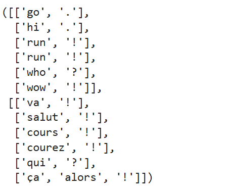
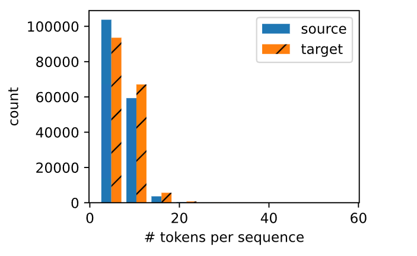
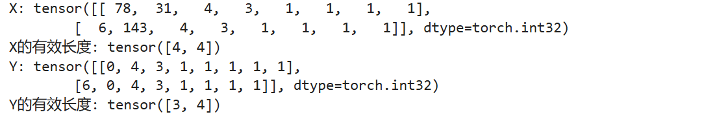

# 5. 机器翻译与数据集

## 5.1 语料库

首先，翻译有两种模型，一种是统计机器翻译，另外一种是神经机器翻译，这与单一语言的语言模型问题是不一样的，因此，需要重新创建预处理方法。

因为机器翻译不是做“单语言预测”，而是要从语言 A 输出语言 B。

- 数据集下载
- 预处理过程
- 词元化
- 生成词表
- 张量转化
- 集成函数

## 5.2 代码实践

```python
#@save
d2l.DATA_HUB['fra-eng'] = (d2l.DATA_URL + 'fra-eng.zip',
                           '94646ad1522d915e7b0f9296181140edcf86a4f5')

# D2L 中维护的 数据仓库索引，数据集名称 法语 - 英文

# 下载链接 + 文件校验和

def read_data_nmt():
    
    """载入“英语－法语”数据集"""

    data_dir = d2l.download_extract('fra-eng') 

    # 若本地没有 fra-eng 数据集 → 自动从 DATA_HUB 下载 fra-eng.zip

    # 返回解压后的目录路径（一般是 fra-eng 文件夹）
    
    with open(os.path.join(data_dir, 'fra.txt'), 'r',

             encoding='utf-8') as f:  # C:\path\to\data\fra.txt

        # 把多个路径片段组合成一个完整路径
        return f.read()

raw_text = read_data_nmt()

print(raw_text[:75])
```


```python

#@save

# 基于空格的词元化（Space-based Tokenization）

def tokenize_nmt(text, num_examples=None):
    
    """词元化“英语－法语”数据数据集"""

    source, target = [], []

    # source is 英语

    # target is 法语

    for i, line in enumerate(text.split('\n')):

      # 将整个文本按换行符分成每行一条平行语料，将很多行，给与编号，一行一行的处理
      
      # 一行包含一句英文和对应的法文

      # i is 对应的序号

        if num_examples and i > num_examples: 

        # 这是一个限制器，防止数值太大

            break
        
        # 在对每一行进行，切分处理成法语和英语

        parts = line.split('\t')

        # 它使用制表符（Tab, \t）进行切分。

        if len(parts) == 2:

            source.append(parts[0].split(' ')) 
            # 取出英文部分，按空格切分

            target.append(parts[1].split(' '))
            # 取出法文部分，按空格切分。

    return source, target

source, target = tokenize_nmt(text)

source[:6], target[:6]
```





```python
#@save
def show_list_len_pair_hist(legend, xlabel, ylabel, xlist, ylist):
    """绘制列表长度对的直方图"""
    d2l.set_figsize()

    # plt.hist 接收一个包含两个列表的列表
    # X轴 (xlabel) 每个句子包含的 Token 数量
    # Y轴 (ylabel 拥有该长度的句子出现的次数
    # plt.hist() 画直方图时，它会返回一个包含 3 个元素的元组：(n, bins, patches), _ 是一个惯用符号，表示 “我不关心这个变量” 或者 “丢弃这个值”

    _, _, patches = d2l.plt.hist(
        [[len(l) for l in xlist], [len(l) for l in ylist]])
    d2l.plt.xlabel(xlabel)
    d2l.plt.ylabel(ylabel)
    for patch in patches[1].patches: 
    # 因为输入了两个列表（source 和 target），patches[1] 指的是第二组数据（即 Target/法语）

        patch.set_hatch('/')

    d2l.plt.legend(legend)


show_list_len_pair_hist(['source', 'target'], '# tokens per sequence',
                        'count', source, target);
```




针对源语言和目标语言去构建两个词表。

```python
src_vocab = d2l.Vocab(source, min_freq=2,
                      reserved_tokens=['<pad>', '<bos>', '<eos>'])
len(src_vocab)
```

由于每个样本是由源和目标组成的文本序列对。截断（truncation）和 填充（padding）方式实现一次只处理一个小批量的文本序列。

意思是文本长了就截断，短了就加入pad

```python

#@save

def truncate_pad(line, num_steps, padding_token):

    """截断或填充文本序列"""

    if len(line) > num_steps:

        return line[:num_steps]  # 截断

    return line + [padding_token] * (num_steps - len(line)) 
    
    # 填充

truncate_pad(src_vocab[source[0]], 10, src_vocab['<pad>'])

# 把第一个源句子转换成 token ID 序列，并填充或截断到长度 10，使用 <pad> token 来补齐。
```

将一个文本序列列表转成：

固定长度的张量
每个序列的有效长度

```python

def build_array_nmt(lines, vocab, num_steps):


    """将机器翻译的文本序列转换成小批量"""

    lines = [vocab[l] for l in lines]
  
    # 将文本行转换为 token ID

    lines = [l + [vocab['<eos>']] for l in lines]
    
    # 每个序列末尾添加 <eos>（end of sequence）

    array = torch.tensor([truncate_pad(
        l, num_steps, vocab['<pad>']) for l in lines])

    # 对每个序列进行 truncate/pad（长度处理），计算每条序列的有效长度
    valid_len = (array != vocab['<pad>']).type(torch.int32).sum(1)
    
    # 就是计算每一条语句的长度是多少，将特殊的填充词汇进行删除
    # 这个比较会生成一个 布尔矩阵 : for this one.
    
    # array != pad_id 
    return array, valid_len
```

```python
#@save
def load_data_nmt(batch_size, num_steps, num_examples=600):

    """返回翻译数据集的迭代器和词表"""

    # 读取原始的双语文件

    text = preprocess_nmt(read_data_nmt())

    # 分词与采样

    source, target = tokenize_nmt(text, num_examples)

    # 词表构建

    src_vocab = d2l.Vocab(source, min_freq=2,
                          reserved_tokens=['<pad>', '<bos>', '<eos>'])
    tgt_vocab = d2l.Vocab(target, min_freq=2,
                          reserved_tokens=['<pad>', '<bos>', '<eos>'])

    # 将文本转化为张量

    src_array, src_valid_len = build_array_nmt(source, src_vocab, num_steps)

    tgt_array, tgt_valid_len = build_array_nmt(target, tgt_vocab, num_steps)

    # 创建小批量数据迭代器
 
    data_arrays = (src_array, src_valid_len, tgt_array, tgt_valid_len)

    data_iter = d2l.load_array(data_arrays, batch_size)

    return data_iter, src_vocab, tgt_vocab
```

```python

train_iter, src_vocab, tgt_vocab = load_data_nmt(batch_size=2, num_steps=8)
for X, X_valid_len, Y, Y_valid_len in train_iter:
    print('X:', X.type(torch.int32))
    print('X的有效长度:', X_valid_len)
    print('Y:', Y.type(torch.int32))
    print('Y的有效长度:', Y_valid_len)
    break
```




## 5.3 问题

### 5.3.1 在load_data_nmt函数中尝试不同的num_examples参数值。这对源语言和目标语言的词表大小有何影响？

词表（vocab）是根据读取到的文本进行“词频统计 + 去重”后生成的，主要会影响词表的大小


### 5.3.2 某些语言（例如中文和日语）的文本没有单词边界指示符（例如空格）。对于这种情况，单词级词元化仍然是个好主意吗？为什么？

从直觉上来看，这不是一个好主意，因为按照空格切分的话，中文是没有的，因为一句话就有可能被生成为一个单词，完全的错误