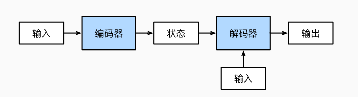

# 6. 编码器-解码器架构

## 6.1 机制

一个包含两个主要组件的架构： 第一个组件是一个编码器（encoder）： 它接受一个长度可变的序列作为输入， 并将其转换为具有固定形状的编码状态。 第二个组件是解码器（decoder）： 它将固定形状的编码状态映射到长度可变的序列。




## 6.2 代码实践

```python
from torch import nn


#@save
class Encoder(nn.Module):
    """编码器-解码器架构的基本编码器接口"""
    def __init__(self, **kwargs):
        super(Encoder, self).__init__(**kwargs)

    def forward(self, X, *args):
        raise NotImplementedError


#@save
class Decoder(nn.Module):
    """编码器-解码器架构的基本解码器接口"""
    def __init__(self, **kwargs):
        super(Decoder, self).__init__(**kwargs)

    def init_state(self, enc_outputs, *args):
        raise NotImplementedError

    def forward(self, X, state):
        raise NotImplementedError


#@save
class EncoderDecoder(nn.Module):
    """编码器-解码器架构的基类"""
    def __init__(self, encoder, decoder, **kwargs):
        super(EncoderDecoder, self).__init__(**kwargs)
        self.encoder = encoder
        self.decoder = decoder

    def forward(self, enc_X, dec_X, *args):
        enc_outputs = self.encoder(enc_X, *args)
        dec_state = self.decoder.init_state(enc_outputs, *args)
        return self.decoder(dec_X, dec_state)

```

下面是例子：

```python

class RNNEncoder(Encoder):
    def __init__(self, input_size, hidden_size):
        super().__init__()
        self.rnn = nn.RNN(input_size, hidden_size)

    def forward(self, X, hidden=None):
        output, hidden = self.rnn(X, hidden)
        return output, hidden

encoder = RNNEncoder(10, 20)

x = torch.randn(5, 3, 10)  # (seq_len, batch, input_size)

out, hidden = encoder(x)

```

## 6.3 问题

### 6.3.1 假设我们使用神经网络来实现“编码器－解码器”架构，那么编码器和解码器必须是同一类型的神经网络吗？

首先来讲，肯定不是的。

编码器：卷积神经网络（CNN）提取图像特征。

解码器：循环神经网络（RNN）生成文本描述。

重点是维度需要匹配。

### 6.3.2 除了机器翻译，还有其它可以适用于”编码器－解码器“架构的应用吗？

文本生成

图像与视觉任务

视频生成 / 视频预测

音频与语音任务

