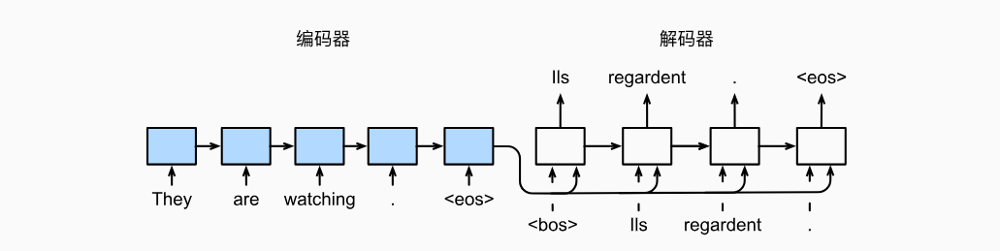
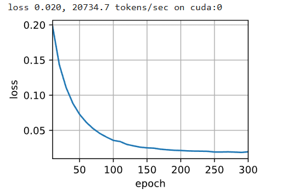
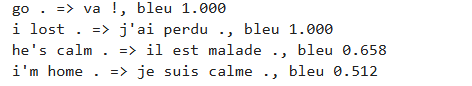
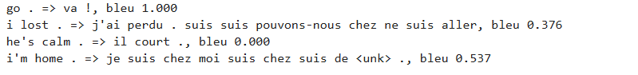
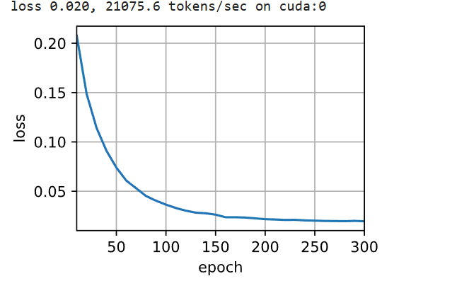
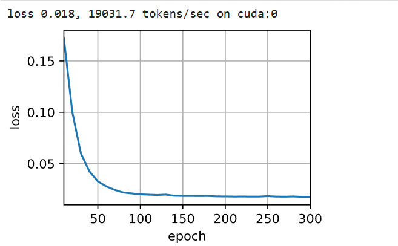
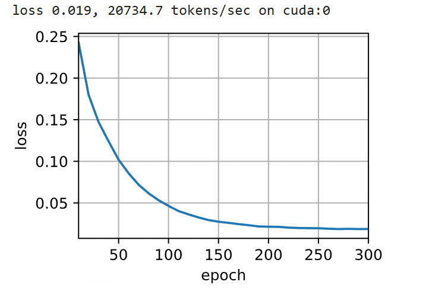

# 7. 序列到序列学习

## 7.1 机制

基于机器翻译中，输入和输出系列的长度是可变的。在上一节提出了编码的结构，然后应用到序列到序列的任务



## 7.2 编码器

所谓的编码器件，实际上就是RNN系列的输入和输出。

$N$: 批量大小 (Batch Size)
$T$: 时间步数 / 序列长度 (Number of Time Steps)
$V$: 词表大小 (Vocab Size)
$D$: 嵌入特征维度 (Embed Size)
$H$: 隐藏状态维度 (Hidden Size)

1. 输入序列 $X$ ： $(N, T)$

加入嵌入层： $(T, N, D)$

2. 循环层：

应该是从 X 取出的切片：$(N, D)$ ， $h_{t-1}$ (上一时间步隐状态):形状: $(N, H)$

$W_{xh}$ (输入到隐藏层): 形状 $(D, H)
$$W_{hh}$ (隐藏层到隐藏层): 形状 $(H, H)
$$b_h$ (偏置): 形状 $(H)$

$h_t$ 的形状为 $(N, H)$

3. 输出与上下文变量：

由于每个 $h_t$ 是 $(N, H)$，共有 $T$ 个，

Output 形状: $(T, N, H)$

通常情况下，上下文变量取的是最后一个变量，还要加上使用多层结构。

State 形状: $(L, N, H)$


## 7.3 解码器

这里就有一个很大的变化，或者说值得注意的就是将上下文进行拼接

$N$: 批量大小 (Batch Size)
$T$: 时间步数 / 序列长度 (Number of Time Steps)
$V$: 词表大小 (Vocab Size)
$D$: 嵌入特征维度 (Embed Size)
$H$: 隐藏状态维度 (Hidden Size)$L$

1. 当前时刻输入 ($y_{t'-1}$) ： $(N, D)$
2. 上下文变量 ($\mathbf{c}$)：  $(N, H)$
3. 进行拼接操作：$$(N, D) \oplus (N, H) \rightarrow (N, D + H)$$

这里稍微解释一下：拼接”通过矩阵运算

将当前维度的词嵌入向量与上下文向量结合，更好地预测。

等价于 $$\text{Output} = [W_x, W_c] \times \begin{bmatrix} x \\ c \end{bmatrix}$$

但是为了计算效率，做 一次 大矩阵乘法（拼接后的宽矩阵），比做 两次 小矩阵乘法再做一次加法，速度要快得多。

这里叫做特征融合

4. 输出层计算（全连接层）：

$$(N, H) \times (H, V') \rightarrow (N, V')$$

## 7.4 损失函数

### 7.4.1Mask演示：

假设：序列最大长度 maxlen = 3，即位置索引为 [0, 1, 2]。有 2 个样本，有效长度分别为 1 和 2。左边（位置索引）：它是一个 (1, 3) 的行向量，比较时会向下复制扩充：$$\begin{bmatrix} 0 & 1 & 2 \end{bmatrix} \xrightarrow{\text{广播}} \begin{bmatrix} 0 & 1 & 2 \\ 0 & 1 & 2 \end{bmatrix}$$右边（有效长度）：它是一个 (2, 1) 的列向量，比较时会向右复制扩充：$$\begin{bmatrix} 1 \\ 2 \end{bmatrix} \xrightarrow{\text{广播}} \begin{bmatrix} 1 & 1 & 1 \\ 2 & 2 & 2 \end{bmatrix}$$执行 < 运算：将上面两个矩阵对应位置进行对比：$$\begin{bmatrix} 0 & 1 & 2 \\ 0 & 1 & 2 \end{bmatrix} < \begin{bmatrix} 1 & 1 & 1 \\ 2 & 2 & 2 \end{bmatrix}$$第一行对比：$0 < 1$ ($\text{True}$)$1 < 1$ ($\text{False}$) $\rightarrow$ 超出长度 1，无效$2 < 1$ ($\text{False}$) $\rightarrow$ 超出长度 1，无效第二行对比：$0 < 2$ ($\text{True}$)$1 < 2$ ($\text{True}$)$2 < 2$ ($\text{False}$) $\rightarrow$ 超出长度 2，无效最终结果 (Mask)：$$\begin{bmatrix} \text{True} & \text{False} & \text{False} \\ \text{True} & \text{True} & \text{False} \end{bmatrix}$$

### 7.4.2 损失函数的Mask解释：

一个 Batch，包含 2 个样本，最大长度为 3

正确答案 (Labels):

样本 1（有效长度 3）：[A, B, C]

样本 2（有效长度 1）：[D, \<Pad>, \<Pad>]

的预测 (Preds)：

样本 1：预测 [A, B, F] （前两个对，第三个错）

样本 2：预测 [D, Z, X] （第一个对，后面两个瞎猜的，因为是凑数位）

有效长度 (valid_len)：[3, 1]


- PyTorch 的 CrossEntropyLoss(reduction='none') 会给每个位置打分。

样本 1：样本 1 原始 Loss 向量：[0.1, 0.1, 2.5]

样本 2：样本 2 原始 Loss 向量：[0.1, 5.0, 6.2] 

在样本2中，实际上是存在pad的，但是你如果不忽略，直接求平均的话，会有问题，

于是采用掩码的方法去处理这个问题：

根据 valid_len = [3, 1] 生成“免死金牌”：

样本 1 (长度3)：[1, 1, 1] （全都算分）

样本 2 (长度1)：[1, 0, 0] （只有第1个算分，后面免单），最终就做了正确的损失函数计算。


## 7.5 训练

这部份代码相对来说，有点复杂，会慢慢整理讲解。

1. 权重初始化
2. 数据加载
3. 前向传播
4. 损失计算
5. 反向传播
6. 梯度裁剪
7. 参数更新
8. 进行可视化

```python

#@save
def train_seq2seq(net, data_iter, lr, num_epochs, tgt_vocab, device):
    """
    输入参数说明：
    net:        网络基本架构
    data_iter:  数据加载器
    lr:         学习率
    tgt_vocab:  词表，用于转化
    num_epochs: 训练次数，迭代次数
    device:     设备
    """
    
    # ============================================================
    # 1. 模型初始化 (权重的准备)
    # ============================================================
    # 首先判断模型采用的哪一种网络
    # RNN 和 Seq2Seq 模型非常容易出现梯度消失或爆炸。使用 Xavier 初始化
    def xavier_init_weights(m):
        # m 代表一种网络层
        
        if type(m) == nn.Linear: # 处理全连接层
            nn.init.xavier_uniform_(m.weight)
            # 因为，全连接权重只是一个简单的 2D 矩阵 (out_features, in_features) | .weight 属性访问它
            # 通常来说，有2种情况，一是输入 → 隐藏层 ，二是隐藏层 → 输出词预测。

        # 针对其他层，存在很多层，每一层不是单个的参数
        if type(m) == nn.GRU: 
            # 注意下划线 _：在 PyTorch 中，函数名末尾带下划线表示 In-place 操作
            for param in m._flat_weights_names:
                # m._flat_weights_names 是一个列表，里面存的就是这些字符串名字： 
                # ['weight_ih_l0', 'weight_hh_l0', 'bias_ih_l0', ...]
                
                if "weight" in param: # 只想对权重矩阵（Weight Matrix）做 Xavier 初始化
                    nn.init.xavier_uniform_(m._parameters[param])
                    # m._parameters 是 PyTorch 模块底层存储参数的字典（OrderedDict）
                    # param 是字符串键

    net.apply(xavier_init_weights)

    net.to(device)
    
    # ============================================================
    # 2. 训练准备
    # ============================================================
    optimizer = torch.optim.Adam(net.parameters(), lr=lr)
    loss = MaskedSoftmaxCELoss()
    net.train()
    animator = d2l.Animator(xlabel='epoch', ylabel='loss',
                            xlim=[10, num_epochs])
                            
    # ============================================================
    # 3. 开始训练循环
    # ============================================================
    for epoch in range(num_epochs):
        timer = d2l.Timer()
        metric = d2l.Accumulator(2)  # 训练损失总和，词元数量
        
        for batch in data_iter:
            optimizer.zero_grad() # 默认会累积梯度, 残留的梯度清零
            
            X, X_valid_len, Y, Y_valid_len = [x.to(device) for x in batch] 
            # 必须搬到和模型一样的设备（GPU）上才能运算
            
            # -------------------------------------------------------
            # 构造强制教学输入 (Teacher Forcing) 的核心逻辑
            # -------------------------------------------------------
            # 1. 构造 <bos>
            # tgt_vocab['<bos>'] 是 0, Y.shape[0] 是 Batch Size 2
            # Python 列表乘法：[0] * 2 得到 [0, 0]
            # .reshape(-1, 1) (关键细节), 为了能够和二维矩阵拼接，必须把它变成列向量
            bos = torch.tensor([tgt_vocab['<bos>']] * Y.shape[0],
                               device=device).reshape(-1, 1)
            
            # 2. 构造 dec_input
            # Y[:, :-1], 取 Y 的所有行，但是丢掉最后一列
            # 因为最后一个词通常是 <eos>（结束符）或者填充符
            dec_input = torch.cat([bos, Y[:, :-1]], 1) 

            '''
            例子演示：
            Batch Size ($B$) = 2 （一次训练 2 句话）
            词表: <bos>=0, i=1, love=2, you=3, <eos>=4
            
            原始数据 Y: 
              "i love you <eos>" ---> [1, 2, 3, 4]
              "love you <eos>"   ----> [2, 3, 4, 0]
            
            切片后的 Y[:, :-1]:
              [1, 2, 3]     # i love you
              [2, 3, 4]     # love you <eos>

            拼接后的 dec_input:
              tensor([
                [0, 1, 2, 3],  # <bos> i love you
                [0, 2, 3, 4]   # <bos> love you <eos>
              ])

            Why should be this (逻辑含义): 
            时间步 (Step) | 输入给 Decoder (dec_input) | 期望 Decoder 输出 (Y) | 逻辑含义
            Step 1        | 0 (<bos>)                 | 1 (i)                | 看到开始信号，预测第一个词
            Step 2        | 1 (i)                     | 2 (love)             | 看到"i"，预测"love"
            Step 3        | 2 (love)                  | 3 (you)              | 看到"love"，预测"you"
            Step 4        | 3 (you)                   | 4 (<eos>)            | 看到"you"，预测结束
            '''
            
            # -------------------------------------------------------
            # 前向传播与损失计算
            # -------------------------------------------------------
            # Y_hat, _: 返回的第二个值通常是解码器的隐藏状态 (Hidden State)
            Y_hat, _ = net(X, dec_input, X_valid_len) 

            # 这里的三个参数，如果忘记了，请参考和考虑图像的整体架构。
            
            '''

            X 是原材料，这里用于生成上下文向量

            dec_input 是 解码器输入

            用于有效长度去使用Mask面具去消除无用的

            '''
            
            # 调用之前定义的 MaskedSoftmaxCELoss
            l = loss(Y_hat, Y, Y_valid_len) 

            '''
            一个是标签值，另外一个是预测值，然后需要将翻译的结果的后面填充的删除，因为在输入的时候，使用一些填充值

            '''
            
            # -------------------------------------------------------
            # 反向传播 (核心理解)
            # -------------------------------------------------------
            # 损失函数的标量进行“反向传播”
            l.sum().backward()      

            # 解释：为什么不使用“各种对应的损失”分别更新，而是汇聚成一个标量（Mean 或 Sum）再更新？
            # 1. 模型只有“一个大脑”（一套参数），它必须同时满足所有人的要求，只能取“最大公约数”或“折中方案”
            # 2. 找一个能让这一批数据整体误差最小的参数更新方向
            
            d2l.grad_clipping(net, 1)
            num_tokens = Y_valid_len.sum() # 计算当前 Batch 里一共有多少个真正的单词
            
            optimizer.step()  # 参数更新
            
            # -------------------------------------------------------
            # 指标统计
            # -------------------------------------------------------
            with torch.no_grad():
                # 平均每个词产生的 Loss
                # 因为这里有计算损失值，其实就是为了避免保存激活值
                metric.add(l.sum(), num_tokens)
        
        if (epoch + 1) % 10 == 0: 
            # 总损失放入 metric[0], 总词数放入 metric[1]
            animator.add(epoch + 1, (metric[0] / metric[1],))
            
    print(f'loss {metric[0] / metric[1]:.3f}, {metric[1] / timer.stop():.1f} '
          f'tokens/sec on {str(device)}')
```

这里由于对应梯度累积，和参数更新，再次产生了疑惑。下面进行阐释：

- 算法视角：

$$Y_l = X_l \cdot W_l$$

$X_l$ 是第 $l$ 层的输入（即第 $l-1$ 层的激活值），形状为 $(B, D_{in})$。
$W_l$ 是权重，形状为 $(D_{in}, D_{out})$。
$Y_l$ 是输出，形状为 $(B, D_{out})$。

计算损失函数 $\mathcal{L}$ 对权重 $W$ 的梯度时，必须用到前向传播时的输入值，也就是上一层的激活值。

们要计算损失函数 $\mathcal{L}$ 对权重 $W_l$ 的梯度 $\frac{\partial \mathcal{L}}{\partial W_l}$。
根据矩阵微积分：

$$\frac{\partial \mathcal{L}}{\partial W_l} = X_l^T \cdot \frac{\partial \mathcal{L}}{\partial Y_l}$$

解析该公式：

$\frac{\partial \mathcal{L}}{\partial Y_l}$ 是从后一层传回来的梯度（Error Signal）。

$X_l$ 是前向传播时的输入值。

为了算出 $W_l$ 的梯度，必须把 $X_l$ 这个矩阵完完整整地拿来做矩阵乘法。

由于 $X_l$ 的形状是 $(B, D_{in})$，包含了 Batch 中 $B$ 个样本的所有具体数值。
为了支持这一步梯度计算，框架在执行前向传播（Forward）时，必须将 $X_l$ 对应的内存块锁定/保存（Saved Tensors），直到反向传播（Backward）完成。

- 显存技术

训练稳定性要求 大 Batch Size（例如 64 或 128），以获得更准确的梯度估计（减少噪声）和更准确的 BatchNorm 统计量。

限制（显存）导致 中间激活值 爆满，物理上只能跑 小 Batch Size

当累加的样本数量达到全局 Batch 的大小时，才进行一次参数更新

以时间换空间。

为什么要清理是因为， 你的Global Batch Size = 64 ，Micro Batch Size = 16。我们需要累加步骤 $k=4$ 次。

那么在下次的 64 次中，就需要清空梯度

- Loss Function

首先，每个样本跑一次，都有自己各种的损失，然后根据参数进行更新。

想法是，拿到第一个样本，算出损失，然后更新得到参数。

然让，每个样本的随机性，太大，就像听取意见一样，应该听取广大的意见。

其次，你每次只计算一次，有点浪费效率，因此，采用GPU 和矩阵计算

此外，损失函数的表面不是平滑的碗，而是像崎岖的山路，到处都是小坑， 都及其有可能是局部最优值

1. 平均损失 

使用平均损失，让学习率 $\eta$ 成为一个更加独立的超参数，降低了调参难度

2. 和损失

你调好了一个模型，Batch Size = 32，学习率 $\eta = 0.01$，训练很顺利

买了新显卡，想把 Batch Size 加大到 64 以加速训练

因为是求和，64 个样本算出来的梯度总值，大约是 32 个样本的 2倍。根据更新公式 $\theta \leftarrow \theta - \eta \cdot \text{Grad}$，你的参数更新步幅突然变成了原来的 2倍。

模型可能会震荡


### 7.5.1 梯度例子

我们可以把这件事简化为**“有钱人”**和**“精打细算”**的两种玩法：

 1. 如果你显存无限大（土豪玩法）
* **目标**：Batch Size = 64。
* **操作**：直接把 64 个样本塞进 GPU。
* **结果**：一次前向传播，一次反向传播，一步更新。
* **状态**：**不需要梯度累加**。代码最简单，速度最快。

 2. 现实是你显存不够（平民玩法）
* **目标**：还是想要 Batch Size = 64 的训练效果（因为这样训练才稳）。
* **限制**：显卡一次只能塞进 16 个。
* **操作**：
    * 没办法，只能**分 4 次**搬运。
    * 第一次搬 16 个，算出梯度，**攒着**。
    * 第二次搬 16 个，算出梯度，**攒着**。
    * ...
    * 攒够了 64 个的量，才敢去更新一次参数。
* **本质**：**这就是梯度累加。**


```python

embed_size, num_hiddens, num_layers, dropout = 32, 64, 2, 0.1

batch_size, num_steps = 64, 10

lr, num_epochs, device = 0.01, 300, d2l.try_gpu()

train_iter, src_vocab, tgt_vocab = d2l.load_data_nmt(batch_size, num_steps)

encoder = Seq2SeqEncoder(len(src_vocab), embed_size, num_hiddens, num_layers,
                        dropout)
decoder = Seq2SeqDecoder(len(tgt_vocab), embed_size, num_hiddens, num_layers,
                        dropout)
net = d2l.EncoderDecoder(encoder, decoder)
train_seq2seq(net, train_iter, lr, num_epochs, tgt_vocab, device)
```




## 7.7 预测

```python
#@save
def predict_seq2seq(net, src_sentence, src_vocab, tgt_vocab, num_steps,
                    device, save_attention_weights=False):
    """
    序列到序列模型的预测 (Inference)
    
    Args:
        net: 训练好的 Seq2Seq 模型
        src_sentence: 源语言句子 (字符串, 如 "I love you")
        src_vocab: 源语言词表
        tgt_vocab: 目标语言词表
        num_steps: 预测的最大长度 (超过截断, 不足填充)
        device: 设备 (CPU/GPU)
        save_attention_weights: 是否保存注意力权重用于可视化
    """

    # ==========================================
    # 1. 考前准备 (Preprocessing)
    # ==========================================
    # 切换到评估模式
    # 关键作用：关闭 Dropout (防止结果随机跳变)，锁定 BatchNorm 的统计参数
    net.eval()

    # 文本转 ID 列表
    # 逻辑：小写 -> 空格切分 -> 查词表 -> 手动追加 <eos> (ID通常为1)
    # 加上 <eos> 是为了明确告诉编码器这句话在哪里结束
    src_tokens = src_vocab[src_sentence.lower().split(' ')] + [
        src_vocab['<eos>']]

    # 记录真实有效长度 (用于告诉 Encoder 忽略后面的 Padding)
    enc_valid_len = torch.tensor([len(src_tokens)], device=device)
    
    # 截断或填充
    # 把变长的句子统一成固定长度 num_steps，方便处理
    src_tokens = d2l.truncate_pad(src_tokens, num_steps, src_vocab['<pad>'])

    # 添加批量轴 (伪装成 Batch Size = 1)
    # 原始 shape: (num_steps,) -> (1, num_steps)
    # 原因: PyTorch 的 Encoder 默认要求输入必须有 Batch 维度
    enc_X = torch.unsqueeze(
        torch.tensor(src_tokens, dtype=torch.long, device=device), dim=0)

    # ==========================================
    # 2. 编码阶段 (Encoding)
    # ==========================================
    # 编码器一口气读完源句子，生成上下文信息
    enc_outputs = net.encoder(enc_X, enc_valid_len)
    
    # 接力棒：将编码器的输出转化为解码器的初始隐藏状态 (Hidden State)
    dec_state = net.decoder.init_state(enc_outputs, enc_valid_len)

    # ==========================================
    # 3. 解码阶段 (Decoding Loop) - 核心逻辑
    # ==========================================
    # 准备启动信号 <bos>
    # 内容：[[0]] (假设 <bos>=0)
    # 形状：(1, 1) -> Batch=1, TimeStep=1
    dec_X = torch.unsqueeze(torch.tensor(
        [tgt_vocab['<bos>']], dtype=torch.long, device=device), dim=0)

    output_seq = []             # 存预测结果 (ID)
    attention_weight_seq = []   # 存注意力图 (用于画图)

    for _ in range(num_steps):
        # [纠错]: 预测阶段不需要 optimizer.zero_grad()，因为不更新参数！
        
        # 前向预测
        # 输入：上一步的词 (dec_X) + 上一步的状态 (dec_state)
        # 输出：这一步的概率分布 (Y) + 更新后的状态
        Y, dec_state = net.decoder(dec_X, dec_state)

        # 贪婪搜索 (Greedy Search)
        # 从概率分布 Y 中找到概率最大的那个词的索引
        # 这里直接更新了 dec_X，实现了“自回归”：这一步的输出 = 下一步的输入
        dec_X = Y.argmax(dim=2)

        # 标量提取
        # dec_X shape: (1, 1) -> squeeze变为(1) -> item变为纯 Python 整数
        pred = dec_X.squeeze(dim=0).type(torch.int32).item()

        # 保存注意力权重 (可选)
        if save_attention_weights:
            attention_weight_seq.append(net.decoder.attention_weights)

        # 断句机制
        # 如果模型猜出了 <eos>，说明它认为翻译结束了，立即跳出循环
        if pred == tgt_vocab['<eos>']:
            break
            
        output_seq.append(pred)

    # ==========================================
    # 4. 结果还原 (Post-processing)
    # ==========================================
    # ID列表 [1, 2, 3] -> 单词列表 ['I', 'love', 'you'] -> 字符串 "I love you"
    return ' '.join(tgt_vocab.to_tokens(output_seq)), attention_weight_seq

    # 这里针对 解码器动作：输入 <bos>，准备预测第一个词

    # 计算出来： 权重快照：[0.9, 0.03, 0.03, 0.04]，将这个保存，我们预测结果只是把这个单纯应用的拿出来

```

## 7.8 预测序列的评估

BLEU, Bilingual Evaluation Understudy,

BLEU 分数就是**老师（真实标签）给学生（模型预测）**的作业打的一个分数，范围是 0 到 1。


1. 核心逻辑一：N-gram 精确度 ($p_n$) —— 查重机制

例子： 

真实标签：A, B, C, D, E, F

预测序列：A, B, B, C, D

$p_1$ (1-gram)：预测有 5 个词 (A, B, B, C, D)。真实标签里有的：A, B, C, D (注意：真实标签只有1个B，所以预测的第2个B不算匹配，BLEU 会截断计数)。匹配数 = 4 (A, B, C, D)。结果：$p_1 = 4/5$。

$p_2$ (2-gram)：预测的词对：AB, BB, BC, CD (共4个)。真实标签的词对：AB, BC, CD, DE, EF。匹配的词对：AB, BC, CD (共3个)。结果：$p_2 = 3/4$。

这意味着BLEU为更长的元语法的精确度分配更大的权重，因为凑对长句子比瞎蒙单词难得多。

2. 核心逻辑二：过短惩罚 (Brevity Penalty) —— 防止偷鸡

为什么要惩罚？ 假设真实标签是：“今天天气真好啊

如果不惩罚，模型可以只预测一个字：“今”。此时 $p_1 = 1/1 = 100\%$ (完美匹配)。

- 惩罚机制：$len_{pred} > len_{label}$ (预测比真实长)：不惩罚，系数为 1。
- $len_{pred} < len_{label}$ (预测比真实短)：惩罚！预测越短，$len_{label}/len_{pred}$ 越大，$1 - \dots$ 就变成负数，exp(负数) 就会变成一个 0 到 1 之间的小数。

3. 核心逻辑三：综合评分

$$BLEU = \underbrace{\exp(\min(0, 1 - \frac{len_{label}}{len_{pred}}))}_{\text{过短惩罚项}} \times \underbrace{\prod_{n=1}^k p_n^{1/2^n}}_{\text{N-gram加权几何平均}}$$这个公式把上面两点结合起来了：先算N-gram 精确度（通常算到 4-gram），把它们乘起来开方（几何平均）。再算长度惩罚系数。两者相乘，得到最终分数。


- 1.0 表示完美（完全一样），0.0 表示完全不沾边。


```python
def bleu(pred_seq, label_seq, k):  #@save
    """计算BLEU"""


    pred_tokens, label_tokens = pred_seq.split(' '), label_seq.split(' ')
  
    len_pred, len_label = len(pred_tokens), len(label_tokens)

    # 分词：简单的按空格切分，算出预测长度 (len_pred) 和真实长度 (len_label)

    score = math.exp(min(0, 1 - len_label / len_pred))

    '''
    情况 A：预测太短 ($len_{pred} < len_{label}$)len_label / len_pred 会大于 1。
    1 - (>1) 是负数。min(0, 负数) 取负数。

    math.exp(负数) 是一个 0 到 1 之间的小数。

    扣分！
    
    情况 B：预测足够长 ($len_{pred} \ge len_{label}$)1 - (<=1) 是正数或 0。min(0, 正数) 是 0。

    math.exp(0) 是 1.0。

    $\rightarrow$ 不扣分，保持原样。
  
    score 初始化：这个惩罚系数就是分数的起跑线。

    '''

    # N-gram 计数与匹配 (核心循环)

    

    for n in range(1, k + 1):

      # 外层循环 n：遍历 1-gram, 2-gram, ..., k-gram 

       '''
       label_subs 是一个字典
       它把真实标签里所有的 n-gram 都存进去，并记录出现的次数

       例子：Label="A B A"，n=1。label_subs = {'A': 2, 'B': 1}

       遍历预测序列的每一个 n-gram

       关键逻辑 (Clipping/截断)：

       if label_subs[...] > 0: 只有当标准答案库里还有“余额”时，才算匹配

       label_subs[...] -= 1: 用掉一个配额。

       防止模型输出 "A A A A A" 来作弊匹配 Label "A"。Label 里只有一个 "A"，你预测再多也只能算对 1 个。

      '''
        num_matches, label_subs = 0, collections.defaultdict(int)

        # 滑动窗口, 假设句子长 5，我们要看 2-gram (n=2)
        # 窗口数 = $5 - 2 + 1 = 4$。即 [0,1], [1,2], [2,3], [3,4]

        for i in range(len_label - n + 1):


        # 列表切片转换成字符串,因为 Python 的字典（dict）的 Key 必须是不可变类型（字符串），不能是列表。


            label_subs[' '.join(label_tokens[i: i + n])] += 1

        '''
        Label = "A B A"

        遇到第一个 "A" label_subs['A'] = 1

        遇到 "B" label_subs['B'] = 1

        到第二个 "A" label_subs['A'] = 2

        '''

       # 核销账本
        for i in range(len_pred - n + 1):

            if label_subs[' '.join(pred_tokens[i: i + n])] > 0:
             
                num_matches += 1
              # 匹配成功，得分 +1
                label_subs[' '.join(pred_tokens[i: i + n])] -= 1
              #  一旦匹配成功一次，就必须从账本里减掉 1

        score *= math.pow(num_matches / (len_pred - n + 1), math.pow(0.5, n))

        # 这个对应这行代码对应公式中的乘法部分：$\prod p_n^{w_n}$

    return score
```


```python

engs = ['go .', "i lost .", 'he\'s calm .', 'i\'m home .']
fras = ['va !', 'j\'ai perdu .', 'il est calme .', 'je suis chez moi .']
for eng, fra in zip(engs, fras):
    translation, attention_weight_seq = predict_seq2seq(
        net, eng, src_vocab, tgt_vocab, num_steps, device)
    print(f'{eng} => {translation}, bleu {bleu(translation, fra, k=2):.3f}')

```




## 7.9 问题

### 7.9.1 试着通过调整超参数来改善翻译效果

```python
embed_size, num_hiddens, num_layers, dropout = 32, 64, 2, 0.1

batch_size, num_steps = 64, 10

lr, num_epochs, device = 0.01, 400, d2l.try_gpu()

train_iter, src_vocab, tgt_vocab = d2l.load_data_nmt(batch_size, num_steps)

encoder = Seq2SeqEncoder(len(src_vocab), embed_size, num_hiddens, num_layers,
                        dropout)
decoder = Seq2SeqDecoder(len(tgt_vocab), embed_size, num_hiddens, num_layers,
                        dropout)
net = d2l.EncoderDecoder(encoder, decoder)
train_seq2seq(net, train_iter, lr, num_epochs, tgt_vocab, device)

```




### 7.9.2 重新运行实验并在计算损失时不使用遮蔽，可以观察到什么结果？为什么会有这个结果？

```python
class UnMaskedSoftmaxCELoss(nn.CrossEntropyLoss):
    """
    问题1代码：不带遮蔽的损失函数
    实验预期：Loss 下降快，但模型学会复读 <pad>，预测结果极差。
    """
    def forward(self, pred, label, valid_len):
        # pred形状: (batch_size, num_steps, vocab_size)
        # label形状: (batch_size, num_steps)
        # valid_len: 这里虽然传进来了，但我们【故意不用它】
        
        self.reduction = 'none'
        # 调整形状以符合 CrossEntropyLoss 要求: (batch, vocab, steps)
        unweighted_loss = super(UnMaskedSoftmaxCELoss, self).forward(
            pred.permute(0, 2, 1), label)
        
        # 【关键修改】：
        # 原版这里会生成 weights = sequence_mask(..., valid_len)
        # 现在直接求平均，意味着 <pad> 的 loss 也被算进去了
        return unweighted_loss.mean(dim=1)

# --- 测试代码 ---
loss_fn = UnMaskedSoftmaxCELoss()
# 假设 batch=2, step=3, vocab=10
dummy_pred = torch.randn(2, 3, 10) 
dummy_label = torch.tensor([[1, 2, 0], [3, 0, 0]]) # 0是pad
dummy_len = torch.tensor([2, 1])

l = loss_fn(dummy_pred, dummy_label, dummy_len)

print("不带 Mask 的 Loss:", l) 

# 结果会包含了对 0 (pad) 的预测误差
```

首先，毫无疑问的是loss会明显放大，训练效果会被放大，但是在实际的训练中，反而没有受到影响，这是因为，数据里 padding 很少或根本没有，优化器和超参数比较稳健。




### 7.9.3 如果编码器和解码器的层数或者隐藏单元数不同，那么如何初始化解码器的隐状态？


```python
class MismatchedSeq2Seq(nn.Module):
    """
    处理编码器和解码器隐藏层维度不一致的 Seq2Seq 模型
    """
    def __init__(self, encoder, decoder, device):
        super(MismatchedSeq2Seq, self).__init__()
        self.encoder = encoder
        self.decoder = decoder
        self.device = device
        
        # 1. 自动探测两个组件的隐藏层维度
        # 你的 encoder.rnn 是 nn.GRU，可以直接读取 hidden_size
        self.enc_dim = encoder.rnn.hidden_size
        self.dec_dim = decoder.rnn.hidden_size
        
        # 2. 定义【整形手术刀】—— 线性投影层
        # 如果维度不一样，就定义一个 Linear 层；如果一样，就留空
        if self.enc_dim != self.dec_dim:
            self.connector = nn.Linear(self.enc_dim, self.dec_dim)
        else:
            self.connector = None

    def forward(self, enc_X, dec_X, *args):
        # enc_X: 源句子
        # dec_X: 目标句子 (训练时是 Teacher Forcing 输入，预测时是 Start Token)
        # *args: 通常包含 enc_valid_len (有效长度)
        
        # --- 步骤 A: 编码 ---
        # 调用你的 Seq2SeqEncoder
        # enc_outputs 包含 (output, state)
        enc_output, enc_state = self.encoder(enc_X, *args)
        
        # enc_state 形状: (num_layers, batch_size, enc_dim)
        
        # --- 步骤 B: 状态整形 (关键步骤) ---
        if self.connector:
            # 投影：把最后一维从 enc_dim 变成 dec_dim
            # 加上 Tanh 是为了保持 RNN 状态数值分布的特性 (-1 到 1 之间)
            dec_state = torch.tanh(self.connector(enc_state))
        else:
            dec_state = enc_state
            
        # dec_state 形状: (num_layers, batch_size, dec_dim)
        # 现在这个状态可以完美喂给 Decoder 了
        
        # --- 步骤 C: 解码 ---
        # 直接调用你的 Seq2SeqDecoder
        # 注意：这里我们要跳过 decoder.init_state，因为我们已经手动转换好 state 了
        # 直接把转换后的 state 传给 decoder.forward
        return self.decoder(dec_X, dec_state)
```

```python
# 设置基本参数
embed_size, num_layers, dropout = 32, 2, 0.1

# 【关键修改 1】：分别设置 Encoder 和 Decoder 的隐藏层大小
# 故意设成不一样，来验证适配器是否工作
enc_hiddens = 32  
dec_hiddens = 64  

batch_size, num_steps = 64, 10
lr, num_epochs, device = 0.005, 300, d2l.try_gpu()

# 加载数据
train_iter, src_vocab, tgt_vocab = d2l.load_data_nmt(batch_size, num_steps)

# 实例化 Encoder (使用 enc_hiddens = 32)
encoder = Seq2SeqEncoder(
    len(src_vocab), embed_size, enc_hiddens, num_layers, dropout)

# 实例化 Decoder (使用 dec_hiddens = 64)
decoder = Seq2SeqDecoder(
    len(tgt_vocab), embed_size, dec_hiddens, num_layers, dropout)

# 【关键修改 2】：使用 MismatchedSeq2Seq 包装，而不是 d2l.EncoderDecoder
# 这里会自动创建一个 Linear(32, 64) 层来连接它们
net = MismatchedSeq2Seq(encoder, decoder, device)

# 打印一下看看结构，确认 Connector 存在
print(f"当前模型架构适配器: {net.connector}") 
# 预期输出: Linear(in_features=32, out_features=64, bias=True)

# 开始训练
# 直接调用你之前定义好的 train_seq2seq 即可，不需要改动训练函数
train_seq2seq(net, train_iter, lr, num_epochs, tgt_vocab, device)
```




### 7.9.4 在训练中，如果用前一时间步的预测输入到解码器来代替强制教学，对性能有何影响？

在 Seq2Seq 模型的训练中，如果完全放弃强制教学 (Teacher Forcing)，直接使用前一时间步的预测（Sampling）作为当前步的输入，通常会产生灾难性的影响，但在特定策略下也能带来长期的好处。

“Exposure Bias”（曝光偏差）

强制教学是本身训练时作弊看答案，为了考试时能自己做对。

“目标序列”当作标签（Label），把它“向右移一位”并补上开始符，当作输入（Input）。

假设正确的翻译句子（Target）是："A B C"。

标签 (Label / Y)：[A, B, C, <eos>]

输入 (Decoder Input)：

[<bos>, A, B, C]

因为输入是已知的，模型不需要等（不用等猜出 A 才能输 B），它同时算出 4 个位置的预测结果

毫无疑问的是误差累积，但是潜在的好处是面对错误会鲁棒性更好。


### 7.9.5 用长短期记忆网络替换门控循环单元重新运行实验。

```python

#@save
class Seq2SeqEncoder(d2l.Encoder):
    """用于序列到序列学习的循环神经网络编码器"""
    def __init__(self, vocab_size, embed_size, num_hiddens, num_layers,
                 dropout=0, **kwargs):
        super(Seq2SeqEncoder, self).__init__(**kwargs)
        # 嵌入层
        self.embedding = nn.Embedding(vocab_size, embed_size)
        # self.rnn = nn.GRU(embed_size, num_hiddens, num_layers, dropout=dropout)
        # 【修改 1】：使用 LSTM
        self.rnn = nn.LSTM(embed_size, num_hiddens, num_layers,
                          dropout=dropout)

    def forward(self, X, *args):
        # 输出'X'的形状：(batch_size,num_steps,embed_size)
        X = self.embedding(X)
        # 在循环神经网络模型中，第一个轴对应于时间步
        X = X.permute(1, 0, 2)
        # output, state = self.rnn(X)
        # 【修改 2】：LSTM 返回 output 和 (h_n, c_n)
        output, (h, c) = self.rnn(X)
        # output的形状:(num_steps,batch_size,num_hiddens)
        # state的形状:(num_layers,batch_size,num_hiddens)
        return output, (h, c)
```

```python
class Seq2SeqLSTMDecoder(d2l.Decoder):
    """用于序列到序列学习的 LSTM 解码器"""
    def __init__(self, vocab_size, embed_size, num_hiddens, num_layers,
                 dropout=0, **kwargs):
        super(Seq2SeqLSTMDecoder, self).__init__(**kwargs)
        self.embedding = nn.Embedding(vocab_size, embed_size)
        
        # 【修改 1】：使用 LSTM
        self.rnn = nn.LSTM(embed_size + num_hiddens, num_hiddens, num_layers,
                          dropout=dropout)
        self.dense = nn.Linear(num_hiddens, vocab_size)

    def init_state(self, enc_outputs, *args):
        # enc_outputs 包含 (output, (h, c))
        # 我们直接返回 (h, c) 元组
        return enc_outputs[1]

    def forward(self, X, state):
        # X shape: (batch_size, num_steps)
        X = self.embedding(X).permute(1, 0, 2)
        
        # 【修改 2】：解包状态 (Tuple Unpacking)
        # state 是 (h, c)，我们需要用 h 来做 Context 广播
        # 如果不解包，直接 state[-1] 会取到 c，虽然形状一样，但物理含义不对
        h, c = state 
        
        # 取 hidden state 的最后一层来做 context
        context = h[-1].repeat(X.shape[0], 1, 1)
        
        X_and_context = torch.cat((X, context), 2)
        
        # 【修改 3】：传入和返回的 state 都是元组
        output, state = self.rnn(X_and_context, state)
        
        output = self.dense(output).permute(1, 0, 2)
        return output, state
```
代码修改的核心陷阱在于 state 变成了元组 (h, c)。在 Decoder 中使用 context 时，一定要记得取 state[0] (也就是 $h$)，不要错把 $c$ 拿去拼接了。




### 7.9.6 有没有其他方法来设计解码器的输出层？

目前的设计是：Dense (Linear) + Softmax：

$$P(y_t) = \text{Softmax}(W \cdot h_t + b)$$

目前，有三种替代和解决方案：

1. 指针生成网络 (Pointer-Generator Network)

源句子里的人名、地名、罕见词可能不在目标词表中（OOV），Softmax 无法预测它们，只能输出 <unk>。

解码器加一个“开关” $p_{gen}$。生成模式：从词表中选词（传统的 Softmax）。复制模式：直接从源句子中“拷贝”一个词过来（基于 Attention 权重）。


2. 方法二：权重绑定 (Weight Tying)

让输出层的权重矩阵共享 Embedding 层的权重矩阵：mbedding 层矩阵是 $(V, D)$，输出层 Linear 矩阵是 $(D, V)$

3. 自适应 Softmax (Adaptive Softmax)

高频词（Head）：放在一个小列表里（比如前 2000 个词），每次都算。

低频词（Tail）：分成几个簇（Cluster）。只有当模型认为大概率是低频词时，才去那个簇里细算。


