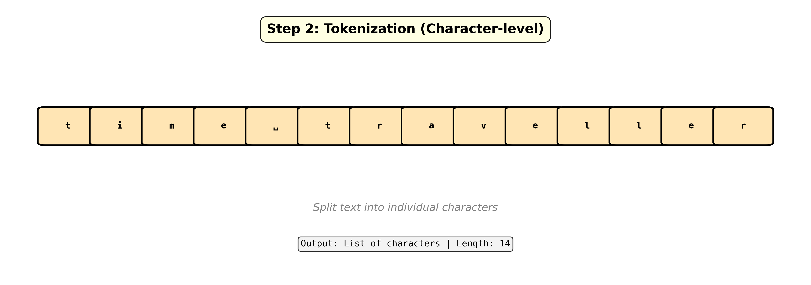
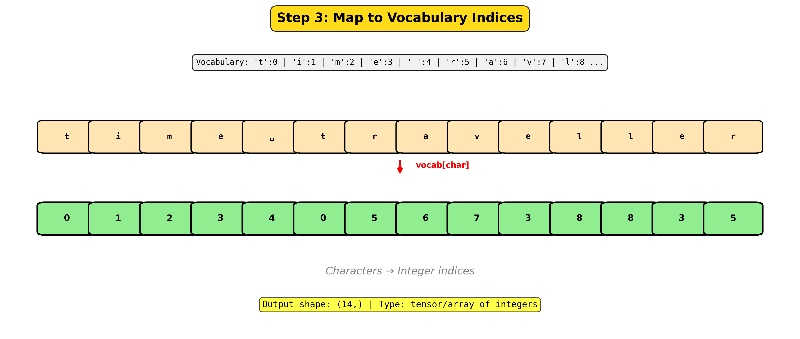
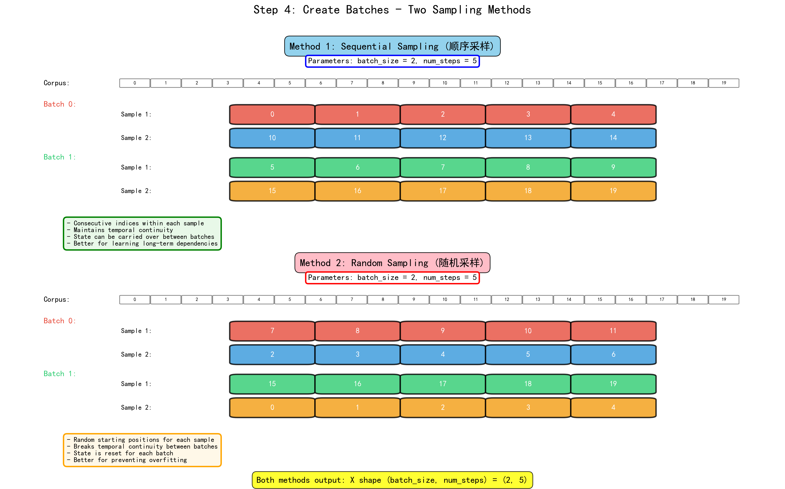
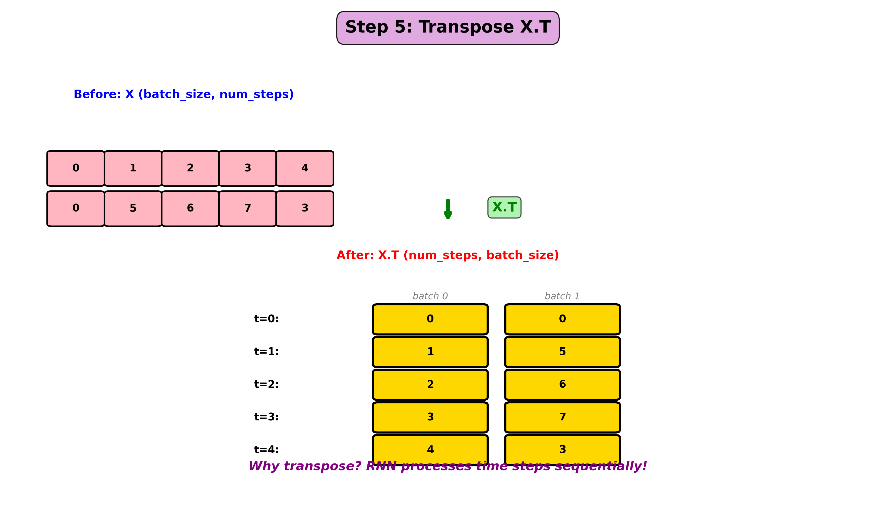
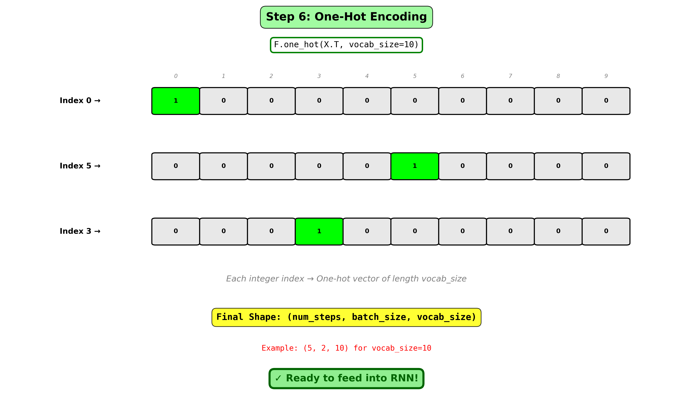
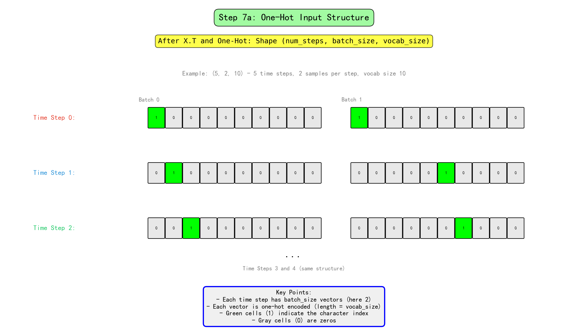
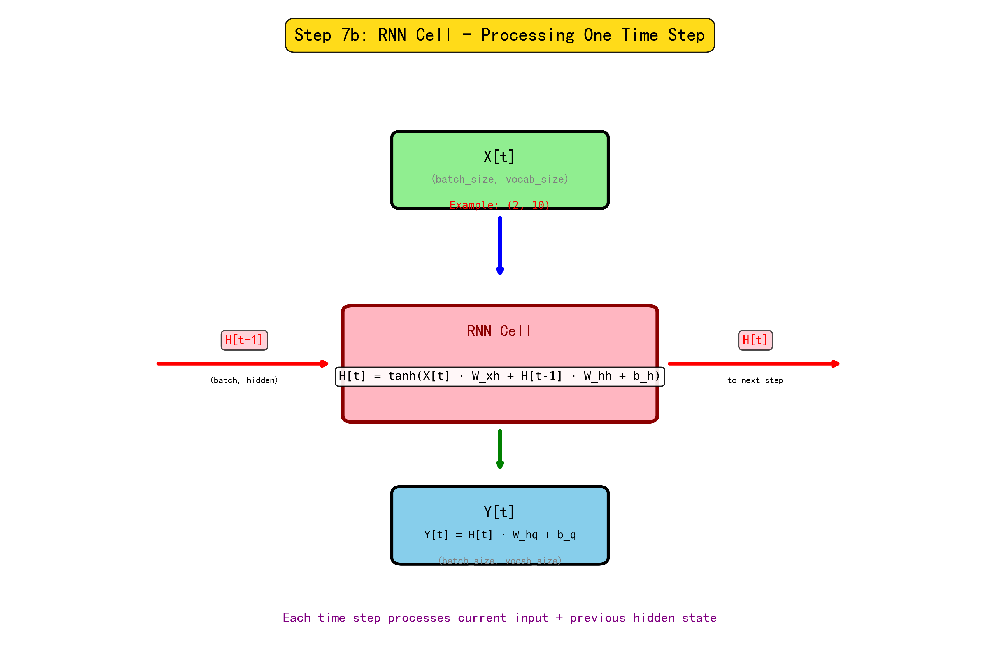
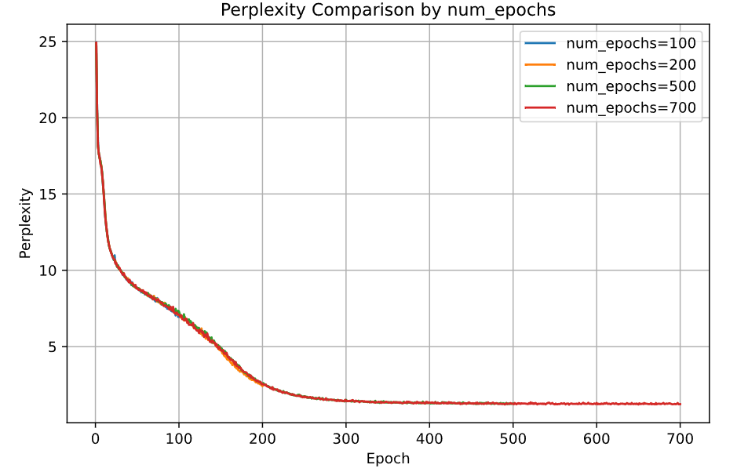

# 4. 循环神经网络从0开始实现

这部分的话，主要是采用代码去实现我们的循环神经网络。

这部分总体来说，内容较为复杂，因此，会在写完后，做个基本的总结、可视化理解以及思维导图。

## 4.1 独热编码

**解释版代码：**
```python
# %matplotlib inline 在jupyter notebook 里面直接展示
import math 
import torch
from torch import nn
# F 用于激活函数、其他函数调用，这里是独热编码
from torch.nn import functional as F
from d2l import torch as d2l

# 小批次一次训练32个样本，每个窗口的大小或者序列的长度是35
batch_size, num_steps = 32, 35
# 调用之前已经写好的函数，返回数据加载器和词表
# 数据集已经被使用了，若是忘记，请看以前RNN_2, load_corpus_time_machine 已经被加载
train_iter, vocab = d2l.load_data_time_machine(batch_size, num_steps)
```

**干净代码：**
```python
%matplotlib inline
import math
import torch
from torch import nn
from torch.nn import functional as F
from d2l import torch as d2l

batch_size, num_steps = 32, 35
train_iter, vocab = d2l.load_data_time_machine(batch_size, num_steps)
```

尽管，每一个词元都表示为一个数字索引，但是将这些索引直接输入神经网络会很困难，因此，这里转为了特征向量。

**解释版代码：**
```python
F.one_hot(torch.tensor([0, 2]), len(vocab))
# 用来把 类别索引（整数） 转换为 独热编码
# tensor([0, 2])： 表示有两个类别索引：第一个样本属于类别 0，第二个样本属于类别 2
# len(vocab)，表示独热编码的"维度数"，也就是类别总数，决定了多少列

# 最终的输出应该是
# tensor([
#     [1, 0, 0, ..., 0],  # 对应类别0
#     [0, 0, 1, ..., 0]   # 对应类别2
# ])
```

**干净代码：**
```python
F.one_hot(torch.tensor([0, 2]), len(vocab))
```

每次，我们获取的是小批量的数据的形状是 （batch_size, num_step）, 再次使用 one_hot, 将其转化三维张量，用于输入的维度。（时间步数，批量大小，词表大小）

**解释版代码：**
```python
# 生成 0 到 9 的一维度张量，生成2行5列的矩阵
X = torch.arange(10).reshape((2, 5))
# 转置，生成10个长度为 28 的 one-hot 向量
F.one_hot(X.T, 28).shape
```

**干净代码：**
```python
X = torch.arange(10).reshape((2, 5))
F.one_hot(X.T, 28).shape
```

## 4.2 网络模型

### 模型初始化

因为这是字符或者每个单词作为输入和预测，意味着输入输出的维度是一样的大小,就是单个的字符，one_hot 形式，维度是词表的大小。

**解释版代码：**
```python
def get_params(vocab_size, num_hiddens, device):
    '''
    参数说明：
    vocab_size：词汇表大小，也就是输入/输出向量的维度（one-hot 编码时，每个词是一个长度为 vocab_size 的向量）
    num_hiddens：隐藏层神经元个数
    device：模型放在哪个设备上运行（CPU 或 GPU）
    '''
    # 比如 输入 '我' ： one_hot，预测输出 '爱'
    # RNN 的输入和输出维度相同
    num_inputs = num_outputs = vocab_size

    # 生成符合标准正态分布（mean=0, std=1）的随机数
    def normal(shape):
        return torch.randn(size=shape, device=device) * 0.01

    # X 的维度是 （时间步数，批量大小，词表大小）
    # 在每个时间步上，我们取出一个 X_t
    # Xt.shape=(B,V)
    # 表示在时间步 t：
    #   一共有 B 个样本
    #   每个样本的输入是一个长度为 V 的向量
    
    # W_xh.shape=(V,H) , (B,V)×(V,H)=(B,H)
    # H = 隐藏层神经元数量 (num_hiddens)
    # 把输入向量从 "词表空间" 投影到 "隐藏状态空间"
    
    # W_hh.shape=(H,H)
    # H_{t-1}.shape=(B,H)
    # (B,H)×(H,H)=(B,H)
    # 把前一时刻的隐藏状态映射成当前时刻的记忆影响，进行累积
    
    # b_h 的形状 b_h.shape=(H,)
    # 在矩阵运算中它会自动广播成 (B,H)
    # 用来给每个样本的隐藏层加上一个偏置项
    
    # 隐藏层参数
    W_xh = normal((num_inputs, num_hiddens))
    W_hh = normal((num_hiddens, num_hiddens))
    b_h = torch.zeros(num_hiddens, device=device)
    
    # 输出层参数
    # 线性层（全连接层）的权重和偏置参数，通常用于神经网络的输出层
    # normal((num_hiddens, num_outputs)) 从正态分布中随机生成一个大小为 (num_hiddens, num_outputs) 的矩阵
    # num_hiddens：隐藏层的神经元个数
    # num_outputs：输出层的神经元个数
    # 每一列对应一个输出神经元的权重
    # 如果隐藏层有 256 个神经元，输出层有 10 个神经元（比如 10 分类任务），则 W_hq 的形状是 (256, 10)
    W_hq = normal((num_hiddens, num_outputs))
    b_q = torch.zeros(num_outputs, device=device)

    # 附加梯度
    # 训练的参数放在一个列表
    params = [W_xh, W_hh, b_h, W_hq, b_q]
    # 让这些参数都参与自动求导（梯度计算）
    # 这样优化器（例如 torch.optim.SGD 或 Adam）在更新时就能调整这些参数
    for param in params:
        param.requires_grad_(True)
    return params
```

**干净代码：**
```python
def init_rnn_params(num_inputs, num_hiddens, num_outputs, device):
    def normal(shape):
        return torch.randn(size=shape, device=device) * 0.01

    W_xh = normal((num_inputs, num_hiddens))
    W_hh = normal((num_hiddens, num_hiddens))
    b_h = torch.zeros(num_hiddens, device=device)
    W_hq = normal((num_hiddens, num_outputs))
    b_q = torch.zeros(num_outputs, device=device)
    
    params = [W_xh, W_hh, b_h, W_hq, b_q]
    for param in params:
        param.requires_grad_(True)
    return params
```

### 循环神经网络模型

由于循环神经网络，需要上一个隐藏状态的加入，但是，对于初始的时候，并没有上面的状态，这里人为创造一个状态出来。

隐藏状态 h0，需要一个h_t-1

\[
h_t = \tanh(W_{xh} x_t + W_{hh} h_{t-1} + b_h)
\]


**解释版代码：**
```python
def init_rnn_state(batch_size, num_hiddens, device):
    # 创建一个形状为 (batch_size, num_hiddens) 的张量
    # 返回一个元组（tuple），里面只有一个元素：初始化好的隐藏状态张量
    # 简单 RNN 只有一个隐藏状态 → 返回 (h, )
    # LSTM 有两个状态 → 返回 (h, c)（隐藏状态和记忆状态）
    return (torch.zeros((batch_size, num_hiddens), device=device), )
```

**干净代码：**
```python
def init_rnn_state(batch_size, num_hiddens, device):
    return (torch.zeros((batch_size, num_hiddens), device=device), )
```

**解释版代码：**
```python
def rnn(inputs, state, params):
    # RNN 的前向传播所需要的一些参数：输入的数据样本，初始状态，参数
    # inputs的形状：(时间步数量，批量大小，词表大小) 实际就是初始 X 的维度
    # 来源于初始化参数
    W_xh, W_hh, b_h, W_hq, b_q = params
    
    # H, = state 用于状态的存放，因为右边的 state 可能是一个元组（tuple），所以这里采用的是逗号
    H, = state
    # 设计一个列表用于存放输出
    outputs = []
    
    # X的形状：(批量大小，词表大小)
    # 每次提取一个批次 (批量大小, 词表大小)
    # 这里批量大小就是 2, 窗口的大小就是 4
    '''
    批次结构示例：
    | 批次编号   | 样本1            | 样本2              |
    | -------- | ---------------- | ------------------ |
    | 第1批次 | [x0, x1, x2, x3] | [x4, x5, x6, x7]   |
    | 第2批次 | [x1, x2, x3, x4] | [x5, x6, x7, x8]   |
    
    inputs: 当前时间步所有样本的输入
    | 样本  | 时间步0 | 时间步1 | 时间步2 | 时间步3 |
    | --- | ---- | ---- | ---- | ---- |
    | 样本1 | x0   | x1   | x2   | x3   |
    | 样本2 | x4   | x5   | x6   | x7   |
    
    inputs[t] 的实际内容：
    | 时间步 t | 样本1 | 样本2 |
    | ----- | --- | --- |
    | t=0   | x0  | x4  |
    | t=1   | x1  | x5  |
    
    RNN 是时间序列模型，它每次只处理当前时间步的数据，用上一次的隐藏状态 H 来累积信息
    窗口的存在主要是为了并行处理和训练效率，实际记忆长度被限制在窗口大小
    批量内部每个样本的时间步可以顺序处理，但不同 batch 可以并行计算
    '''
    for X in inputs:
        # torch.mm(X, W_xh)：矩阵乘法函数（matrix multiplication），专门用于二维张量（矩阵）之间的乘法
        H = torch.tanh(torch.mm(X, W_xh) + torch.mm(H, W_hh) + b_h)
        Y = torch.mm(H, W_hq) + b_q
        # 当前时间步的输出结果保存在 outputs
        outputs.append(Y)
    
    # 把每个时间步的输出按时间维拼接起来，就是一行一行，竖着排
    return torch.cat(outputs, dim=0), (H,)
```

**干净代码：**
```python
def rnn(inputs, state, params):
    # inputs的形状：(时间步数量，批量大小，词表大小)
    W_xh, W_hh, b_h, W_hq, b_q = params
    H, = state
    outputs = []
    # X的形状：(批量大小，词表大小)
    for X in inputs:
        H = torch.tanh(torch.mm(X, W_xh) + torch.mm(H, W_hh) + b_h)
        Y = torch.mm(H, W_hq) + b_q
        outputs.append(Y)
    return torch.cat(outputs, dim=0), (H,)
```

### 类

在上面所有的基本函数，写好后，建立一个通用的模板。

**解释版代码：**
```python
class RNNModelScratch: #@save
    """从零开始实现的循环神经网络模型"""
    def __init__(self, vocab_size, num_hiddens, device,
                 get_params, init_state, forward_fn):
        '''
        导入之前的参数和函数，基本初始化
        vocab_size, num_hiddens：词表大小和隐藏层神经元数量
        get_params：参数初始化函数
        init_state：隐藏状态初始化函数
        forward_fn：前向传播函数
        '''
        # 变成对象的属性
        self.vocab_size, self.num_hiddens = vocab_size, num_hiddens
        self.params = get_params(vocab_size, num_hiddens, device)
        # 把想要的前向传播函数和初始化状态的方法写入进去对象里面，可以调用
        self.init_state, self.forward_fn = init_state, forward_fn

    def __call__(self, X, state):
        # __call__ 方法让你可以直接用实例调用 RNN：Y, state = model(X, state)
        # 将输入数据转变需要的维度，然后进行前向传播
        X = F.one_hot(X.T, self.vocab_size).type(torch.float32)
        # 这个就是之前写的函数所需要传递进去的参数
        return self.forward_fn(X, state, self.params)

    def begin_state(self, batch_size, device):
        return self.init_state(batch_size, self.num_hiddens, device)
```

**干净代码：**
```python
class RNNModelScratch: #@save
    """从零开始实现的循环神经网络模型"""
    def __init__(self, vocab_size, num_hiddens, device,
                 get_params, init_state, forward_fn):
        self.vocab_size, self.num_hiddens = vocab_size, num_hiddens
        self.params = get_params(vocab_size, num_hiddens, device)
        self.init_state, self.forward_fn = init_state, forward_fn

    def __call__(self, X, state):
        X = F.one_hot(X.T, self.vocab_size).type(torch.float32)
        return self.forward_fn(X, state, self.params)

    def begin_state(self, batch_size, device):
        return self.init_state(batch_size, self.num_hiddens, device)
```

**解释版代码：**
```python
# 有512个神经元
num_hiddens = 512

# 生成一个net的对象，输入词表大小，神经元数量，装置，参数初始化，隐藏状态初始化，前向传递函数
net = RNNModelScratch(len(vocab), num_hiddens, d2l.try_gpu(), get_params,
                      init_rnn_state, rnn)

# X.shape[0]：批量大小 (batch_size)
# net.begin_state：根据批量大小初始化隐藏状态 state
state = net.begin_state(X.shape[0], d2l.try_gpu())

# 前向传播
Y, new_state = net(X.to(d2l.try_gpu()), state)
Y.shape, len(new_state), new_state[0].shape
```

**干净代码：**
```python
num_hiddens = 512
net = RNNModelScratch(len(vocab), num_hiddens, d2l.try_gpu(), get_params,
                      init_rnn_state, rnn)
state = net.begin_state(X.shape[0], d2l.try_gpu())
Y, new_state = net(X.to(d2l.try_gpu()), state)
Y.shape, len(new_state), new_state[0].shape
```

### 预测
#### warm-up

模型刚开始时的隐藏状态是随机初始化的，它不包含任何上下文信息。如果直接用这个隐藏状态生成字符，预测的结果可能完全随机，不连贯。

**解释版代码：**
```python
def predict_ch8(prefix, num_preds, net, vocab, device):  #@save
    """在prefix后面生成新字符"""
    '''
    参数说明：
    prefix：字符串，用作生成文本的"起始种子"，你自己放的的一些基本文字
    num_preds：要生成的新字符数
    net：RNN 模型
    vocab：词表对象，用于把字符映射为索引，或索引映射为字符
    device：设备（CPU 或 GPU），比如 d2l.try_gpu()
    '''
    # 因为只有一个样本，所以样本的大小是 1
    state = net.begin_state(batch_size=1, device=device)
    
    # prefix[0] 先放入单个字符，转换成词表的数字索引，是一个列表
    outputs = [vocab[prefix[0]]]
    
    # 每次生成或预测字符时，RNN 的输入是上一个输出字符
    # outputs[-1] → 最新的字符索引，最后面的一个
    # .reshape((1, 1)) → 变成 (batch_size=1, seq_len=1) 的形状
    get_input = lambda: torch.tensor([outputs[-1]], device=device).reshape((1, 1))
    
    # 预热期，这里隐藏状态就得到了更新
    # 遍历前缀剩余字符（除第一个）
    for y in prefix[1:]:
        _, state = net(get_input(), state)
        outputs.append(vocab[y])
    
    # 预测num_preds步，这里就进行小测试
    # _ 是循环计数器，这里不需要具体值，所以用 _
    for _ in range(num_preds):
        y, state = net(get_input(), state)
        # y 是预测概率向量，例如 [0.1, 0.7, 0.2]
        # y.argmax(dim=1) → 选出概率最大的索引
        # reshape(1) → 保持与 outputs 列表元素一致的形状
        # int(...) → 转成整数索引
        # 将模型生成的字符索引加入输出列表
        outputs.append(int(y.argmax(dim=1).reshape(1)))
    
    # outputs → 包含前缀字符索引 + 模型生成的字符索引
    # vocab.idx_to_token[i] → 把索引转换回字符
    # ''.join(...) → 拼接成完整字符串，返回最终生成文本
    return ''.join([vocab.idx_to_token[i] for i in outputs])
```

**干净代码：**
```python
def predict_ch8(prefix, num_preds, net, vocab, device):  #@save
    """在prefix后面生成新字符"""
    state = net.begin_state(batch_size=1, device=device)
    outputs = [vocab[prefix[0]]]
    get_input = lambda: torch.tensor([outputs[-1]], device=device).reshape((1, 1))
    for y in prefix[1:]:  # 预热期
        _, state = net(get_input(), state)
        outputs.append(vocab[y])
    for _ in range(num_preds):  # 预测num_preds步
        y, state = net(get_input(), state)
        outputs.append(int(y.argmax(dim=1).reshape(1)))
    return ''.join([vocab.idx_to_token[i] for i in outputs])
```

#### 梯度裁剪

为了防止梯度消失或者梯度爆炸，使用名为梯度裁剪的办法。

梯度下降的基本公式：

\[ 
w′=w−η∇f(w)
\]

梯度裁剪公式：

\[
\tilde{\mathbf{g}} = \min\left(1, \frac{\theta}{\|\mathbf{g}\|}\right)\mathbf{g}
\]

其中：
- **\(\mathbf{g}\)**：原始梯度  
- **\(\theta\)**：梯度范数的上限（一个超参数，比如 5）  
- **\(\tilde{\mathbf{g}}\)**：裁剪后的梯度  
- 如果太大，就把它**缩小**，使得 \(\|\tilde{\mathbf{g}}\| = \theta\)

**解释版代码：**
```python
def grad_clipping(net, theta):  #@save
    """裁剪梯度"""
    # 如公式所看，两个基本的参数：原始梯度和梯度上限
    # 如果 net 是一个 PyTorch 模型（nn.Module），就提取出所有需要计算梯度的参数
    # 否则（比如是自定义模型对象），从 net.params 中获取参数
    if isinstance(net, nn.Module):
        params = [p for p in net.parameters() if p.requires_grad]
    else:
        params = net.params
    
    # 计算所有参数梯度的整体范数（L2 范数）
    norm = torch.sqrt(sum(torch.sum((p.grad ** 2)) for p in params))
    
    # 如果 norm 超过了阈值 θ，就把所有梯度都乘上一个系数
    # param.grad = param.grad * (theta / norm)
    if norm > theta:
        for param in params:
            param.grad[:] *= theta / norm
```

**干净代码：**
```python
def grad_clipping(net, theta):  #@save
    """裁剪梯度"""
    if isinstance(net, nn.Module):
        params = [p for p in net.parameters() if p.requires_grad]
    else:
        params = net.params
    norm = torch.sqrt(sum(torch.sum((p.grad ** 2)) for p in params))
    if norm > theta:
        for param in params:
            param.grad[:] *= theta / norm
```

### 训练

**解释版代码：**
```python
#@save
def train_epoch_ch8(net, train_iter, loss, updater, device, use_random_iter):
    """训练网络一个迭代周期（定义见第8章）"""
    '''
    参数说明：
    net：模型（可以是 PyTorch 的 nn.Module 或自定义模型）
    train_iter：训练数据迭代器（batch 形式）
    loss：损失函数
    updater：优化器或自定义更新函数
    device：训练设备（CPU/GPU）
    use_random_iter：是否使用随机采样（而非顺序采样）
    '''
    # state：RNN 的隐藏状态（如 LSTM 的 (h, c)）
    # timer：计时器，用于计算训练速度
    state, timer = None, d2l.Timer()
    # metric：当前 epoch 累积的损失之和和处理的总词元数（tokens）
    metric = d2l.Accumulator(2)  # 训练损失之和,词元数量
    
    for X, Y in train_iter:
        if state is None or use_random_iter:
            # 在第一次迭代或使用随机抽样时都需要初始化state
            state = net.begin_state(batch_size=X.shape[0], device=device)
        else:
            # 另外就是顺序采样 → 保持状态连续，但必须 detach()
            # state 是单个张量还是两个张量
            if isinstance(net, nn.Module) and not isinstance(state, tuple):
                # state对于nn.GRU是个张量
                state.detach_()
            else:
                # state对于nn.LSTM或对于我们从零开始实现的模型是个张量
                # 有两个张量，元组的形式
                for s in state:
                    s.detach_()
        
        # Y 是形状 [batch_size, seq_len] 的目标序列
        # reshape(-1) → 拉平成 [seq_len * batch_size] 的向量，方便使用交叉熵损失
        y = Y.T.reshape(-1)
        # 将输入 X 和标签 y 移动到指定设备（CPU 或 GPU）
        X, y = X.to(device), y.to(device)
        # 基本的前向传播
        y_hat, state = net(X, state)
        # 计算交叉熵损失
        l = loss(y_hat, y.long()).mean()
        
        # 下面就基本的参数更新流程
        if isinstance(updater, torch.optim.Optimizer):
            updater.zero_grad()  # 清空梯度
            l.backward()  # 计算梯度
            grad_clipping(net, 1)  # 防止梯度爆炸
            updater.step()  # 更新梯度
        else:
            # 使用自定义优化器（从零实现的 SGD）
            l.backward()
            grad_clipping(net, 1)
            # 因为已经调用了mean函数
            # 你已经对损失做了 .mean()，也就是说 l 已经是平均值
            # 如果优化器内部还除以 batch_size，就会把梯度再缩小一次，这样学习率会变得太小
            updater(batch_size=1)
        
        # 当前 batch 的平均损失（已经通过 .mean() 计算过）
        # 为了累积"总损失"，必须乘回词元数
        # y.numel()：当前 batch 中的词元数量（tokens 数）
        metric.add(l * y.numel(), y.numel())
    
    # metric[0] → 累积总损失
    # metric[1] → 累积总词元数
    # 计算困惑度和训练速度（每秒处理的词元数量）
    return math.exp(metric[0] / metric[1]), metric[1] / timer.stop()
```

**干净代码：**
```python
#@save
def train_epoch_ch8(net, train_iter, loss, updater, device, use_random_iter):
    """训练网络一个迭代周期（定义见第8章）"""
    state, timer = None, d2l.Timer()
    metric = d2l.Accumulator(2)  # 训练损失之和,词元数量
    for X, Y in train_iter:
        if state is None or use_random_iter:
            # 在第一次迭代或使用随机抽样时初始化state
            state = net.begin_state(batch_size=X.shape[0], device=device)
        else:
            if isinstance(net, nn.Module) and not isinstance(state, tuple):
                # state对于nn.GRU是个张量
                state.detach_()
            else:
                # state对于nn.LSTM或对于我们从零开始实现的模型是个张量
                for s in state:
                    s.detach_()
        y = Y.T.reshape(-1)
        X, y = X.to(device), y.to(device)
        y_hat, state = net(X, state)
        l = loss(y_hat, y.long()).mean()
        if isinstance(updater, torch.optim.Optimizer):
            updater.zero_grad()
            l.backward()
            grad_clipping(net, 1)
            updater.step()
        else:
            l.backward()
            grad_clipping(net, 1)
            # 因为已经调用了mean函数
            updater(batch_size=1)
        metric.add(l * y.numel(), y.numel())
    return math.exp(metric[0] / metric[1]), metric[1] / timer.stop()
```

**解释版代码：**
```python
#@save
def train_ch8(net, train_iter, vocab, lr, num_epochs, device,
              use_random_iter=False):
    """训练模型（定义见第8章）"""
    # 这里，肯定就疑惑了为什么看着和上面的很像，就是因为要使用上面的函数，因此，就需要加入新的参数
    '''
    参数说明：
    net：你要训练的模型（RNN或类似结构）
    train_iter：训练数据迭代器
    vocab：词表，用于将索引转换成词、生成预测文本
    lr：学习率
    num_epochs：训练轮数
    device：训练设备（CPU或GPU）
    use_random_iter：是否使用随机采样训练序列（影响序列的连续性）
    '''
    # 使用交叉熵损失函数 CrossEntropyLoss 来训练语言模型
    loss = nn.CrossEntropyLoss()
    # d2l.Animator 是可视化训练困惑度的工具
    # xlabel='epoch'：x轴为训练轮数
    # ylabel='perplexity'：y轴为困惑度（Perplexity）
    # legend=['train']：图例显示"train"
    # xlim=[10, num_epochs]：x轴显示范围从第10轮到最终轮
    animator = d2l.Animator(xlabel='epoch', ylabel='perplexity',
                            legend=['train'], xlim=[10, num_epochs])
    
    # 初始化
    # 如果 net 是 PyTorch 的 nn.Module，使用标准的 SGD 优化器
    if isinstance(net, nn.Module):
        updater = torch.optim.SGD(net.parameters(), lr)
    else:
        # 使用自定义的优化器
        updater = lambda batch_size: d2l.sgd(net.params, lr, batch_size)
    # 预测函数
    predict = lambda prefix: predict_ch8(prefix, 50, net, vocab, device)
    
    # 训练和预测
    for epoch in range(num_epochs):
        # ppl：困惑度（Perplexity）
        # speed：训练速度（词元/秒）
        ppl, speed = train_epoch_ch8(
            net, train_iter, loss, updater, device, use_random_iter)
        
        # 每 10 轮生成一次预测文本，提示词是 'time traveller'
        # 这是用于验证模型的进步，一样的提示词，但是随着模型的进步，预测效果也越来越好
        if (epoch + 1) % 10 == 0:
            print(predict('time traveller'))
            # 用于画出困惑度随训练轮数变化的曲线，方便观察训练是否收敛
            animator.add(epoch + 1, [ppl])
    
    # f'...' 是 f-string（格式化字符串）
    print(f'困惑度 {ppl:.1f}, {speed:.1f} 词元/秒 {str(device)}')
    print(predict('time traveller'))
    print(predict('traveller'))
```

**干净代码：**
```python
#@save
def train_ch8(net, train_iter, vocab, lr, num_epochs, device,
              use_random_iter=False):
    """训练模型（定义见第8章）"""
    loss = nn.CrossEntropyLoss()
    animator = d2l.Animator(xlabel='epoch', ylabel='perplexity',
                            legend=['train'], xlim=[10, num_epochs])
    # 初始化
    if isinstance(net, nn.Module):
        updater = torch.optim.SGD(net.parameters(), lr)
    else:
        updater = lambda batch_size: d2l.sgd(net.params, lr, batch_size)
    predict = lambda prefix: predict_ch8(prefix, 50, net, vocab, device)
    # 训练和预测
    for epoch in range(num_epochs):
        ppl, speed = train_epoch_ch8(
            net, train_iter, loss, updater, device, use_random_iter)
        if (epoch + 1) % 10 == 0:
            print(predict('time traveller'))
            animator.add(epoch + 1, [ppl])
    print(f'困惑度 {ppl:.1f}, {speed:.1f} 词元/秒 {str(device)}')
    print(predict('time traveller'))
    print(predict('traveller'))
```

**运行示例（顺序采样）：**
```python
num_epochs, lr = 500, 1
train_ch8(net, train_iter, vocab, lr, num_epochs, d2l.try_gpu())
```

**运行示例（随机抽样）：**

下面使用的是随机抽样方法的结果。

```python
net = RNNModelScratch(len(vocab), num_hiddens, d2l.try_gpu(), get_params,
                      init_rnn_state, rnn)
train_ch8(net, train_iter, vocab, lr, num_epochs, d2l.try_gpu(),
          use_random_iter=True)
```

## 4.3 相关流程图示












## 4.4 问题

### 嵌入表示与独热编码

1. **嵌入表示（Embedding）**

   * 是一种把离散类别（如单词、物品、用户、城市等）映射到 **连续向量空间** 的方法。
   * 每个类别都有一个向量表示，可以用于捕捉类别特性和关系。

2. **独热编码（One-Hot Encoding）是嵌入的一种特殊情况**

   * 向量长度 = 类别数量
   * 向量只有一个位置是 1，其余都是 0
   * 每个类别都有一个唯一向量，但向量非常简单、**稀疏**（只有少数元素非零，其余为 0）
   * 例如，苹果的独热编码：[1, 0, 0]

3. **嵌入向量更加灵活**

   * 可以是稠密向量（大部分元素非零，不只是 0 和 1）
   * 可以学习类别之间的相似性，例如苹果和香蕉的向量更接近，葡萄向量更远
   * 允许向量自由表示对象的特征，而不仅仅是简单的 0 和 1


### 参数调整改变困惑度

通过调整超参数（如迭代周期数、隐藏单元数、小批量数据的时间步数、学习率等）来改善困惑度。

由于参数较多，使用列表用于检查单个参数在同一张图上进行展示。
并且新增一个函数，用来记录困惑度

```python
def train_ch8_record(net, train_iter, vocab, lr, num_epochs, device,
                     use_random_iter=False):
    """原 train_ch8 的记录版本，不画图，返回每轮 perplexity"""

    # 一样的配置
    
    loss = nn.CrossEntropyLoss() 
    # 损失函数设置为交叉熵函数

    if isinstance(net, nn.Module):
        updater = torch.optim.SGD(net.parameters(), lr)
    # 没有 net.parameters() 方法，所以不能直接用 PyTorch 的优化器
    else:
        updater = lambda batch_size: d2l.sgd(net.params, lr, batch_size)
    # 承了 nn.Module，有标准接口 net.parameters()
    ppl_list = []
    for epoch in range(num_epochs):
        ppl, speed = train_epoch_ch8(
            net, train_iter, loss, updater, device, use_random_iter)
        ppl_list.append(ppl) 
    # 将每一次的迭代返回一个列表
    return ppl_list


def compare_hyperparams_plot(param_name, values, train_iter, vocab, base_config):
    """
    对比单个超参数对困惑度的影响，并绘制曲线。
    
    param_name: 要对比的超参数名 ('lr', 'num_hiddens', 'num_epochs')
    values: 不同取值的列表
    train_iter, vocab: 数据迭代器与词表
    base_config: dict，包含基础参数配置
    """
    device = d2l.try_gpu()
    results = {} # 创建一个空字典用于保存结果

    for v in values: 
    # 复制一份基础配置，然后只修改当前要实验的那个超参数（比如学习率）
        cfg = base_config.copy() 
        cfg[param_name] = v
        print(f"\n=== 实验 {param_name}={v} ===")

        # 创建 scratch RNN 模型
        net = RNNModelScratch(
            vocab_size=len(vocab),
            num_hiddens=cfg['num_hiddens'],
            device=device,
            get_params=get_params,
            init_state=init_rnn_state,
            forward_fn=rnn
        )

        # 训练并记录每轮困惑度
        ppl_list = train_ch8_record(
            net, train_iter, vocab,
            lr=cfg['lr'],
            num_epochs=cfg['num_epochs'],
            device=device
        )

        # 将结果放入到创建好的字典中去
        """
        results = {}
        param_name = "lr"
        v = 0.01
        ppl_list = [10.3, 9.8, 9.6]

        results[f"{param_name}={v}"] = ppl_list 

        # {'lr=0.01': [10.3, 9.8, 9.6]}
        """
        results[f"{param_name}={v}"] = ppl_list

    # ----------------------
    # 绘制困惑度曲线
    # ----------------------
    # 每次绘制，选择其中一个参数去绘制。
    plt.figure(figsize=(8,5))
    for label, ppl in results.items():
        # results.items() 会返回一个一个的 (label, ppl) 对，例如：
        # ("lr=0.001", [52.1, 47.3, 44.9, 43.0])
        # ("lr=0.01", [49.5, 42.8, 38.7, 36.2])
        # ("lr=0.1", [80.2, 77.1, 75.0, 73.5])
        plt.plot(range(1, len(ppl)+1), ppl, label=label)

    plt.xlabel("Epoch")
    plt.ylabel("Perplexity")
    plt.title(f"Perplexity Comparison by {param_name}")
    plt.legend()
    plt.grid(True)
    plt.show()
```

**使用示例：**

```python
compare_hyperparams_plot(
    param_name='lr',
    values=[0.01,0.1,1.0,2.0],
    train_iter=train_iter,
    vocab=vocab,
    base_config=base_config
)

compare_hyperparams_plot(
    param_name='num_hiddens',
    values=[128, 256, 512, 1024, 2048],
    train_iter=train_iter,
    vocab=vocab,
    base_config=base_config
)

compare_hyperparams_plot(
    param_name='num_epochs',
    values=[100, 200, 500, 700],
    train_iter=train_iter,
    vocab=vocab,
    base_config=base_config
)
```




简单来说，除了最后的迭代次数，其余的效果不是很好，有可能是我调整的基本


### 使用学习的嵌入表示替换独热编码

嵌入和独热的区别就是可以是不同长度为向量大小

这里为了替换生成，需要改变一些函数的结构，具体修改如下：

1. 加入 embedding
2. 修改，不再用 F.one_hot
3. 在 rnn 函数中使用嵌入后的向量

```python
X = F.one_hot(X.T, self.vocab_size).type(torch.float32)

这个是独热编码的输入，删除，添加

class RNNModelScratch: 
    def __init__(self, vocab_size, num_hiddens, device,
                 get_params, init_state, forward_fn, embed_size=100):
        self.vocab_size, self.num_hiddens = vocab_size, num_hiddens
        self.embed_size = embed_size
        self.params = get_params(vocab_size, num_hiddens, device)
        self.init_state, self.forward_fn = init_state, forward_fn
        # 可学习嵌入层
        self.embedding = nn.Embedding(vocab_size, embed_size).to(device)

    def __call__(self, X, state):
        # X的形状: (batch_size, num_steps)
        X = self.embedding(X.T)  # 变成 (num_steps, batch_size, embed_size)
        return self.forward_fn(X, state, self.params)

    def begin_state(self, batch_size, device):
        return self.init_state(batch_size, self.num_hiddens, device)

RNN 的输入维度要和嵌入维度匹配，所以还要修改 get_params 中 W_xh 的大小，
因为，输出主要就是关于 

```

```python

W_xh 是 (vocab_size, num_hiddens),输入维度变成 embed_size

def get_params(vocab_size, num_hiddens, device, embed_size=100):

    num_inputs = embed_size  # W_xh 的输入维度必须改为 embed_size

    # 因为输入改了更为稠密的向量

    num_outputs = vocab_size

    def normal(shape):
        return torch.randn(size=shape, device=device) * 0.01

    # 隐藏层参数
    W_xh = normal((num_inputs, num_hiddens))
    W_hh = normal((num_hiddens, num_hiddens))
    b_h = torch.zeros(num_hiddens, device=device)
    # 输出层参数
    W_hq = normal((num_hiddens, num_outputs))
    b_q = torch.zeros(num_outputs, device=device)
    # 附加梯度
    params = [W_xh, W_hh, b_h, W_hq, b_q]
    for param in params:
        param.requires_grad_(True)
    return params
```

```python
embed_size = 100  # 嵌入维度，可尝试 50~300
net = RNNModelScratch(len(vocab), num_hiddens, d2l.try_gpu(),
                      lambda vocab_size, num_hiddens, device: get_params(vocab_size, num_hiddens, d2l.try_gpu(), embed_size),
                      init_rnn_state, rnn, embed_size=embed_size)
```

最终的最终的效果还是不错：


### 使用其他数据集合

其他书作为数据集时效果如何， 例如世界大战

这里需要修改

```python
train_iter, vocab = d2l.load_data_time_machine(batch_size, num_steps)
```

由于，这个的逻辑是一样的，涉及到，重新建立新的词表，以及其他系列，相对来说，有点麻烦，因此， 实在需要，就后面自己写

### 修改预测函数，例如使用采样，而不是选择最有可能的下一个字符

贪心选择（argmax） 改成 按概率采样（sampling）

```python
def predict_ch8_sample(prefix, num_preds, net, vocab, device, temperature=1.0):
    """在prefix后面生成新字符（使用采样而非贪心选择）
    
    temperature 控制随机性：<1 保守，>1 更随机
    """
    state = net.begin_state(batch_size=1, device=device)
    outputs = [vocab[prefix[0]]]
    
    get_input = lambda: torch.tensor([outputs[-1]], device=device).reshape((1, 1))
    
    # 预热期
    for y in prefix[1:]:
        _, state = net(get_input(), state)
        outputs.append(vocab[y])
    
    # 采样生成新字符
    for _ in range(num_preds):
        y, state = net(get_input(), state)
        # logits -> softmax -> 温度调节
        prob = torch.softmax(y / temperature, dim=1)
        next_char_idx = torch.multinomial(prob, num_samples=1)  # 按概率采样
        outputs.append(int(next_char_idx.reshape(1)))
    
    return ''.join([vocab.idx_to_token[i] for i in outputs])
```

**对比贪心选择和采样：**

每次都选择概率最大的：
```python
outputs.append(int(y.argmax(dim=1).reshape(1)))
```

- `y` 是网络输出的每个字符的概率分布（通常是 logits）
- 原始的分数，并未归一化
- `y.argmax(dim=1)` 直接取概率最高的字符索引
- 这就是贪心策略，生成的文本每次都是最可能的下一步

主要的修改就是：

```python
prob = torch.softmax(y, dim=1)           # 转为概率分布
# 按概率采样
next_char = torch.multinomial(prob, num_samples=1)
```

- 从给定概率分布 `prob` 中随机采样 1 个样本
- `outputs.append(int(next_char.reshape(1)))`
- `next_char_idx` 是一个张量，形状通常是 `(1,1)`
- `reshape(1)` 把它展平成一维 `[0]`，再转化为普通的python 整数

**两种方法对比：**

| 特性           | 贪心选择          | 采样            |
| ------------ | ------------- | ------------- |
| **生成文本的确定性** | 每次生成相同        | 每次可能不同（随机性）   |
| **多样性**      | 很低，容易重复模式     | 高，可以生成更丰富的文本  |
| **流畅度**      | 可能更平滑，但容易陷入循环 | 可能偶尔生成不自然字符组合 |
| **创意/新颖性**   | 低             | 高             |


### 在不裁剪梯度的情况下运行本节中的代码会发生什么？

首先，不裁剪梯度，可能会导致梯度爆炸。梯度消失，倒是不知道。

可以自己删除，然后实践。

### 更改顺序划分，使其不会从计算图中分离隐状态。运行时间会有变化吗？困惑度呢？

肯定是有变化的，RNN 训练的时候，使用了窗口，就是为了避免大量的计算。

**不 detach 的影响：**

- BPTT 会跨越多个小段，梯度传播路径变长
- 计算图更大，占用更多显存
- **运行时间增加**：
  - 因为反向传播需要处理更长的依赖链
  - 计算量增加，尤其是序列很长时

肯定会记录更多，会出现更好的结果，但是会不稳定，出现梯度爆炸，计算的时间更长。

### 用ReLU替换本节中使用的激活函数，并重复本节中的实验。我们还需要梯度裁剪吗？为什么？

**梯度爆炸风险高：**

- ReLU 输出可以无限大，累乘梯度时很容易爆炸
- 特别是长序列训练时，梯度裁剪能防止训练发散

**保持训练稳定：**

- 即使 ReLU 避免了梯度消失，梯度裁剪可以让学习率和优化器设置更安全
- 不裁剪可能出现：
  - loss NaN
  - 参数跳跃过大，模型不收敛

**不同激活函数对比：**

| 激活函数         | 梯度消失 | 梯度爆炸 | 是否需要梯度裁剪   |
| ------------ | ---- | ---- | ---------- |
| tanh/sigmoid | 常见   | 较少   | 推荐（尤其长序列）  |
| ReLU         | 较少   | 高    | 必须（防止梯度爆炸） |
