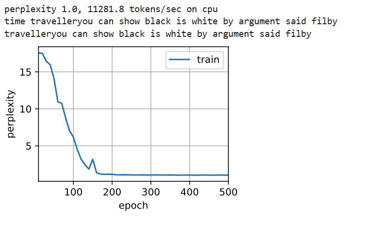

# 5. 循环神经网络简洁实现

这部分是针对上面复杂的模型的高度浓缩，为了使用更加地方便, 并且在上一节的代码中，并没有涉及到多层的意义。

## 5.1 基本库加载
```python
import torch
from torch import nn
from torch.nn import functional as F
from d2l import torch as d2l

batch_size, num_steps = 32, 35

train_iter, vocab = d2l.load_data_time_machine(batch_size, num_steps)
```

```python
num_hiddens = 256
rnn_layer = nn.RNN(len(vocab), num_hiddens)
```

## 5.2 定义基础模板

**类说明：**
- `rnn_layer`: 一个 RNN 层对象，可能是 `nn.RNN`, `nn.LSTM`, 或 `nn.GRU`
- `vocab_size`: 词表大小（有多少不同的词）
- `**kwargs`: 关键字参数（keyword arguments），接收任意数量的关键字参数并自动打包成字典

**kwargs 示例：**
```python
def func(a, b, **kwargs):
    print(a, b)
    print(kwargs)

func(1, 2, x=10, y=20)
# 输出:
# 1 2
# {'x': 10, 'y': 20}
```

**RNN类型说明：**
- **单向 RNN**：时间步 t 只看过去的输入（从左到右）
- **双向 RNN**：时间步 t 同时看过去和未来（从左→右 + 右→左）
- `nn.RNN / nn.GRU`：只有一个隐藏状态张量 H
- `nn.LSTM`：有两个状态 - 隐藏状态 H 和记忆单元 C

**详细实现：**

```python
#@save
class RNNModel(nn.Module):
    """循环神经网络模型"""
    
    def __init__(self, rnn_layer, vocab_size, **kwargs):
        super(RNNModel, self).__init__(**kwargs)
        self.rnn = rnn_layer
        self.vocab_size = vocab_size
        self.num_hiddens = self.rnn.hidden_size
        # 如果RNN是双向的（之后将介绍），num_directions应该是2，否则应该是1
        if not self.rnn.bidirectional:
            self.num_directions = 1
            self.linear = nn.Linear(self.num_hiddens, self.vocab_size)
        else:
            self.num_directions = 2
            self.linear = nn.Linear(self.num_hiddens * 2, self.vocab_size)

    def forward(self, inputs, state):
        X = F.one_hot(inputs.T.long(), self.vocab_size)
        X = X.to(torch.float32)
        Y, state = self.rnn(X, state)
        # 全连接层首先将Y的形状改为(时间步数*批量大小,隐藏单元数)
        # 它的输出形状是(时间步数*批量大小,词表大小)。
        output = self.linear(Y.reshape((-1, Y.shape[-1])))
        return output, state

    def begin_state(self, device, batch_size=1):
        if not isinstance(self.rnn, nn.LSTM):
            # nn.GRU以张量作为隐状态
            return  torch.zeros((self.num_directions * self.rnn.num_layers,
                                 batch_size, self.num_hiddens),
                                device=device)
        else:
            # nn.LSTM以元组作为隐状态
            return (torch.zeros((
                self.num_directions * self.rnn.num_layers,
                batch_size, self.num_hiddens), device=device),
                    torch.zeros((
                        self.num_directions * self.rnn.num_layers,
                        batch_size, self.num_hiddens), device=device))
```

## 5.3 测试

```python
device = d2l.try_gpu()
net = RNNModel(rnn_layer, vocab_size=len(vocab))
net = net.to(device)
d2l.predict_ch8('time traveller', 10, net, vocab, device)
```

```python
num_epochs, lr = 500, 1
d2l.train_ch8(net, train_iter, vocab, lr, num_epochs, device)
```


## 5.4 问题

### 5.4.1 尝试使用高级API，能使循环神经网络模型过拟合吗？

首先，需要理解过拟合：

过拟合本质上是 模型容量过大，或者 训练数据量不足，导致模型在训练集上表现很好，但在测试集/验证集上泛化能力差。

    影响 RNN 过拟合的因素：

    模型复杂度：

    隐藏层单元数 (hidden_size) 太大

    堆叠层数 (num_layers) 太多

    双向 RNN → 参数数量翻倍

    训练数据量不足

    训练轮数太多（epoch 太多）

    缺少正则化（dropout、权重衰减等）

高级 API 并不会自动防止过拟合，参数是本身需要你自己调整

### 5.4.2 如果在循环神经网络模型中增加隐藏层的数量会发生什么？能使模型正常工作吗？

可以通过设置 `num_layers` 参数来增加隐藏层数量。

**默认参数：**
- `input_size = len(vocab)`
- `hidden_size = num_hiddens`
- `num_layers = 1`（默认一层）
- `bidirectional = False`（默认单向）

**增加层数示例：**

```python
# 创建10层RNN
rnn_layer = nn.RNN(len(vocab), num_hiddens, num_layers=10)

# 与此同时，还需要修改 state 的初始配置：
# 原始代码：state = torch.zeros((1, batch_size, num_hiddens))  # 错误，层数是10
state = torch.zeros((rnn_layer.num_layers, batch_size, num_hiddens)) 
# 或者直接使用数字：
# state = torch.zeros((10, batch_size, num_hiddens))
```



**结论：** 总体来说，结果还是不错的，多层RNN可以正常工作。