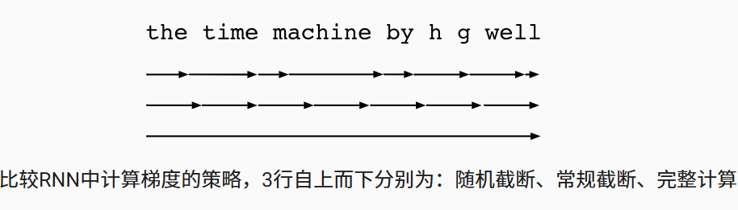

# 6. 通过时间反向传播

这部份将会模型的反向传播 和 detach 更好地解释和使用。

## 6.1 通过时间反向传播简介

反向传播，本身是从结果往后面求梯度，基于这里的数据是序列有时间信息，因此，从时间的后面计算，这里就可以理解为从时间穿越。

当然，还需要考虑的是计算图。

### 6.1.1 隐藏状态的更新（Activation of the Hidden State）：

$$h_t = f(W_h h_{t-1} + W_x x_t)$$

* **$h_t$**: 第 $t$ 时刻的**隐藏状态**。它捕获了从序列开始到 $t$ 时刻的所有信息。
* **$h_{t-1}$**: 上一个时刻（$t-1$）的隐藏状态。
* **$x_t$**: 当前时刻 $t$ 的**输入**。
* **$W_x$**: 连接输入 $x_t$ 到隐藏层 $h_t$ 的**权重矩阵**。
* **$W_h$**: 连接上一时刻隐藏状态 $h_{t-1}$ 到当前隐藏层 $h_t$ 的**权重矩阵**。
    * **关键点**: $W_x$ 和 $W_h$ 在所有时间步 $t$ 都是**共享**的，这是 RNN 的核心特征。
* **$f$**: 非线性激活函数（如 $\tanh$ 或 $\text{ReLU}$），用于引入非线性，使网络能学习更复杂的模式。

$$y_t = g(W_y h_t)$$

* **$y_t$**: 第 $t$ 时刻的**输出**（例如，下一个词的概率分布）。
* **$W_y$**: 连接隐藏状态 $h_t$ 到输出 $y_t$ 的**权重矩阵**。
* **$g$**: 另一个非线性激活函数（例如，对于分类任务，通常是 $\text{softmax}$）。

### 6.1.2 目标函数（Objective/Loss Function）

$$L = \sum_{t=1}^{T} \ell(y_t, \hat{y}_t)$$

* **$L$**: 整个序列的**总损失**。
* **$T$**: 序列的**总时间步长**。
* **$\ell(y_t, \hat{y}_t)$**: 在**单个时间步 $t$** 上的损失函数（例如，交叉熵损失或均方误差）。
    * **$\hat{y}_t$**: 第 $t$ 时刻的**真实标签或目标值**（Ground Truth）。
    * **$y_t$**: 第 $t$ 时刻的**模型预测输出**。

这里实际上就是每个时间步上损失函数之和加在一起使得

**训练目标**：通过调整权重参数 $W_x, W_h, W_y$，使总损失 $L$ **最小化**。

## 6.2 梯度推导

有三个基本参数：$W_h, W_x, W_y$

对于输出层权重 $W_y$，由于它只影响**当前时间步 $t$ 的输出 $y_t$**，所以梯度计算相对直接，不需要追溯到过去的隐状态：

$$\frac{\partial L}{\partial W_y} = \sum_{t} \frac{\partial \ell_t}{\partial y_t} \frac{\partial y_t}{\partial W_y}$$

* $L$: 总损失。
* $\ell_t$: 时间步 $t$ 的损失。

$$\frac{\partial L_t}{\partial W_h} = \frac{\partial L_t}{\partial y_t} \frac{\partial y_t}{\partial h_t} \frac{\partial h_t}{\partial W_h}$$

\[ \mathbf{L} \xrightarrow{\text{关于 } y} \mathbf{y}_t \xrightarrow{\text{关于 } h} \mathbf{h}_t \xrightarrow{\text{关于 } W_h} \mathbf{W}_h\]

这里的关键是在于最后一项：

$$h_t = f(W_h h_{t-1} + W_x x_t + b)$$

问题的关键就在于产生了递归，我这里不理解的是: 梯度的反向传播原理，随着时间的路径传播：

基于上述的问题，进行思考和回顾：

在神经网络中，一个变量往往通过多条路径影响最终结果，或者最终结果依赖于多个中间变量。假设 $L$ 依赖于 $Y$ 和 $Z$，而 $Y$ 和 $Z$ 都依赖于 $W$：$$L = f(Y, Z) \quad \text{且} \quad Y = g(W), Z = h(W)$$我们要计算 $L$ 对 $W$ 的梯度 $\frac{\partial L}{\partial W}$。公式：$$\frac{\partial L}{\partial W} = \frac{\partial L}{\partial Y} \frac{dY}{dW} + \frac{\partial L}{\partial Z} \frac{dZ}{dW}$$
- 关键变化：偏导数 $\partial$： 当一个函数有多个输入时，我们使用偏导数。求和 $\sum$： 如果 $W$ 通过多条路径（$Y$ 和 $Z$）影响 $L$，你需要将所有路径的贡献相加。

- 比喻： 你的努力 $W$ 影响你的成绩 $L$。你的努力 $W$ 影响了你的学习时间 $Y$。你的努力 $W$ 也影响了你的睡眠时间 $Z$。

- 总成绩变化 $\frac{\partial L}{\partial W}$ 等于：

    路径一： 学习时间 $Y$ 对成绩的影响 ($\frac{\partial L}{\partial Y}$) 乘以 努力 $W$ 对学习时间 $Y$ 的影响 ($\frac{dY}{dW}$)
    路径二： 睡眠时间 $Z$ 对成绩的影响 ($\frac{\partial L}{\partial Z}$) 乘以 努力 $W$ 对睡眠时间 $Z$ 的影响 ($\frac{dZ}{dW}$)

这里还有需要主要的是：

好的，这是对 BPTT 中**链式法则简化**的逻辑整理。

### 简化 BPTT 链式法则：抽象与聚焦

在 BPTT 中，当我们计算参数（如 $W_h$）对**当前时刻损失 $\ell_t$** 的梯度时，完整的链式法则是：

$$\frac{\partial \ell_t}{\partial W_h} = \left( \frac{\partial \ell_t}{\partial y_t} \cdot \frac{\partial y_t}{\partial h_t} \right) \cdot \frac{\partial h_t}{\partial W_h}$$

(即 $W_h \to h_t \to y_t \to \ell_t$)

为了简化推导并专注于 BPTT 的核心难题，我们执行以下操作：

**1. 抽象与简化 (Abstraction)**

我们将 $h_t \to y_t \to \ell_t$ 这个“中间部分”打包：

$$\frac{\partial \ell_t}{\partial h_t} \equiv \left( \frac{\partial \ell_t}{\partial y_t} \cdot \frac{\partial y_t}{\partial h_t} \right)$$

* **为什么可以这样做？**
    * 这条路径 $h_t \to y_t \to \ell_t$ 是**局部的 (local)** 和**非递归的 (non-recursive)**。
    * 它**只发生在当前时间步 $t$ 内部**，不依赖 $t-1$ 或 $t+1$ 时刻。
* **作用：**
    * 我们把它视为一个已知的、可以轻松计算的“黑盒”。
    * $\frac{\partial \ell_t}{\partial h_t}$ 就是这个黑盒的导数，代表**“$h_t$ 对当前 $\ell_t$ 的局部影响”**。

**2. 聚焦核心问题 (Focus)**

BPTT 的真正困难**不在于** $h_t \to \ell_t$ 这个局部计算。

BPTT 的真正困难在于**时间轴上的依赖关系**，即：

* **来自未来的递归：** $h_t$ 如何被**未来**的 $\ell_{t+1}, \dots, \ell_T$ 影响（通过 $\frac{\partial L}{\partial h_{t+1}}$ 传回）。
* **来自过去的长链：** $h_t$ 如何被**过去**的 $W_h$ 影响（通过 $\frac{\partial h_t}{\partial h_{t-1}} \dots$ 传导）。

**3. 结论：简化的核心公式**

通过将 $h_t \to y_t \to \ell_t$ 简化为 $\frac{\partial \ell_t}{\partial h_t}$，我们清理了公式，使我们能够更清晰地看到并专注于 BPTT 的**核心递归结构**（即总误差信号 $\frac{\partial L}{\partial h_t}$ 的计算）：

$$\frac{\partial L}{\partial h_t} = \underbrace{\frac{\partial \ell_t}{\partial h_t}}_{\text{简化的局部影响}} + \underbrace{\frac{\partial L}{\partial h_{t+1}} \frac{\partial h_{t+1}}{\partial h_t}}_{\text{真正的、跨时间的递归难题}}$$

### 6.2.2 关键的链式法则展开：误差信号的递推

在RNN中，基于多变量微积分的链式法则：

$W_h$ 是所有时间步上共享参数，意味着，当求$\frac{\partial L}{\partial W_h}$， 需要统计求和 $\sum_{t=1}^T (\dots)$ ，有多条路径。

$$\frac{\partial L}{\partial W_h} = \sum_{t=1}^T \frac{\partial \ell_t}{\partial W_h}$$

我们在计算 $\frac{\partial L}{\partial W_h}$ 时，引入 $\frac{\partial L}{\partial h_t}$ 是为了解耦（decouple）计算过程。

在 BPTT 中，我们最终想计算 $W_h$ 和 $W_x$ 的梯度。

**1. 如果没有 $\frac{\partial L}{\partial h_t}$（效率低下的做法）**

假设我们要计算 $W_h$ 和 $W_x$ 对 $L$ 的梯度，并且我们从 $t=T$ 算到 $t=1$。

当我们在 $t=1$ 时刻时：
* **计算 $\frac{\partial L}{\partial W_h}$：** 我们需要追溯 $W_h$ 通过 $h_1 \to h_2 \to \dots \to h_T$ 影响 $L$ 的所有路径。这个计算涉及一个极其复杂的、横跨 $T$ 个时间步的乘法链。
* **计算 $\frac{\partial L}{\partial W_x}$：** $W_x$ 也要通过 $h_1 \to h_2 \to \dots \to h_T$ 影响 $L$。这个计算涉及另一个、但几乎完全相同的、横跨 $T$ 个时间步的乘法链。

**问题：** 为了计算 $W_h$ 和 $W_x$ 的梯度，我们必须**重复计算**从 $h_1$ 到 $h_T$ 的所有梯度传播项。这浪费了大量的计算资源。

**2. 使用 $\frac{\partial L}{\partial h_t}$（高效的做法）**

我们引入 $\frac{\partial L}{\partial h_t}$ 作为中间变量的梯度。

当我们在 $t=1$ 时刻时：

* **第一步：计算并存储 $\frac{\partial L}{\partial h_1}$**
    我们使用递归公式（依赖于 $\frac{\partial L}{\partial h_2}, \frac{\partial L}{\partial h_3}, \dots$ 这些之前已经算好的值）来计算 $\frac{\partial L}{\partial h_1}$。这个 $\frac{\partial L}{\partial h_1}$ 包含了所有未来时刻的误差信息。
    * *（递归公式：$\frac{\partial L}{\partial h_t} = \frac{\partial \ell_t}{\partial h_t} + \frac{\partial L}{\partial h_{t+1}} \frac{\partial h_{t+1}}{\partial h_t}$）*

* **第二步：计算 $\frac{\partial L}{\partial W_h}$**
    $$\frac{\partial L}{\partial W_h} \propto \frac{\partial L}{\partial h_1} \cdot \frac{\partial h_1}{\partial W_h}$$
    （我们使用 $\frac{\partial L}{\partial h_1}$）

* **第三步：计算 $\frac{\partial L}{\partial W_x}$**
    $$\frac{\partial L}{\partial W_x} \propto \frac{\partial L}{\partial h_1} \cdot \frac{\partial h_1}{\partial W_x}$$
    （我们再次使用 $\frac{\partial L}{\partial h_1}$）

#### 举例说明：

一个 $T=10$ 的序列是一个很好的例子，因为它太长了，无法手动写出所有项，这恰恰突显了**为什么**必须使用高效的方法（方法二）。

**🚀 实际例子：一个 $T=10$ 的 RNN**

**模型设置：**
* $h_t = W_h h_{t-1} + W_x x_t$
* $L = \sum_{t=1}^{10} \ell_t$ (假设 $\ell_t = \frac{1}{2}h_t^2$)

**目标：** 计算 $\frac{\partial L}{\partial W_h}$ 和 $\frac{\partial L}{\partial W_x}$。

**方法一：效率低下的做法（独立计算）**

**焦点：计算中最昂贵的共享部分**

让我们只关注计算中**最长、最昂贵**的那条传播路径：**从 $t=1$ 的输入，一直传播到 $t=10$ 的最终损失 $\ell_{10}$**。

这个最长的路径是：
$$\frac{\partial \ell_{10}}{\partial h_1} = \frac{\partial \ell_{10}}{\partial h_{10}} \cdot \frac{\partial h_{10}}{\partial h_9} \cdot \frac{\partial h_9}{\partial h_8} \cdot \dots \cdot \frac{\partial h_2}{\partial h_1}$$

这个计算涉及 9 次矩阵乘法（在我们的例子中是 $h_{10} \cdot W_h \cdot W_h \cdot \dots \cdot W_h = h_{10} \cdot (W_h)^9$）。这是一个非常昂贵的计算。（*推导：$\frac{\partial \ell_{10}}{\partial h_{10}} = \frac{\partial (\frac{1}{2}h_{10}^2)}{\partial h_{10}} = h_{10}$ | $\frac{\partial h_t}{\partial h_{t-1}} = \frac{\partial (W_h h_{t-1} + W_x x_t)}{\partial h_{t-1}} = W_h$*）

**A. 计算 $\frac{\partial L}{\partial W_x}$**
总梯度 $\frac{\partial L}{\partial W_x} = \sum_{t=1}^{10} \frac{\partial \ell_t}{\partial W_x}$。
当我们计算 $W_x$ 在 $t=1$ 时的贡献 $\frac{\partial \ell_{10}}{\partial W_x}$ 时，我们需要：
$$\left( \frac{\partial \ell_{10}}{\partial h_{10}} \cdot \dots \cdot \frac{\partial h_2}{\partial h_1} \right) \cdot \frac{\partial h_1}{\partial W_x}\big|_{\text{local}}$$
* 我们必须计算 $h_{10} \cdot (W_h)^9$ 这一项。

**B. 计算 $\frac{\partial L}{\partial W_h}$**
总梯度 $\frac{\partial L}{\partial W_h} = \sum_{t=1}^{10} \frac{\partial \ell_t}{\partial W_h}$。
当我们计算 $W_h$ 在 $t=1$ 时的贡献 $\frac{\partial \ell_{10}}{\partial W_h}$ 时，我们需要：
$$\left( \frac{\partial \ell_{10}}{\partial h_{10}} \cdot \dots \cdot \frac{\partial h_2}{\partial h_1} \right) \cdot \frac{\partial h_1}{\partial W_h}\big|_{\text{local}}$$
* 我们**再一次**必须计算 $h_{10} \cdot (W_h)^9$ 这一项。

**低效点分析：**
我们为了 $W_x$ 计算了一遍 $h_{10} \cdot (W_h)^9$，然后又为了 $W_h$ **重复计算**了完全相同的值。

这不仅仅发生在 $\ell_{10} \to h_1$ 这条路径上。计算 $\ell_{10} \to h_2$、$\ell_9 \to h_1$、$\ell_8 \to h_3$……**每一条**跨时间的误差传播路径，都必须为 $W_x$ 和 $W_h$ **重复计算**。

**方法二：高效的做法（使用 $\frac{\partial L}{\partial h_t}$）**

在这种方法中，我们首先计算并存储所有跨时间的误差总和 $\frac{\partial L}{\partial h_t}$，然后重用它们。

**阶段一：计算并存储 $\frac{\partial L}{\partial h_t}$（倒序递归）**

我们从 $t=10$ 开始倒序计算，**只计算一次**。

1.  **$t=10$:** $\frac{\partial L}{\partial h_{10}} = \frac{\partial \ell_{10}}{\partial h_{10}} = h_{10}$
    * *存储 $\frac{\partial L}{\partial h_{10}}$*
2.  **$t=9$:** $\frac{\partial L}{\partial h_9} = \frac{\partial \ell_9}{\partial h_9} + \frac{\partial L}{\partial h_{10}} \cdot \frac{\partial h_{10}}{\partial h_9} = h_9 + (\frac{\partial L}{\partial h_{10}} \cdot W_h)$
    * *存储 $\frac{\partial L}{\partial h_9}$*
... (依此类推) ...
10. **$t=1$:** $\frac{\partial L}{\partial h_1} = \frac{\partial \ell_1}{\partial h_1} + \frac{\partial L}{\partial h_2} \cdot \frac{\partial h_2}{\partial h_1} = h_1 + (\frac{\partial L}{\partial h_2} \cdot W_h)$
    * *存储 $\frac{\partial L}{\partial h_1}$*

**关键点：** 当我们计算 $\frac{\partial L}{\partial h_1}$ 时，它已经**自动包含**了 $h_{10} \cdot (W_h)^9$、$h_9 \cdot (W_h)^8$ 等所有来自未来的、昂贵的长链乘积的总和。

**阶段二：使用 $\frac{\partial L}{\partial h_t}$ 计算参数（高效重用）**

现在我们有了所有打包好的误差信号 $\frac{\partial L}{\partial h_t}$ ($t=1$ 到 $10$)。

**A. 计算 $\frac{\partial L}{\partial W_x}$**
$$\frac{\partial L}{\partial W_x} = \sum_{t=1}^{10} \frac{\partial L}{\partial h_t} \cdot \frac{\partial h_t}{\partial W_x}\big|_{\text{local}}$$
$$\frac{\partial L}{\partial W_x} = \sum_{t=1}^{10} \left( \frac{\partial L}{\partial h_t} \cdot x_t \right)$$
*(这是一个简单的循环，只涉及**本地**计算和**查表**（读取 $\frac{\partial L}{\partial h_t}$）)*

**B. 计算 $\frac{\partial L}{\partial W_h}$**
$$\frac{\partial L}{\partial W_h} = \sum_{t=1}^{10} \frac{\partial L}{\partial h_t} \cdot \frac{\partial h_t}{\partial W_h}\big|_{\text{local}}$$
$$\frac{\partial L}{\partial W_h} = \sum_{t=1}^{10} \left( \frac{\partial L}{\partial h_t} \cdot h_{t-1} \right)$$
*(这同样是一个简单的本地计算和查表)*

#### 真正的低效点：$O(T^2)$ 路径

您可能会观察到：对于**单一路径** $\ell_{10} \to h_1$，我可以只计算一次 $C = h_{10} \cdot (W_h)^9$ 并重用它。

“方法一”的**真正低效**之处在于：$W_x$ 和 $W_h$ 在 $t=1$ 时的局部贡献，需要**所有未来损失**（$\ell_2, \ell_3, \dots, \ell_{10}$）传播回来的**总和**，而不仅仅是 $\ell_{10}$ 这一条路径。

要计算 $t=1$ 的总贡献，您必须**手动计算并求和 10 条不同的传播链**：

1.  **$\ell_1 \to h_1$ 的贡献：**
    $C_1 = \frac{\partial \ell_1}{\partial h_1} = h_1$
2.  **$\ell_2 \to h_1$ 的贡献：**
    $C_2 = \frac{\partial \ell_2}{\partial h_2} \cdot \frac{\partial h_2}{\partial h_1} = h_2 \cdot W_h$
3.  **$\ell_3 \to h_1$ 的贡献：**
    $C_3 = \frac{\partial \ell_3}{\partial h_3} \cdot \frac{\partial h_3}{\partial h_2} \cdot \frac{\partial h_2}{\partial h_1} = h_3 \cdot (W_h)^2$
...
10. **$\ell_{10} \to h_1$ 的贡献：**
    $C_{10} = \frac{\partial \ell_{10}}{\partial h_{10}} \cdot \dots \cdot \frac{\partial h_2}{\partial h_1} = h_{10} \cdot (W_h)^9$

在“方法一”中，要计算 $W_x$ 和 $W_h$ 在 $t=1$ 的总贡献，您必须：
1.  **手动计算所有 10 条路径** $C_1, C_2, \dots, C_{10}$。
2.  **将它们求和：** $C_{\text{total}} = C_1 + C_2 + \dots + C_{10}$。
3.  **用于 $W_x$：** $\text{Gradient}_{W_x} = C_{\text{total}} \cdot \frac{\partial h_1}{\partial W_x}\big|_{\text{local}}$
4.  **用于 $W_h$：** $\text{Gradient}_{W_h} = C_{\text{total}} \cdot \frac{\partial h_1}{\partial W_h}\big|_{\text{local}}$

“方法一”的低效在于您需要**手动计算并存储 $O(T^2)$ 条（$10+9+8+\dots+1 = 55$ 条）**这样的路径来计算总梯度。

#### 方法二的真正优势：自动求和

“方法二”（BPTT 算法）是一种**自动完成**上述所有求和的、极其高效的动态规划算法。

当我们最终计算到 $\frac{\partial L}{\partial h_1}$ 时，根据递归公式：
$$\frac{\partial L}{\partial h_1} = \frac{\partial \ell_1}{\partial h_1} + \frac{\partial L}{\partial h_2} \cdot \frac{\partial h_2}{\partial h_1}$$

这个 $\frac{\partial L}{\partial h_1}$ 的**最终计算结果**，**在数学上等价于**：
$$\frac{\partial L}{\partial h_1} = C_1 + C_2 + \dots + C_{10}$$

* **阶段一 (倒序递归)：** 我们只花了 $O(T)$（即 10 步）的时间，就计算出了 $\frac{\partial L}{\partial h_1}$。这个值**已经自动包含了**所有 10 条路径 $C_1$ 到 $C_{10}$ 的总和。
* **阶段二 (参数计算)：** $W_x$ 和 $W_h$ 直接重用这个**已经求和完毕**的 $\frac{\partial L}{\partial h_1}$。

#### 复杂度结论

* **方法一（低效）：** $O(T^2)$。总操作次数与 $1 + 2 + \dots + T = \frac{T(T+1)}{2}$ 成正比。如果序列长度 $T$ 增加 10 倍，计算量增加 **100 倍**。
* **方法二（BPTT）：** $O(T)$。总操作次数是 阶段一 $O(T)$ + 阶段二 $O(T)$ = $O(T)$。如果序列长度 $T$ 增加 10 倍，计算量只增加 **10 倍**。

这就是为什么 $\frac{\partial L}{\partial h_t}$ 的递归算法是训练 RNN 的唯一可行方法。

说白了，就是只计算一次，多次重复利用。

## 6.3 截断时间步/随机/常规截断

在实际的应用中，完整的计算，计算量过大。因此，采用近似计算。

一种是叫常规截断，另外一种叫随机截断。

常规截断： 是工业界和学术界最常用的解决方案，只要求它能学习最近 $\tau$ 步的依赖关系，使用窗口的思想。

机制（detach() 的作用）：前向传播（看电影时）： 你会带着上一集的记忆（隐状态 $h_{t-1}$）去看下一集（$h_t$）。信息可以从头流到尾。

反向传播（写影评时）： 当你写第 5 集的影评（计算 $\ell_5$ 的梯度）时，你只会回顾第 5 集的内容（时间步 $t=41$ 到 $50$）。你不会让这一集的错误去修正你对第 4 集的记忆。

detach() 就好比一个梯度的“停止标志”。它允许信息（$h_t$）在前向传播时通过，但阻止梯度（$\frac{\partial L}{\partial h_t}$）在反向传播时流过。

核心思想： 我们想要一个**无偏（unbiased）**的梯度估计。我们希望模型有时能看到长距离依赖，但又不想总是承受长距离的计算和不稳定性。

做法（好比抽查）：

你还是看那部 1000 分钟的电影。

但这次，你每看完一分钟，就掷骰子：

90% 的概率，你停止回顾（截断）。

10% 的概率，你继续往前回顾。

机制（无偏估计）：

短链（高概率）： 大多数时候，你只回顾几分钟（梯度链很短），计算稳定且快速。

长链（低概率）： 极少数时候，你（通过随机）被允许回顾 100 分钟。

补偿（加权）： 为了让这种抽查在数学上是公平的（无偏），那些低概率的长链梯度会被赋予极高的权重。

（好比：你很少听取某个下属的意见，但一旦你听了，你会给这个意见 10 倍的重视，以确保平均来看你没有忽视他）。

## 6.4 问题

完美地揭示了循环神经网络（RNN）中梯度消失与梯度爆炸的根本数学原理：

简单来说，特征值是描述一个矩阵（或变换）在某个特定方向上产生拉伸或压缩的**“缩放因子”**。1. 矩阵的作用：变换首先，您需要理解一个矩阵 $M$ 的主要作用是变换一个向量。当您用一个矩阵 $M$ 乘以一个向量 $x$ 得到 $Mx$ 时，通常会发生两件事：向量的长度被改变（拉伸或压缩）。向量的方向被改变（旋转）。例如： 如果 $M = \begin{bmatrix} 2 & 1 \\ 1 & 2 \end{bmatrix}$ 且 $x = \begin{bmatrix} 1 \\ 0 \end{bmatrix}$，那么 $Mx = \begin{bmatrix} 2 & 1 \\ 1 & 2 \end{bmatrix} \begin{bmatrix} 1 \\ 0 \end{bmatrix} = \begin{bmatrix} 2 \\ 1 \end{bmatrix}$。向量 $x$ 从 $(1, 0)$ 旋转并拉伸到了 $(2, 1)$。2. 特殊情况：特征向量 (Eigenvector)然而，对于任何一个矩阵 $M$，都存在一些**“特殊方向”**。当 $M$ 乘以一个指向这些“特殊方向”的向量 $v$ 时， $M$ 不会旋转这个向量 $v$。$M$ 对 $v$ 的唯一作用就是沿着 $v$ 自身的直线方向拉伸或压缩它（或者方向反转）。这些“特殊方向” $v$ 就被称为特征向量 (Eigenvector)。3. 定义：特征值 (Eigenvalue)特征值 ($\lambda$) 就是在那个“特殊方向” $v$ 上的缩放比例。这可以用一个简洁的数学公式来表示：$$Mv = \lambda v$$$M$：我们的矩阵（变换规则）。$v$：特征向量（$M$ 的一个“特殊方向”）。$\lambda$：特征值（一个标量，即一个数字）。它是在 $v$ 方向上的“缩放因子”。例如： 对于同一个矩阵 $M = \begin{bmatrix} 2 & 1 \\ 1 & 2 \end{bmatrix}$，它的一个特征向量是 $v = \begin{bmatrix} 1 \\ 1 \end{bmatrix}$。我们来计算 $Mv$：$$Mv = \begin{bmatrix} 2 & 1 \\ 1 & 2 \end{bmatrix} \begin{bmatrix} 1 \\ 1 \end{bmatrix} = \begin{bmatrix} 3 \\ 3 \end{bmatrix}$$您可以看到：$$\begin{bmatrix} 3 \\ 3 \end{bmatrix} = 3 \cdot \begin{bmatrix} 1 \\ 1 \end{bmatrix}$$结果 $\begin{bmatrix} 3 \\ 3 \end{bmatrix}$ 与原始向量 $\begin{bmatrix} 1 \\ 1 \end{bmatrix}$ 在同一条直线上（没有旋转）。它只是被拉伸了 3 倍。在这个例子中，$\lambda = 3$ 就是对应的特征值。为什么特征值对 RNN 如此重要？因为 BPTT（反向传播）涉及同一个矩阵的“重复”乘法。如果我们知道了 $Mv = \lambda v$，那么计算 $M$ 的幂（$M^k$）就变得极其简单：$M^2 v = M(Mv) = M(\lambda v) = \lambda(Mv) = \lambda(\lambda v) = \lambda^2 v$$M^3 v = M(M^2 v) = M(\lambda^2 v) = \lambda^2(Mv) = \lambda^2(\lambda v) = \lambda^3 v$...$M^k v = \lambda^k v$这对 RNN 梯度的意义：BPTT 中的长链乘积 $\prod \frac{\partial h_j}{\partial h_{j-1}}$ 就好比 $M^k$。梯度爆炸： 如果 $M$ 的最大特征值 $|\lambda_1| > 1$，那么 $M^k$ 的效果就是 $\lambda_1^k$。当 $k$ 很大时，$\lambda_1^k \to \infty$。梯度消失： 如果 $M$ 的最大特征值 $|\lambda_1| < 1$，那么 $M^k$ 的效果就是 $\lambda_1^k$。当 $k$ 很大时，$\lambda_1^k \to 0$。

幂迭代法” (Power Iteration)

一个系统（矩阵 $M$）如果被重复应用（$k$ 次），那么任何一个随机的初始状态（向量 $x$），最终都会被这个系统的“最强主导力量”（主导特征向量 $v_1$）所“同化”或“对齐”。

用途 A：一个著名的实际算法（例如：Google PageRank）

这是一个非常棒的问题！您刚才看懂的那个2D例子，是整个深度学习（尤其是RNN）中最核心的数学原理之一。这个概念在数学上称为**“幂迭代法” (Power Iteration)**。1. 这是什么东西？这是一个数学证明，它展示了一个“赢家通吃”的动态系统是如何演化的。这个证明告诉我们：一个系统（矩阵 $M$）如果被重复应用（$k$ 次），那么任何一个随机的初始状态（向量 $x$），最终都会被这个系统的“最强主导力量”（主导特征向量 $v_1$）所“同化”或“对齐”。在我们的2D例子中：系统 $M$ 有两个方向：$v_1$ 和 $v_2$。最强主导力量 $v_1$：它的“增长倍率” $\lambda_1=3$ 是最强的。初始状态 $x$：在 $v_1$ 和 $v_2$ 上都有投资。结果 $M^k x$：经过 $k$ 轮后，$v_2$ 方向的投资（增长慢）变得微不足道，几乎所有财富都来自 $v_1$（增长快）。2. 它有什么用？（它为什么重要？）这个概念有两大用途：一个在计算机科学中，一个在我们正在讨论的 RNN 梯度问题上。用途 A：一个著名的实际算法（例如：Google PageRank）“幂迭代法”是 Google 早期 PageRank 算法的核心。$x$ 是互联网上所有网页的初始“重要性”（随机赋予）。$M$ 是一个描述“网页A链接到网页B”的巨大矩阵（链接矩阵）。$M^k x$ 就是模拟一个用户在互联网上随机点击 $k$ 次。经过多次迭代（$k$ 很大时）， $M^k x$ 会收敛到主导特征向量 $v_1$。这个 $v_1$ 向量就是所有网页的最终“PageRank”排名。$v_1$ 中数值最大的那个元素，对应的就是“最重要”的网页。用途 B：解释 RNN 梯度为什么会爆炸或消失（我们的核心问题）这是它对我们最重要的用途。它提供了一个完美的数学模型来解释 BPTT（通过时间反向传播）的根本缺陷。1. 建立对应关系：$M^k$ （矩阵的 $k$ 次幂）$\leftrightarrow$ BPTT 梯度链（$\frac{\partial h_t}{\partial h_{t-1}} \cdot \frac{\partial h_{t-2}}{\partial h_{t-1}} \cdot \dots$）。这个梯度链就是重复乘以 $W_h$ 矩阵 $k$ 次。$x$ （随机初始向量）$\leftrightarrow$ $\frac{\partial L}{\partial h_t}$ （在 $t$ 时刻的初始梯度/误差）。$M^k x$ （$k$ 轮后的结果）$\leftrightarrow$ $\frac{\partial L}{\partial h_{t-k}}$ （传播了 $k$ 步后，在 $t-k$ 时刻的最终梯度）。2. 揭示必然的结果：我们的证明 $M^k x \approx (c_1 \lambda_1^k) v_1$ 告诉我们，传播了 $k$ 步后的梯度 $\frac{\partial L}{\partial h_{t-k}}$ 必然会：方向上：与 $W_h$ 矩阵的主导特征向量 $v_1$ 对齐。幅度上：被主导特征值 $\lambda_1$ 缩放了 $k$ 次（$\lambda_1^k$）。3. 最终的用途：这个数学工具让我们得以最终证明（这也是您原始提示中的第三个问题）：如果 $|\lambda_1| > 1$： 梯度幅度 $\lambda_1^k \to \infty$。这就是梯度爆炸。如果 $|\lambda_1| < 1$： 梯度幅度 $\lambda_1^k \to 0$。这就是梯度消失。

