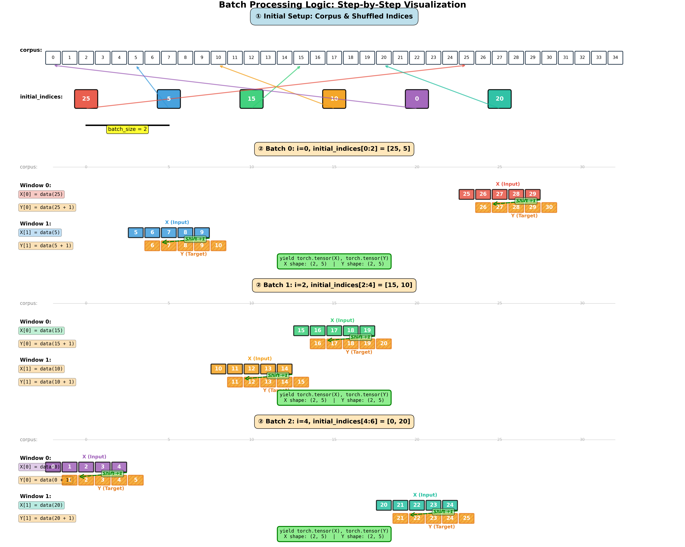
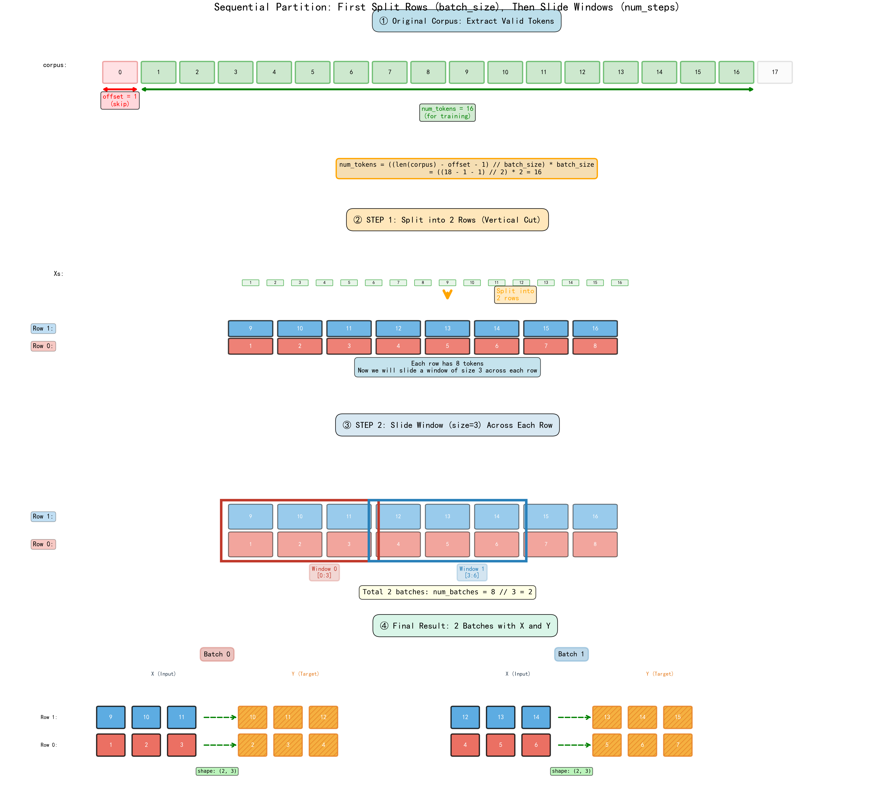

# 缺失图片清单

## 📋 需要补充的图片

### 📘 03-语言模型和数据集.md (共7张)

#### 3.6.1 自然语言统计部分
**位置**: 第163行
```markdown

```
**建议命名**: `vocab_frequency_stats.png`
**内容**: 词频统计结果的表格或数据展示

---

**位置**: 第174行
```markdown

```
**建议命名**: `word_frequency_distribution.png`
**内容**: 词频分布的图表（log-log坐标系）

---

#### 3.6.2 二元语法统计部分
**位置**: 第203行
```markdown

```
**建议命名**: `bigram_frequency.png`
**内容**: 二元语法的词频统计结果

---

#### 3.6.3 三元语法统计部分
**位置**: 第214行
```markdown

```
**建议命名**: `trigram_frequency.png`
**内容**: 三元语法的词频统计结果

---

#### 3.6.4 对比分析部分
**位置**: 第226行
```markdown

```
**建议命名**: `ngram_comparison.png`
**内容**: 一元、二元、三元语法的对比图（通常是折线图）

---

#### 3.7 长序列数据处理部分
**位置**: 第370行
```markdown

```
**建议命名**: `batch_processing_logic.png`
**内容**: 批次处理的逻辑流程图

---

**位置**: 第471行
```markdown

```
**建议命名**: `sequential_partition_diagram.png`
**内容**: 顺序分区的示意图，展示序列如何划分

---

## 📂 图片存放位置

所有图片应放在：
```
d:\Github\haoming58.github.io\_notes\deep-learning\rnn\figures\
```

## 🔄 添加图片后需要做的事

### 选项1: 使用原有的引用名称
直接将图片重命名为markdown中引用的名称：
- `image-23.png`
- `image-24.png`
- `image-26.png`
- `image-27.png`
- `image-28.png`
- `batch_logic_clear-1.png`
- `seq_partition.png`

### 选项2: 使用建议的语义化命名（推荐）
1. 将图片重命名为建议的名称
2. 运行以下脚本更新markdown引用：

```python
# update_image_refs.py
replacements = {
    'image-23.png': 'vocab_frequency_stats.png',
    'image-24.png': 'word_frequency_distribution.png',
    'image-26.png': 'bigram_frequency.png',
    'image-27.png': 'trigram_frequency.png',
    'image-28.png': 'ngram_comparison.png',
    'batch_logic_clear-1.png': 'batch_processing_logic.png',
    'seq_partition.png': 'sequential_partition_diagram.png'
}

with open('03-语言模型和数据集.md', 'r', encoding='utf-8') as f:
    content = f.read()

for old, new in replacements.items():
    content = content.replace(f'figures/{old}', f'figures/{new}')

with open('03-语言模型和数据集.md', 'w', encoding='utf-8') as f:
    f.write(content)

print("✅ 图片引用已更新！")
```

## 📊 图片内容参考

根据代码上下文，这些图片应该包含：

### 词频相关图片
- **词频统计表**: 显示前10个最常见的词及其频率
- **词频分布图**: Log-log坐标系，展示Zipf定律
- **N-gram对比**: 多条曲线对比不同阶数的词频分布

### 数据处理图片
- **批次处理逻辑**: 展示如何将长序列切分成批次
- **顺序分区**: 展示随机偏移和顺序采样的区别

## ✅ 检查清单

添加图片后，请检查：
- [ ] 图片文件已放在 `figures/` 目录
- [ ] 图片文件名与markdown引用一致
- [ ] 图片内容清晰可读
- [ ] 图片格式为PNG
- [ ] 在本地预览markdown确认图片正常显示

## 🎯 快速操作指南

1. **生成图片**（运行相应代码生成图表）
2. **截图保存**到 `figures/` 目录
3. **重命名**为对应的文件名
4. **验证**：打开markdown文件，确认图片显示正常

---

**需要补充**: 7张图片
**目标位置**: `deep-learning/rnn/figures/`
**涉及笔记**: `03-语言模型和数据集.md`
